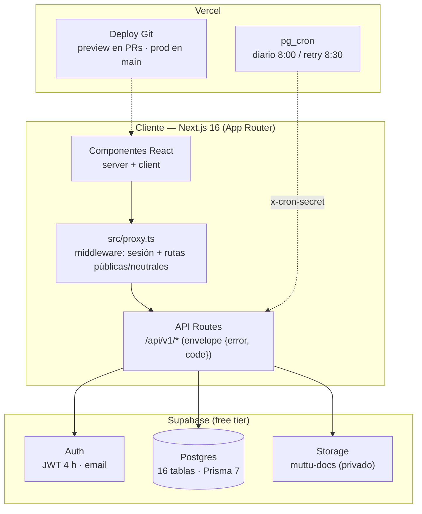
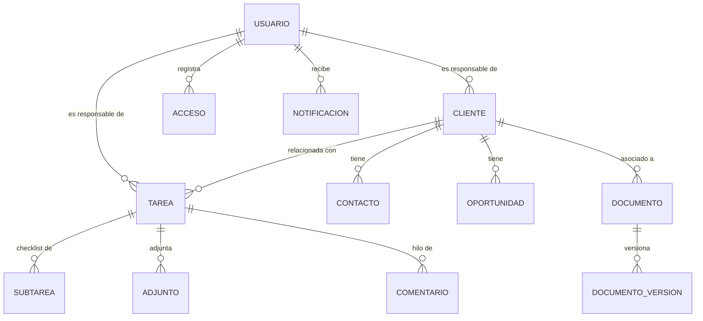
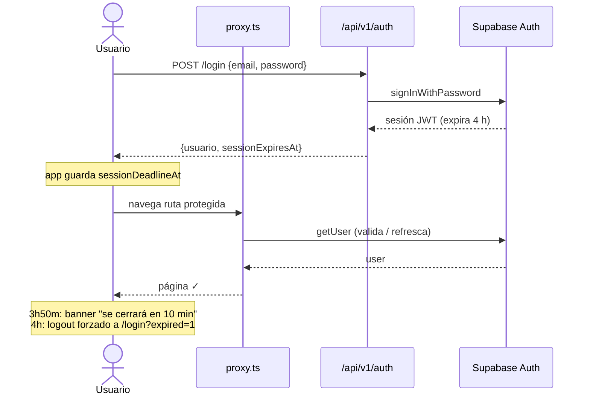
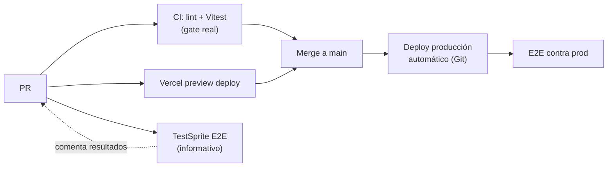

# Muttu Hub


Plataforma integral de **Muttu Innovación Social** (aliados y clientes, tablero
Kanban, repositorio documental, reportes y dashboard) construida con
**Next.js 16 (App Router) + Supabase (Auth/Postgres/Storage) + Prisma**,
desplegada en **Vercel**.

---

## Resumen ejecutivo

| | |
|---|---|
| **Estado** | v1 completa del PRD (hitos 1–7) — 2026-08-11; auditoría QA cerrada (12/12) — 2026-08-19 |
| **Calidad** | 711 tests Vitest en verde · `tsc` 0 errores · ESLint limpio |
| **Entrega** | Deploy automático en PRs (preview) y producción por integración Git |
| **Sesión** | JWT 4 h con banner de cierre y logout forzado |

**Módulos** — todo operativo con datos reales en Supabase:

| Módulo | Qué hace |
|---|---|
| 🔐 **Login y sesión** | Email + password, 4 h sin renovación, recuperación por correo, confirmación de email propia |
| 👥 **CRM** | Clientes, contactos, oportunidades, bitácora inmutable, búsqueda con debounce y filtros |
| 🗂️ **Tablero Kanban** | Tareas, subtareas, adjuntos (≤10 MB), etiquetas, comentarios inmutables |
| 📚 **Repositorio** | Documentos con versionado, categorías restringidas, descarga individual/zip |
| 🔔 **Notificaciones** | Panel por tarea + resumen diario por correo (pg_cron 8:00 Colombia) |
| 📊 **Dashboard** | 4 caras (pipeline, tareas, actividad, mi resumen) con filtros y export imprimible |
| ⚙️ **Administración** | Catálogos configurables (etiquetas/categorías), bitácora de accesos, bitácora de auditoría de negocio (clientes/tareas/documentos), gestión de usuarios |

> **Auditoría QA v1.0**: 12/12 hallazgos cerrados — `docs/pendientes/plan-accion-auditoria-qa.md`
>
> **Oportunidades de mejora (funcionalidad/UX)**: `docs/pendientes/oportunidades-mejora-funcionalidad-ux.md`
>
> **Pendientes y deuda técnica**: `docs/pendientes/pendientes-y-mejoras.md`

---

## Arquitectura



### Modelo de datos (núcleo)



> **Decisión de diseño — identidad auth ↔ usuario**: el `id` de la fila
> `Usuario` de la app **es el mismo UUID del usuario de Supabase Auth**
> (relación 1:1). Al crear un usuario, el admin crea primero el auth user con
> `supabase.auth.admin.createUser` (service role key) y luego
> `prisma.usuario.create` con ese mismo `id`; esto conserva la integridad
> referencial entre Auth y la tabla `usuarios` (documentado también en
> `src/app/api/v1/users/route.ts`).

---

## Flujo de sesión (4 h, sin renovación)



**Reglas de sesión**

- Login escribe la bitácora de accesos (`accesos`), best-effort.
- Usuario desactivado: la sesión activa vence; el próximo login responde 403 `INACTIVE`.
- Recuperación de contraseña: correo de un solo uso (1 h), siempre 200 (sin enumerar cuentas).
- Confirmación de email: `/auth/confirm` canjea token (`verifyOtp`) o code PKCE
  (`exchangeCodeForSession`), modal "¡Correo verificado!" y redirect a `/login` a los 3 s.
  Es una ruta **neutral** del proxy: accesible para anónimos y logueados.

---

## Pipeline de entrega



| Check | Rol |
|---|---|
| **CI (Vitest + ESLint)** | Gate de PRs — 212 tests |
| **Vercel** | Preview en cada PR + producción en main (integración Git) |
| **TestSprite E2E** | Informativo (`blocking: false`); suite MCP falla en su sandbox (incompatibilidad conocida) |

---

## Puesta en marcha

### 1. Requisitos

- Node.js 20+ y npm.
- Proyecto de Supabase (el plan gratuito alcanza para v1).

### 2. Variables de entorno

```bash
cp .env.example .env
```

| Variable | Desde dónde |
| --- | --- |
| `DATABASE_URL` / `DIRECT_URL` | Supabase → Settings → Connection string |
| `NEXT_PUBLIC_SUPABASE_URL` | Supabase → Settings → API |
| `NEXT_PUBLIC_SUPABASE_ANON_KEY` | Supabase → Settings → API (anon key, pública) |
| `SUPABASE_SERVICE_ROLE_KEY` | Supabase → Settings → API (**solo servidor**, nunca expongas) |
| `NEXT_PUBLIC_APP_URL` | URL de la app (dev: `http://localhost:3000`) |

> Las consultas de runtime usan `DATABASE_URL` con el driver adapter de Prisma
> (`@prisma/adapter-pg`); `DIRECT_URL` queda para migraciones con pooler (PRD §8.4).

### 3. Supabase Auth

1. **Authentication → Providers → Email**: activa el proveedor.
2. **Authentication → Settings → Session duration**: JWT en **14400 s (4 h)**,
   en sintonía con el banner de cierre (3h50m/4h).
3. El reset de contraseña redirige a
   `${NEXT_PUBLIC_APP_URL}/auth/reset-password/confirm` (configurado en el código).

### 4. Base de datos (Prisma)

```bash
npm run db:migrate
npm run db:generate   # regenera el cliente Prisma si cambia el esquema
```

> Las 3 migraciones (`0001_init`, `0002_adjuntos_tamano_bytes`, `0003_settings`)
> están aplicadas en el remoto (verificado 2026-08-11).

### 5. Primer administrador

Supabase no permite registro público; crea el primer usuario con la service role key:

```bash
node - <<'EOF'
require("dotenv").config();
const { createClient } = require("@supabase/supabase-js");
const { PrismaPg } = require("@prisma/adapter-pg");
const { PrismaClient } = require("@prisma/client");

const supabase = createClient(
  process.env.NEXT_PUBLIC_SUPABASE_URL,
  process.env.SUPABASE_SERVICE_ROLE_KEY,
  { auth: { autoRefreshToken: false, persistSession: false } },
);

(async () => {
  const email = "admin@muttu.co";
  const { data: authUser, error } = await supabase.auth.admin.createUser({
    email,
    password: "ClaveSegura123",
    email_confirm: true,
  });
  if (error) throw error;

  const adapter = new PrismaPg({ connectionString: process.env.DATABASE_URL });
  const db = new PrismaClient({ adapter });
  await db.usuario.create({
    data: {
      id: authUser.user.id,
      email,
      nombre: "Administrador",
      rol: "ADMINISTRADOR",
    },
  });
  console.log("Primer admin creado:", email);
})().catch((e) => { console.error(e); process.exit(1); });
EOF
```

### 6. Correr la app

```bash
npm run dev    # http://localhost:3000
npm run build  # build de producción
npm run lint   # ESLint
```

> **Modo dev sin configurar**: si faltan `NEXT_PUBLIC_SUPABASE_URL` /
> `NEXT_PUBLIC_SUPABASE_ANON_KEY`, el proxy deja pasar todas las rutas, el login
> muestra "Plataforma no configurada" y las APIs responden 500 con el envelope.

---

## API v1

Base `/api/v1`, sesión por cookie, errores siempre en
`{ "error": "string", "code": "string" }` (PRD §8.2):

| HTTP | Código | Cuándo |
| --- | --- | --- |
| 400 | `VALIDATION_ERROR` | Campo inválido o faltante |
| 401 | `UNAUTHORIZED` | Sin sesión o token expirado |
| 403 | `FORBIDDEN` / `INACTIVE` | Sin permisos / cuenta inactiva |
| 404 | `NOT_FOUND` | Recurso inexistente |
| 409 | `CONFLICT` | Email ya registrado |
| 500 | `INTERNAL_ERROR` | Error no controlado |

<details>
<summary><b>Endpoints por módulo</b> (clic para expandir)</summary>

### Auth

```
POST /api/v1/auth/login                     { email, password } → { usuario, sessionExpiresAt }
POST /api/v1/auth/logout                    204
GET  /api/v1/auth/me                         { usuario } → 401
POST /api/v1/auth/reset-password             { email } → 200 siempre
POST /api/v1/auth/reset-password/confirm     { code?, newPassword }
GET  /api/v1/auth/accesos                   (solo ADMINISTRADOR) bitácora de accesos
```

### Usuarios *(solo ADMINISTRADOR)*

- `GET   /api/v1/users` → `{ usuarios }` (`id`, `nombre`, `email`, `rol`, `activo`, `created_at`)
- `POST  /api/v1/users` `{ nombre, email, rol, password }` → crea el auth user y la
  fila `Usuario`; contraseña ≥ 8 caracteres con letras y números; `409` si existe.
- `PATCH /api/v1/users/:id` `{ rol?, activo?, nombre? }`
- `POST  /api/v1/users/:id/deactivate` → soft delete (`activo = false`); nunca elimina.

### CRM

```
GET  /api/v1/clients                   lista con búsqueda, filtros y paginación
POST /api/v1/clients                   crear cliente
GET  /api/v1/clients/export            xlsx clientes.xlsx (mismo filtrado)
GET  /api/v1/clients/:id               detalle + conteos + valor potencial
PATCH/DELETE /api/v1/clients/:id       actualizar parcial / borrado lógico
GET  /api/v1/clients/:id/contacts      | POST crear contacto
PATCH/DELETE /api/v1/clients/:id/contacts/:contactId
GET  /api/v1/clients/:id/opportunities | POST crear oportunidad
PATCH/DELETE /api/v1/clients/:id/opportunities/:opportunityId
GET  /api/v1/clients/:id/log           | POST nota de bitácora (inmutable)
GET  /api/v1/tasks                     lista CRM + Kanban con filtros
POST /api/v1/tasks                     crear tarea (responsable obligatorio)
GET  /api/v1/tasks/:id                 detalle con hilo de comentarios
PATCH/DELETE /api/v1/tasks/:id         actualizar parcial / borrado lógico
PATCH /api/v1/tasks/:id/status         cambio de estado (motivo al bloquear)
POST /api/v1/tasks/:id/comments        comentario (hilo inmutable)
GET  /api/v1/catalogs/users            usuarios activos para selects
```

**Permisos (v1 pragmática)**: `ADMINISTRADOR`, `GERENCIA` y `COORDINADOR`
leen/escriben todo; `COLABORADOR` solo sus propios clientes y tareas (y las de
clientes que lidera). El export xlsx (valor en COP, máx. 500 filas) respeta el
mismo filtrado y alcance. La bitácora (`/log`) y los comentarios son **inmutables**.

### Tablero (Kanban)

```
POST /api/v1/tasks/:id/subtasks              { titulo (1-200), completada? } → 201
GET  /api/v1/tasks/:id/subtasks            [{ id, titulo, completada, tarea_id }]
PATCH /api/v1/tasks/:id/subtasks/:subtaskId  { titulo?, completada? }
DELETE /api/v1/tasks/:id/subtasks/:subtaskId → 204 (borrado físico)
POST /api/v1/tasks/:id/attachments         multipart/form-data, campo `file` → 201
GET  /api/v1/tasks/:id/attachments         [{ id, nombre, tamano_bytes, created_at }]
GET  /api/v1/tasks/:id/attachments/:attachmentId/download → 302 a signed URL (60 s)
GET  /api/v1/tasks/report                  ?rango=week|month|quarter|all&responsable=&cliente=
GET  /api/v1/tasks/export                  xlsx (mismos filtros, máx 500 filas)
```

- Adjuntos: ≤ 10 MB (413 `FILE_TOO_LARGE`), PDF/DOCX/XLSX/JPG/PNG; bucket
  `muttu-docs` con service role.
- Reporte: `tasa_cumplimiento = completadas / total_asignadas`; proxy "a tiempo"
  = `updated_at <= fecha_entrega` (no hay `completed_at` en v1).
- Subtareas: `DELETE` es borrado físico (checklist).

### Repositorio de documentos

```
GET  /api/v1/documents                    lista con búsqueda y filtros (page/limit máx 100)
POST /api/v1/documents                  multipart form-data: file, titulo?, categoria, etiquetas? → 201
GET  /api/v1/documents/:id              detalle completo + versiones + conteos
DELETE /api/v1/documents/:id            soft delete → 204
POST /api/v1/documents/:id/versions     sube la versión max+1 (201)
GET  /api/v1/documents/:id/versions     todas las versiones desc
GET  /api/v1/documents/:id/download     descarga la versión activa (302 signed URL 60 s)
GET  /api/v1/documents/:id/versions/:versionId/download   descarga ESA versión
POST /api/v1/documents/zip              { ids: string[] } (1 a 50) → documentos.zip
```

- Versión activa = siempre la de mayor número; una versión jamás se borra.
- Categorías restringidas (default `Legal`, `Administrativo-financiero`):
  `COLABORADOR` no las ve ni las descarga (403).
- Zip: máx. 50 docs; si un archivo falla se salta y un `README.txt` lista los fallos.

### Notificaciones y cron

```
GET   /api/v1/notifications        ?leida=false (solo sin leer)
PATCH /api/v1/notifications/:id/read
PATCH /api/v1/notifications/read-all
```

- Alcance: `COLABORADOR` → solo sus tareas; roles completos → todas.
- Cron diario 8:00 Colombia (13:00 UTC) con reintento 8:30; idempotente
  (`already_sent_today`); registro en `cron_logs` (retención 30 días); sin
  `RESEND_API_KEY` responde `SKIPPED_NO_CONFIG`.
- Setup: envs `CRON_SECRET`, `RESEND_API_KEY`, `EMAIL_FROM` en Vercel + ejecutar
  `scripts/cron_setup.sql` reemplazando `[CRON_SECRET]`.

### Dashboard (4 caras)

```
GET /api/v1/dashboard/pipeline          → { scope, total_activas, valor_activo, embudo, top_clientes, comparativo }
GET /api/v1/dashboard/tasks             → { scope, por_columna, cumplimiento_por_persona, vencidas }
GET /api/v1/dashboard/clients-activity  → { scope, sin_gestion, distribucion, actividad_por_responsable }
GET /api/v1/dashboard/my-summary        → { scope: "own", activas, vencidas, hoy, compromisos, clientes_asignados }
```

- Filtros comunes: rango (Todo/30/90 días — custom como TODO), responsable, tipo
  de cliente; chip de días sin gestión (7/14/30/60).
- Export imprimible: `/print/dashboard/{cara}?{filtros}`.
- Alcance por rol: `COLABORADOR` → scope "own"; resto → plataforma completa.

### Administración *(solo ADMINISTRADOR)*

```
GET  /api/v1/settings                → { task_tags, doc_categories }
PUT  /api/v1/settings                { task_tags?, doc_categories? }
GET  /api/v1/catalogs/settings       (cualquier usuario autenticado) → mismo snapshot
GET  /api/v1/auth/accesos            ?limit&before → bitácora paginada por keyset
```

- Catálogos configurables: `task_tags` (1-30 ítems, ≤40 chars) y `doc_categories`
  (1-30, `[{ nombre, restringida }]`, ≤80 chars); enforcement en vivo en
  documentos sin tocar código.
- Bitácora de accesos: cada login exitoso escribe una fila (ip + user-agent
  best-effort); paginación keyset (`?before` + `next_before`).
- Permisos granulares por módulo (§3.3.2): fuera del alcance de v1 — gates por rol.

</details>

---

## Testing

Unit/component tests con **Vitest + Testing Library** (jsdom, sin red ni
Supabase); el E2E en producción lo cubre TestSprite.

```bash
npm test              # suite completa (711 tests)
npm run test:watch    # modo watch
npm run test:coverage # reporte text + html (gate desactivado, ver abajo)
```

- Tests co-located junto a cada fuente (`*.test.ts`) o componente (`*.test.tsx`).
- Todo lo que toca Supabase/react-query se mockea (`vi.mock`), nunca el backend.
- Coverage: `src/lib/*`, `src/store/*`, `src/hooks/*`, `src/components/*`; los
  módulos de servidor (Prisma/Supabase server/auth) quedan fuera de Vitest.
- **Gate desactivado a propósito**: el coverage real (~13-15 %) no alcanza la
  meta de 60 %; thresholds comentados en `vitest.config.ts` y deuda documentada
  en `docs/pendientes/pendientes-y-mejoras.md`.

---

## Estado y próximos pasos

### ✅ Cerrado en v1 (2026-08-11)

- Bugs BUG-001 (filtros persistidos) y BUG-002 (debounce del buscador).
- Página de confirmación de email `/auth/confirm` (con ruta neutral del proxy).
- 6 templates de email con marca en `supabase/email-templates/` (listos).
- Pipeline: preview deploy en PRs (`VERCEL_TOKEN`), deploy automático a
  producción por integración Git, E2E informativo.

### ✅ Auditoría QA v1.0 cerrada (2026-08-19)

12 hallazgos (9 del informe QA + 3 reportados por el equipo sobre Tablero y
Repositorio) resueltos, cada uno con test de regresión, en 12 PRs
encadenadas mergeadas a `main` con CI en verde. Incluye la nueva **bitácora
de auditoría de negocio** (Administración → registro de creación/edición/
eliminación de clientes, tareas y documentos) y el espejado automático de
adjuntos de tarea al Repositorio de Documentos.

> Detalle hallazgo por hallazgo: `docs/pendientes/plan-accion-auditoria-qa.md`

### 🔭 Oportunidades de mejora

| Área | Mejora | Detalle |
|---|---|---|
| **Email** | Templates con marca en Supabase | Requiere DNS de `muttu.co` (Resend) o plan Pro ($25/mes) |
| **Seguridad** | UI de reautenticación | Modal `verifyOtp` type=reauthentication para operaciones sensibles (template listo) |
| **Calidad** | Cobertura hacia 60 % | Real ~13-15 %; priorizar hooks y componentes críticos |
| **E2E** | Gate TestSprite bloqueante | Cuando el sandbox soporte los tests del MCP |
| **Infra** | Supabase Pro | Solo cuando haya uso real (backups, >500 MB storage) |

> Deuda técnica e infraestructura: `docs/pendientes/pendientes-y-mejoras.md`
>
> Funcionalidad y UX/UI (con lo que ya está instalado en el proyecto):
> `docs/pendientes/oportunidades-mejora-funcionalidad-ux.md`

---

## Scripts

```bash
npm run dev            # dev server
npm run build          # build de producción
npm run start          # producción local
npm run lint           # ESLint
npm run db:generate    # genera el cliente Prisma
npm run db:migrate     # aplica migraciones
npm run db:studio      # inspectar la BD
```

## Documentación relacionada

| Doc | Contenido |
|---|---|
| `docs/Muttu_Hub_PRD_v2.md` | PRD del producto |
| `docs/pendientes/plan-accion-auditoria-qa.md` | Auditoría QA v1.0: los 12 hallazgos, cómo se cerró cada uno, PRs y verificación final |
| `docs/pendientes/oportunidades-mejora-funcionalidad-ux.md` | Oportunidades de mejora en funcionalidad y UX/UI, dentro del alcance de las herramientas ya instaladas |
| `docs/pendientes/pendientes-y-mejoras.md` | Deuda técnica + oportunidades de infraestructura |
| `docs/pendientes/bugs-pendientes.md` | Historial de bugs |
| `docs/pendientes/vitest-unit-tests.md` | Convenciones de testing |
| `docs/plan-supabase-manana.md` | Estado de Supabase, email y TestSprite |
