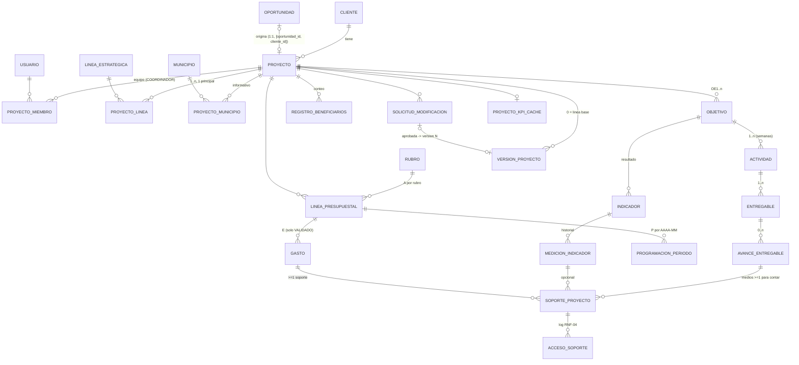

# Muttu Hub v2 — Projects module (RF v2.0) + Clients gaps — Spec-Driven Development document

## 0. Header

| Field | Value |
|---|---|
| Status | **SDD READY FOR IMPLEMENTATION** — nothing implemented yet. No code, schema, migration or data changed by this document. |
| Date | 2026-09-29 |
| Author | Single SDD writer (delegated), for user `agutierrezreginodev` |
| Backbone | `odd/tasks/v2-projects-and-clients-plan.md` (slice IDs S0–S10 and task IDs kept stable) |
| PO sources | RF v2.0 Módulo Proyectos (2026-09-28) → scratchpad `rf.txt`; Estructura del detalle técnico y financiero v1.0 → scratchpad `est.txt`; RF Detalle de Cliente (2026-09-10) → scratchpad `clientes.txt` (scratchpad = `/tmp/claude-1000/-mnt-c-Users-Adrian-Documents-MuttuHub-CRM/271358b0-5ea7-45e9-96f6-1ae64377aa25/scratchpad/`; the originals are the `.docx` files in `~/Downloads`) |
| Current branch at writing time | `feat/v6-visual-alignment` @ `97d639e` (95 commits ahead of `main`) |
| Artifact store | This file (openspec-style content in one ODD feature document). Engram mirror: topic `odd/v2-projects-sdd/tasks` (to be created by the orchestrator, not by this writer). |
| TDD | Strict TDD ON. Runner `npx vitest run <file>`; full suite `npx vitest run`; typecheck `npx tsc --noEmit`; lint `npx eslint <files>` |

### 0.1 Branch strategy note (user decides)
- **Recommended:** create `feat/projects-v2` from the current v6 HEAD (`97d639e`) so the v2 work builds on the v6
  primitives (`StatusChip`, `KpiTile`, `ProgressBar`, `EmptyState`, `PageHeader`, button sizes 44/40/36) that
  already exist on this branch but not on `main`. Chained PRs target `feat/v6-visual-alignment` until it merges,
  then are retargeted to `main`.
- **Alternative:** wait for the v6 branch to merge and branch from `main`. Cleaner PR bases, but blocks S0 start
  and S10 on the merge date.
- Either way: v2 work never lands on `feat/v6-visual-alignment` itself (another writer is active there).

### 0.2 How to read this document
1. Section 1 is enough to start tomorrow morning.
2. Sections 2 (proposal) and 3 (delta specs) say WHAT; section 4 (design) says HOW; section 5 is the executable
   task list (each task self-contained: files, RED tests, commands, acceptance, commit message).
3. Section 6 is the release/verification gate list; section 7 the risk/assumption/decision registers and the
   Spanish questions for the PO; section 8 the appendix (fixtures, template map, matrix, glossary).
4. Evidence tags used everywhere:
   - **VERIFIED** — checked in the repo on 2026-09-29 (path/line cited).
   - **PO-C / PO-P / PO-PEND** — PO status Confirmado / Propuesto / Pendiente (RF v2.0 §0).
   - **USER-RESOLVED** — decision taken by the user on 2026-09-29, still "to confirm with PO".
   - **ASSUMPTION A-nn** — our default where the PO source is silent; registered in §7.2 with how to falsify it.
   - **UNVERIFIED** — could not be checked from the repo; a task exists to verify it.
5. PO rule (RF v2.0 §0): never close a Pendiente item without confirmation. Propuesto items are designed and
   built behind admin-editable parameters or clearly labelled defaults, never presented as final.

### 0.3 Glossary (domain terms; Spanish terms are kept verbatim in UI copy — see §8.4)

| Term | Meaning in this document |
|---|---|
| **A** (Asignado vigente) | Assigned budget of a rubro in the current (vigente) version (est §4.5). |
| **P** (Programado acumulado) | Σ monthly programming of the rubro from the first period up to and including the cut-off period. |
| **E** (Ejecutado validado acumulado) | Σ **validated** expenses (`estado = VALIDADO`) of the rubro with `periodo ≤ corte`. |
| **D** (Diferencia) | E − P. Negative = spent less than programmed. |
| E/P, E/A | Percent executed vs programmed / vs assigned, shown with one decimal, half-up rounding. |
| tol (tolerancia financiera) | Yellow band width above P for the financial semáforo (placeholder 10 %). |
| **Objetivo** (específico) | OE1..OEn; replaces v1 `Meta` (USER-RESOLVED DP-01: Meta = Objetivo específico). |
| **Actividad** | Schedule item in relative weeks (`semana_inicio..semana_fin`), code `1.1`, belongs to one Objetivo. |
| **Entregable** | Simple measurable goal of an activity (`1.4-E1`), `cantidad_meta > 0`, `unidad`, `tipo_medio_exigido`. |
| **Avance** | Quantity achieved for an Entregable at a date, with ≥ 1 medio de verificación to count (PO-P). |
| **Medio de verificación** | File or https link supporting an Avance or a Medición. |
| **Indicador de resultado / Medición** | Result indicator on an Objetivo; dated measurement history. |
| **Rubro** | Budget category from the single catalog R01–R15 (codes PO-P). |
| **Programación** | Monthly (`AAAA-MM`) programmed amount of a rubro. |
| **Gasto** | Legalized expense document: Registrado → Validado / Rechazado. |
| **Línea base / versión 0** | The frozen snapshot approved by Gerencia; project moves Borrador → En ejecución. |
| **Versión N** | Snapshot created when a modification request is approved. |
| **Solicitud de modificación** | Request of type traslado / adición / reducción / reprogramación / cronograma / entregables. |
| **Corte** | Cut-off: a period `AAAA-MM` (financial) or a date `AAAA-MM-DD` (technical). |
| **Gerente** | Role GERENCIA (+ ADMINISTRADOR) — USER-RESOLVED N-01. |
| **Gestor / Ejecutor** | COORDINADOR who is a member of the project team — USER-RESOLVED N-01/N-20. |
| **Visualizador** | Any user with `puede_ver_tablero_gerencial = true` who is not ADMINISTRADOR/GERENCIA. |
| **Coexistence flag** | Setting `feature_projects_v2`; off = v1 module (today), on = v2 module. |
| pp | Percentage points (technical deviation unit). |

## 1. Executive summary and "Start tomorrow" checklist

### 1.1 Executive summary
The Projects module was built from RF v1.0 (Proyecto → Meta → Actividad with one planned date, LineaPresupuestal,
Gasto without validation, bidirectional financial semáforo). RF v2.0 (PO, 2026-09-28) replaces that model with:
Objetivo → Actividad in relative weeks → Entregable → Avance → Medio de verificación; result indicators with
measurement history; budget per rubro (A) with monthly programming (P); validated expenses (E) with an
optimal-spend semáforo; Excel template import (atomic, V-01..V-14); baseline approval by Gerencia and versioned,
approved modifications; append-only audit. The Clients requirements (RF-C01..C04, RNF-C01..C02) are mostly already
implemented; three gaps remain (RF-C04 prefill in one step, RNF-C01 panel separation, RNF-C02 assigned-only
visibility).

We deliver this **incrementally** in 11 slices (S0–S10, **71 tasks** after splitting every L task), behind a
Setting-backed coexistence flag `feature_projects_v2` (default off), using **expand → backfill → switch →
contract** migrations. v1 keeps working at every commit until the contract task S9.6. All data scripts run only
against the local Docker database (`.env.local`, localhost guard); promotion to the remote Supabase is a separate,
human-run step.

Key fixed decisions (USER-RESOLVED 2026-09-29, to confirm with PO): Meta = Objetivo; only GERENCIA and
ADMINISTRADOR manage projects; COORDINADOR = executor on member projects (many-to-many team); validation by
GERENCIA/ADMINISTRADOR, never by the registrant; overspend blocks validation and alerts Gerencia; optimal-spend
semáforo with tolerance 10 % reproducing the PO example exactly; several strategic lines with one principal;
one-step project creation from a GANADA opportunity; legacy EN_EJECUCION projects return to Borrador; legacy
expenses become REGISTRADO; rubro catalog = R01–R15 only; uploads ≤ 25 MB, light office/image types, never
deleted.

Three findings discovered while writing this SDD that change the plan:
1. **Hosting upload limit (UNVERIFIED, high impact).** The app is deployed on Vercel (VERIFIED `README.md:14`).
   Vercel functions document a ~4.5 MB request-body limit, and the remote bucket `muttu-docs` is configured at
   10 MB (VERIFIED `docs/plan-supabase-manana.md:53`). Raising uploads to 25 MB through a route handler will not
   work on production as-is → new tasks **S0.8** (verify) and **S0.9** (25 MB policy + direct-to-storage signed
   upload if confirmed).
2. **Inconsistent current limits.** `src/lib/api/files.ts:9` = 10 MB (documents, project supports) while
   `src/app/api/v1/tasks/[id]/attachments/route.ts:32-40` already defaults to 25 MB via `MAX_FILE_SIZE_MB`.
3. **Test inventory confirmed.** A direct-scope sweep (project API routes, `src/components/proyectos`, rubros,
   settings, dashboard/projects, tablero-gerencial, project-from-opportunity, `semaforo`/`permissions`/`projects`
   tests) counts **419 `it(`/`test(` call sites in 39 files** (`it.each` counted once). This matches the plan's
   "~419" estimate; S0.2 still classifies them one by one.

### 1.2 Start tomorrow — first 90 minutes

**Step 1 — environment sanity (≈15 min).** All commands from the repo root
`/mnt/c/Users/Adrian/Documents/MuttuHub-CRM`. Never run a DB command without `.env.local`.

```bash
git status --short                      # expect the untracked files listed in the session start snapshot
git log --oneline -1                    # expect 97d639e (or later if the v6 writer pushed)
# 1. Prove .env.local points to the local Docker DB (prints host only, never credentials):
node --env-file=.env.local -e "console.log(new URL(process.env.DATABASE_URL).host)"   # expect 127.0.0.1:54322
node --env-file=.env.local -e "console.log(new URL(process.env.DIRECT_URL).host)"     # expect 127.0.0.1:54322
# 2. Local Supabase up (Docker). If not running: `supabase start` (docs/guia-demo.md:39)
supabase status
# 3. Migration state of the LOCAL DB only (script already wraps --env-file=.env.local, package.json)
npm run db:migrate:status
```
Stop if any host is not `127.0.0.1`/`localhost` — do not "fix" it by editing `.env`.

**Step 2 — baseline checks (≈25 min).**
```bash
npx vitest run 2>&1 | tail -40     # baseline; KNOWN failing file: prisma/invariant.test.ts (record message, do not fix here)
npx tsc --noEmit                    # expect 0 errors
npx eslint src/lib/permissions.ts src/lib/semaforo.ts src/lib/api/files.ts
```
Record in §6.7 "Progress / Evidence": total tests, failures (expected only `prisma/invariant.test.ts`), tsc result.
Any other failure = pre-existing; list it under "Known environmental failures" before writing code.

**Step 3 — branch (≈5 min, user decides, see §0.1).**
```bash
git switch -c feat/projects-v2      # recommended: from current HEAD 97d639e
```

**Step 4 — first three tasks (rest of the morning).** Order: **S0.5 → S0.4 → S0.6** (all decision-free).

| # | Task | First RED test to write | Command |
|---|---|---|---|
| 1 | S0.5 weeks + money pure libs | `src/lib/proyectos/weeks.test.ts` → `it("week n starts at fecha_inicio + 7(n−1) days and ends at fecha_inicio + 7n − 1 days")` | `npx vitest run src/lib/proyectos/weeks.test.ts` |
| 2 | S0.4 append-only AuditoriaCambio | `src/lib/api/audit-cambios.test.ts` → `it("diffFields returns one entry per changed field with before and after values")`; live DB: `prisma/auditoria-cambios.invariant.test.ts` → `it("rejects UPDATE on auditoria_cambios with the append-only trigger")` | `npx vitest run src/lib/api/audit-cambios.test.ts` |
| 3 | S0.6 migration safety kit | `scripts/migrate-v2/_guard.test.ts` → `it("aborts before importing the db client when DATABASE_URL is not loopback")` | `npx vitest run scripts/migrate-v2/_guard.test.ts` |

Full RED→GREEN→REFACTOR detail per task is in §5. After these three: S0.1, S0.2, S0.3, S0.7, S0.8, then S1.x.

## 2. Proposal

### 2.1 Intent
Make the Projects section of the Muttu Hub the single source of truth for the technical and financial follow-up
of social-impact projects as specified by the PO in RF v2.0 and the Estructura document, and close the residual
Clients/Opportunities gaps — without a big-bang rewrite, without data loss, and without breaking the module that
users have today.

### 2.2 Problem
- The live model (VERIFIED `prisma/schema.prisma:550-766`) is RF v1.0: `Meta`, `Actividad.fecha_planificada`
  (single date), `Actividad.peso Int @default(1)`, `porcentaje_avance` typed by hand, `LineaPresupuestal`
  (no programming), `Gasto` without validation states, `Indicador.valor_actual` (no history),
  `Proyecto.territorio String` and single `linea_estrategica` enum.
- The financial semáforo is bidirectional (VERIFIED `src/lib/semaforo.ts:47-52`), which contradicts the
  confirmed optimal-spend criterion (RF v2.0 §1.4, RF-24).
- COORDINADOR has global write authority over every project (VERIFIED `MANAGE_ANY_ROLES`,
  `src/lib/permissions.ts:11-15`, composed by `canManageProject` line 94 and `canCreateProject` line 79),
  contradicting the resolved role model.
- Audit is best-effort and not append-only (VERIFIED `src/lib/api/audit.ts` swallows errors; model
  `Auditoria` has no before/after per field) — gap vs RF-04, RNF-05.
- 419 tests (39 files) encode v1 behavior; a direct replacement would break them and the loaded data.

### 2.3 Scope
**IN**
- RF-01..RF-36, RNF-01..RNF-07 (Alta first, Media after) of RF v2.0, the entity model, template, V-01..V-14,
  versioning and audit of the Estructura document.
- Residual Clients gaps: RF-C04 (one-step conversion with prefill), RNF-C01 (projects vs opportunities in the
  general panel), RNF-C02 (executors see only assigned active projects).
- Data migration of existing projects (local first; remote promotion is a human-run checklist).
- Unified upload policy (≤ 25 MB, light office/image types, soft-delete only) for ALL uploads (user wording
  "25mb o menos, para los archivos"), gated by the hosting/bucket verification S0.8.
- Removal of territorial semaforización (RF v2.0 §2).
- Retirement of v1 project code/tests at the contract step; re-plan of held visual tasks (S10).

**OUT** (RF v2.0 §10.2 future, or not requested)
- DIAN XML invoice reading; accounting integration; S-curve and financial close projection; per-type templates.
- Notifications in general (RF v2.0 §10.2). **Exception (USER-RESOLVED DP-11):** the overspend notification to
  Gerencia is IN. The delay alert is visual only (no notification).
- External (client/funder) access to the Hub; they receive exported reports only (RF v2.0 §2, §3).
- Replacement for territorial semaforización (municipios become informative only).
- Personal data of beneficiaries (count only, RF-11).

### 2.4 Success criteria
1. Every RF/RNF/RF-C row maps to a task whose acceptance evidence is recorded (§3.18, §6).
2. The PO's illustrative financial example reproduces **exactly** (all nine figures and both colors) in an
   automated golden test (§3.8, §8.1).
3. An Excel template generated by the Hub for a Borrador project, filled with the CedeTextil structure, imports
   atomically; any single V-rule violation imports nothing and reports sheet/row/column/rule (§3.10).
4. A project can go Borrador → baseline v0 → modification v1 → comparison v0 vs vigente with every step in the
   append-only audit (§3.11, §3.16).
5. No agent-run command ever touches the remote `.env` database; every backfill has a recorded local dry-run.
6. v1 module works at every commit until S9.6; the full suite is green at each slice close (except the
   pre-existing known failure, until it is fixed separately).
7. Management dashboard KPIs answer in < 3 s with the demo dataset × 10 projects (RNF-02, §3.17).

### 2.5 Non-goals
- No new role enum value (Gerente maps to GERENCIA; no financial role — USER-RESOLVED DP-02).
- No redesign of Clients/Opportunities screens beyond the three gaps.
- No generic workflow engine; modification approval is a fixed state machine.
- No offline/mobile app; mobile = responsive web capture of progress and expenses (RNF-01 PO-P, S10.3).
- No automatic "fix" of storage orphans; they are reported only.

### 2.6 Approach summary
- **Coexistence flag** `feature_projects_v2` (Setting row, default off) read by a server helper; v2 endpoints
  answer 404 while off; v1 endpoints of an area become read-only while on, once that area's switch task lands.
- **Additive schema first** (new tables and nullable/defaulted columns, composite `[id, proyecto_id]` FKs, CHECKs
  in SQL). Reuse existing tables where the concept is the same and it avoids moving FKs or storage objects
  (`Actividad`, `LineaPresupuestal` as "PresupuestoRubro", `Gasto`, `Indicador`, `SoporteProyecto`, `Rubro`).
- **Pure domain libraries** under `src/lib/proyectos/` (weeks, money, avance, ficha financiera, semáforo v2,
  KPIs, versioning diff, template validators) — framework/DB-free like `src/lib/permissions.ts`, tested first.
- **Integer-cent money math** in pure libs (bigint), `Decimal(15,2)` in the DB (RNF-06).
- **Append-only audit** `auditoria_cambios` with DB trigger, written inside the same transaction as the business
  write (not best-effort).
- **Snapshot versioning** (JSONB) per RF v2.0 §10.3.
- **Precomputed KPI cache** per project (RF v2.0 §10.3, RNF-02).

### 2.7 Rollback plan
| Phase | Rollback |
|---|---|
| Expand migration merged, flag off | Nothing to roll back functionally (v1 unaffected). Schema rollback = a new down-migration only if a column blocks something (never drop data columns before S9.6). |
| Backfill applied locally | Scripts are idempotent and each writes a `migracion_v2_lote` id; rollback = re-run with `--revert <lote>` (only removes rows created by that lote; never touches v1 columns). Local DB can always be rebuilt with `supabase db reset` + seed. |
| Area switched (flag on locally / pilot) | Set `feature_projects_v2 = {enabled:false}` (admin) or env `PROJECTS_V2_OVERRIDE=off`; v1 data untouched because v2 never writes v1-only columns. |
| Remote promotion (human) | Pre-promotion `pg_dump` of the remote DB (checklist S0.6); restore = human decision. |
| After S9.6 contract | Restore from the pre-contract backup; this is why S9.6 needs explicit user sign-off. |

### 2.8 Delivery strategy
- Chained PRs, one reviewable work unit each; **~400 authored changed lines per PR is an advisory review budget,
  not a cap** (additions + deletions, generated files and lockfiles excluded). A correct solution that exceeds it
  is explained in the PR, not artificially split.
- Delivery strategy: `ask-on-risk` (cached from the plan). Chain strategy (`stacked-to-main` vs
  `feature-branch-chain`) is **not chosen yet** → asked once before the first slice that exceeds the budget.
- Work-unit commits: behavior + its tests + docs in the same commit; Conventional Commits
  (`feat(projects): …`, `test(projects): …`, `chore(db): …`, `docs(odd): …`); **no `Co-Authored-By` and no AI
  attribution lines** (user rule, overrides any tool default).
- Reviewer-friendly order inside a slice: schema/migration → pure lib → API → UI → backfill script → switch (the
  switch PR retires the v1 tests of that area).
- Native review (RDD) per work-unit commit under the user-owned switch; the assessed tier and outcome are
  recorded in §6.7.

### 2.9 Affected areas

| Area | Paths (VERIFIED exist unless marked NEW) | Change |
|---|---|---|
| Schema & migrations | `prisma/schema.prisma`, `prisma/migrations/**` (NEW migrations `2026100x…_v2_*`) | Additive models/columns, CHECKs, triggers; contract at S9.6 |
| Permissions | `src/lib/permissions.ts`, `src/lib/api/projects.ts`, `src/components/proyectos/project-list.tsx`, `src/app/api/v1/projects/route.ts`, `src/app/api/v1/clients/[id]/opportunities/[opportunityId]/project/route.ts`, `src/app/api/v1/dashboard/projects/route.ts`, `src/lib/openapi/paths/projects.ts`, `src/lib/openapi/paths/dashboard-admin.ts` | Project-specific predicates; COORDINADOR removed from project management; membership visibility |
| Audit | `src/lib/api/audit.ts` (kept), NEW `src/lib/api/audit-cambios.ts` | Append-only change log |
| Settings / flags | `src/lib/settings.ts`, `src/app/api/v1/settings/route.ts`, `src/lib/catalogs.ts`, NEW `src/lib/features.ts` | Flag + semáforo params v2 |
| Pure domain libs | NEW `src/lib/proyectos/*.ts` | weeks, money, avance, ficha, semáforo v2, kpis, template |
| Semáforo v1 | `src/lib/semaforo.ts` | Kept for v1 until S9.6; v2 lives in `src/lib/proyectos/semaforo-v2.ts` |
| Files | `src/lib/api/files.ts`, `src/app/api/v1/tasks/[id]/attachments/route.ts`, `src/app/api/v1/documents/route.ts`, `src/app/api/v1/projects/[id]/attachments/route.ts`, `src/components/proyectos/soporte-dialog.tsx`, `src/components/documents/upload-dialog.tsx` | 25 MB unified policy, type allowlist, signed upload |
| Project API | `src/app/api/v1/projects/**` (15 route files), NEW sub-routes (§4.8) | v2 endpoints behind flag |
| Catalog API | `src/app/api/v1/rubros/**`, NEW `src/app/api/v1/strategic-lines/**`, NEW `src/app/api/v1/municipalities/**` | Catalog rules (suspend-not-delete) |
| Opportunities | `src/app/api/v1/clients/[id]/opportunities/[opportunityId]/project/route.ts`, `src/components/crm/entity-dialogs.tsx` | One-step GANADA → project with prefill |
| Dashboards | `src/app/api/v1/dashboard/projects/route.ts`, `src/app/(app)/tablero-gerencial/page.tsx`, `src/components/dashboard/cara-management.tsx`, `src/components/dashboard/kpi-cards.tsx` | v2 KPIs, remove territory |
| UI | `src/components/proyectos/**`, `src/hooks/projects.ts`, `src/app/(app)/proyectos/**` | v2 screens (S10 styling) |
| Notifications | `prisma/schema.prisma` (`TipoNotificacion`, `Notificacion`), `src/app/api/v1/notifications/**` | Overspend notification type |
| Scripts | `scripts/seed-proyectos-demo.ts`, `prisma/seed.ts`, NEW `scripts/migrate-v2/**` | Guarded backfills, v2 demo data |
| Specs/docs | `openspec/changes/{proyecto-financiero-tab,proyecto-legalizacion-tab,proyecto-metas-tab,proyecto-soportes-tab,tablero-gerencial-unificado,admin-umbrales-editables}` | Marked superseded by v2 (S0.1) |

## 3. Specs (delta specs)

### 3.0 Conventions
- Requirement IDs `REQ-<CAP>-nn` are stable; each is tagged `[src: …]` (PO IDs) and `[impl: …]` (task IDs).
- RFC-2119 keywords: MUST / MUST NOT / SHOULD / MAY.
- Scenarios are Given/When/Then; each scenario becomes at least one `it()` in the implementing task (§5).
- "Actor" shorthands: **ADM** = ADMINISTRADOR, **GER** = GERENCIA, **COORD-M** = COORDINADOR member of the
  project team, **COORD-X** = COORDINADOR not a member, **COLAB** = COLABORADOR without flag, **VIS** =
  Visualizador (flag `puede_ver_tablero_gerencial`, not ADM/GER). A user may be COORD-M and VIS at once: the
  union of permissions applies, except that VIS never widens write authority.
- Spanish strings inside quotes are the exact UI/API copy (the app's UI and API messages are Spanish — VERIFIED
  e.g. `src/app/api/v1/projects/route.ts:31-45`).
- These are **delta specs** against `openspec/specs/{project-access-control,project-budget,project-schedule,
  project-tracking,project-attachments,management-dashboard}` (v1). At S9.6 they are merged into main specs.

### 3.1 Capability ACC — Access and roles
[src: RF-36, RF v2.0 §3, DP-02, DP-06, N-01, N-20, RNF-03, RNF-C02] [impl: S0.7, S2.6, S6.5]

**Permission matrix (target, v2).** ✓ = allowed, — = denied (403, or 404 when the project must not be revealed),
"own" = only on projects where the actor is a team member.

| # | Action | ADM | GER | COORD-M | COORD-X | COLAB | VIS |
|---|---|---|---|---|---|---|---|
| P01 | List/see projects (portfolio) | all | all | own | — | — | all (read) |
| P02 | See project ficha (general, technical, schedule) | ✓ | ✓ | own | — | — | ✓ |
| P03 | See financial ficha (aggregates A/P/E/D) | ✓ | ✓ | own | — | — | ✓ |
| P04 | See/download individual financial supports and third-party IDs | ✓ | ✓ | own | — | — | — (RNF-03) |
| P05 | Create project (either origin) | ✓ | ✓ | — | — | — | — |
| P06 | Edit general data / structure / budget / programming in Borrador; import template | ✓ | ✓ | — | — | — | — |
| P07 | Manage team members | ✓ | ✓ | — | — | — | — |
| P08 | Approve baseline (Borrador → En ejecución) | ✓ | ✓ | — | — | — | — |
| P09 | Register avances, medios, mediciones, beneficiarios (En ejecución) | ✓ | ✓ | own | — | — | — |
| P10 | Register expense with supports (En ejecución) | ✓ | ✓ | own | — | — | — |
| P11 | Validate / reject expense (never own registration) | ✓ | ✓ | — | — | — | — |
| P12 | Request modification | ✓ | ✓ | own (A-01) | — | — | — |
| P13 | Approve / reject modification | ✓ | ✓ | — | — | — | — |
| P14 | Close / suspend / cancel project | ✓ | ✓ | — | — | — | — |
| P15 | Catalogs (rubros, líneas, municipios), semáforo params, feature flag | ✓ | — | — | — | — | — |
| P16 | Export project ficha / financial ficha (PDF, Excel) | ✓ | ✓ | own | — | — | ✓ (no supports, no third-party IDs) |
| P17 | Management dashboard (Tablero gerencial) | all | all | own projects only (A-02) | — | — | all |
| P18 | Void (anular) an avance/medición/beneficiario record | ✓ | ✓ | — | — | — | — |

Notes: RF v2.0 §3 lists the Gestor as creator/loader of projects; the user restricted P05/P06 to ADM/GER
(USER-RESOLVED N-01) — flagged in §7.4 as a confirmation for the PO. RF-05 says "solo el rol Gerente puede
aprobar"; the user maps Gerente = GERENCIA **and** ADMINISTRADOR.

**REQ-ACC-01** Project-management authority MUST be granted only to ADMINISTRADOR and GERENCIA. COORDINADOR MUST
NOT derive any project authority from `MANAGE_ANY_ROLES`. `canManageAny` itself MUST remain unchanged for
clients/tasks/documents (no behavior change outside projects).
- Scenario: *Given* a COORDINADOR who is not a member, *When* they `PATCH /api/v1/projects/:id`, *Then* 403
  `FORBIDDEN` "No tienes permisos sobre este proyecto."
- Scenario: *Given* a COORDINADOR, *When* they `POST /api/v1/projects`, *Then* 403 "No tienes permisos para crear
  proyectos." (behavior change: today 201 — VERIFIED `src/lib/permissions.ts:78-80`).
- Scenario: *Given* a COORDINADOR responsable of a client, *When* they edit that client, *Then* it still succeeds
  (regression guard for `canEditClient`).

**REQ-ACC-02** Project visibility MUST be: ADM, GER, VIS see every non-deleted project; a COORDINADOR sees only
projects where they have an active team membership (ASSUMED visibility — DP-06 PO proposal "solo asignados");
COLABORADOR without flag sees none.
- Scenario: *Given* COORD-A member of P1 only, *When* `GET /api/v1/projects`, *Then* the list contains P1 only.
- Scenario: *Given* COORD-A not member of P2, *When* `GET /api/v1/projects/P2`, *Then* 403 `FORBIDDEN`
  (existence is already public to the actor through ids in links; same NOT_FOUND/FORBIDDEN shape as
  `loadProjectScoped`, VERIFIED `src/lib/api/projects.ts:19-35`).
- Scenario: *Given* a COLABORADOR with `puede_ver_tablero_gerencial = true`, *When* `GET /api/v1/projects`,
  *Then* all projects, read-only (`puede_editar_proyecto = false`).

**REQ-ACC-03** Executor actions (P09, P10, P12) MUST require an active membership and project state
`EN_EJECUCION`; structure actions (P06) MUST require state `BORRADOR` and ADM/GER.
- Scenario: *Given* P1 in `BORRADOR`, *When* COORD-M posts an avance, *Then* 409 `INVALID_STATE` "El proyecto aún
  no tiene línea base aprobada."

**REQ-ACC-04** The expense validator MUST NOT be the user who registered the expense (DP-02).
- Scenario: *Given* GER registered gasto G, *When* GER validates G, *Then* 403 "No puedes validar un gasto que tú
  registraste." and G stays `REGISTRADO`.

**REQ-ACC-05** VIS MUST NOT access individual financial supports or third-party identification numbers
(RNF-03, RNF-04 PO-P), in the UI, the API (signed URL endpoints) or exports.
- Scenario: *Given* VIS, *When* `GET /api/v1/projects/:id/expenses/:eid/attachments`, *Then* 403.
- Scenario: *Given* VIS, *When* exporting the financial ficha, *Then* the file contains rubro aggregates only, no
  `tercero_numero_id` column.

**REQ-ACC-06** The `puede_ver_tablero_gerencial` flag MUST never compose into a write predicate (existing
invariant, VERIFIED `src/lib/permissions.ts:82-89` comment; kept).

**REQ-ACC-07** Team membership MUST be many-to-many (a project has 1..n COORDINADORES; a COORDINADOR has 1..n
projects), soft-removable (`removed_at`), audited; only users with `rol = COORDINADOR` MAY be added as executor
members (ADM/GER already see everything).
- Scenario: *Given* P1, *When* GER adds COORD-A and COORD-B, *Then* both see P1 and can register avances.
- Scenario: *When* GER removes COORD-B, *Then* COORD-B loses access immediately; the membership row keeps
  `removed_at` and the audit shows `EDITAR proyecto_miembro`.
- Scenario: *When* GER tries to add a COLABORADOR as member, *Then* 400 `VALIDATION_ERROR` "Solo un Coordinador
  puede ser integrante del equipo del proyecto."

### 3.2 Capability ORG — Project origin and general data
[src: RF-01, RF-02, RF-11, DP-05, DP-07, N-02, N-03, N-17, RF-C04] [impl: S2.1–S2.5]

**REQ-ORG-01** Creation MUST ask the origin: `OPORTUNIDAD` or `INDEPENDIENTE` (RF-01 PO-C).
**REQ-ORG-02** For `OPORTUNIDAD`, only opportunities with `estado = GANADA` and no live project MUST be listed;
creating the project MUST, in one transaction, set the opportunity `fase = EJECUCION` and `fecha_adjudicacion`
(if null), create the project with `cliente_id`, `nombre` and `valor_total` prefilled from the opportunity
(editable before saving), and write audit rows `convertir oportunidad` and `CREAR proyecto` (N-02 USER-RESOLVED,
RF-C04). Relation is 1:1 (DP-07 default, `Proyecto.oportunidad_id @unique` VERIFIED `schema.prisma:559`).
- Scenario: *Given* opportunity O in `GANADA`, `fase = PROSPECCION`, *When* GER creates a project from O, *Then*
  201, O.fase = `EJECUCION`, project.origen = `OPORTUNIDAD`, project.cliente_id = O.cliente_id.
- Scenario: *Given* O in `EN_NEGOCIACION`, *When* creating from O, *Then* 409 `CONFLICT` "Solo se crea un
  proyecto desde una oportunidad en estado Ganada."
- Scenario: *Given* O already has a project, *Then* 409 "Esta oportunidad ya tiene un proyecto." (existing copy,
  VERIFIED route line ~86).
- Scenario: *Given* O already `fase = EJECUCION` (converted with the legacy two-step flow) and no project, *Then*
  creation succeeds and does not rewrite `fecha_adjudicacion`.
**REQ-ORG-03** For `INDEPENDIENTE`, the client MUST be chosen from Clientes (id), never free text.
**REQ-ORG-04** General data: código (autogenerated), nombre, cliente, responsable (user), líneas estratégicas
(1..n, exactly one principal), municipios (1..n, informative), fecha_inicio, fecha_fin (> inicio),
duración en semanas (calculated, read-only), valor_total (COP, > 0 before baseline), meta de beneficiarios
(integer ≥ 0 at creation, > 0 required at template import V-03 and at baseline approval).
**REQ-ORG-05** Code MUST be autogenerated `PRY-AAAA-NNN` (AAAA = year of creation, NNN = per-year sequence,
zero-padded to 3, grows to 4+ digits after 999), unique, concurrency-safe; legacy codes are kept untouched
(N-03 default, format PO-P).
- Scenario: *Given* no 2026 project, *When* two projects are created concurrently, *Then* codes are
  `PRY-2026-001` and `PRY-2026-002` (no duplicate, no gap caused by the race).
- Scenario: *Given* a legacy project with code `PRY-2026-004` typed by hand, *When* the sequence is initialised,
  *Then* the next code is `PRY-2026-005` (sequence starts at max existing matching NNN).
**REQ-ORG-06** If valor_total differs from the opportunity's `valor_estimado_cop`, the UI MUST show a non-blocking
alert and the difference MUST be persisted (`diferencia_valor_oportunidad`) and audited (RF-02 PO-C).
- Scenario: *Given* opportunity value 245.500.000 and project value 245.450.000, *Then* alert "El valor total del
  proyecto difiere del valor de la oportunidad en $50.000." and saving still succeeds.
**REQ-ORG-07** Duration MUST be `ceil((fecha_fin − fecha_inicio + 1) / 7)` weeks (est §3.1).
**REQ-ORG-08** States: `BORRADOR`, `EN_EJECUCION`, `CERRADO` (PO-C) plus `SUSPENDIDO`, `CANCELADO` (PO-P, kept
because they exist — N-25 default). `CERRADO` and `CANCELADO` projects are read-only. The semáforo is a computed
attribute, never a state (RF v2.0 §5).
**REQ-ORG-09** Changing `fecha_inicio` in `BORRADOR` MUST recompute every activity's dates (RF-07); in
`EN_EJECUCION` it MUST only happen through an approved modification (RF-05, RF-26).

### 3.3 Capability CAT — Catalogs: strategic lines, municipios, rubros
[src: RF-33, RF-34, RF-02, DP-05, N-13, N-21, est §4.1] [impl: S1.1a, S1.1b, S1.2, S1.3, S2.1]

**REQ-CAT-01 Rubro catalog.** The catalog MUST contain exactly the 15 PO rubros with immutable codes
(codes PO-P): R01 Personal, R02 Consultor, R03 Subsidio arriendo, R04 Promoción y divulgación, R05 Alistamiento,
R06 Caracterización, R07 Acompañamiento, R08 Formación, R09 Capital semilla, R10 Viáticos, R11 Varios,
R12 Transporte, R13 Suministros, R14 Oficina, R15 Dotación. Existing rows "Personal" and "Transporte" (VERIFIED
migration `20260918153200_tablero_seguimiento_social/migration.sql:293-298`) get R01/R12. "Material POP" and
"Operación logística" MUST leave the catalog (suspended, not offered to any project, no code) and their existing
amounts MUST NOT be touched until the manual per-project reassignment (N-13 USER-RESOLVED).
- Scenario: *Given* the migrated catalog, *When* `GET /api/v1/rubros`, *Then* exactly 15 active rubros ordered
  R01..R15.
- Scenario: *Given* a project with a LineaPresupuestal on "Material POP", *When* the S1.1b report runs, *Then* it
  lists that project, rubro and amount, and writes nothing.
**REQ-CAT-02** A rubro, strategic line or municipio with associated data MUST NOT be renamed or deleted; it MAY
only be suspended (RF-33 PO-C, RF-34 PO-P). Without data, rename/delete (soft) is allowed. Codes are immutable
always.
- Scenario: *Given* R01 used by a project, *When* ADM `PATCH /api/v1/rubros/:id {nombre: "Talento"}`, *Then* 409
  `CONFLICT` "El rubro tiene datos asociados: no se puede renombrar, solo suspender." (today this succeeds —
  VERIFIED `RUBRO_PATCH_SCHEMA` accepts `nombre`, `src/app/api/v1/rubros/[id]/route.ts:22-29`).
- Scenario: *Given* R01 used, *When* `DELETE`, *Then* 409 with the same rule (today soft-deletes, line 80).
- Scenario: *When* ADM suspends R14, *Then* new projects do not get R14; projects that already have an R14 row keep
  it (RF-33 last criterion PO-P).
**REQ-CAT-03 Strategic lines.** A catalog table MUST be seeded with the 8 RF-02 values (Empleabilidad,
Emprendimiento, Productividad, Cultural, Social, Cívico-político, Método Muttu, Ambiental — VERIFIED enum
`LineaEstrategica`, `schema.prisma:102-111`), administrable by ADM with REQ-CAT-02 rules. A project MUST have
1..n lines and exactly one principal (DP-05 USER-RESOLVED). Dashboards count by principal only.
- Scenario: *When* saving a project with two lines and none principal, *Then* 400 "Marca una línea estratégica
  como principal."
**REQ-CAT-04 Municipios.** A catalog table (nombre, departamento, optional código DANE) administrable by ADM with
REQ-CAT-02 rules; a project MUST have ≥ 1 municipio (est §3.1 "Oblig. Sí"); informative only — no semáforo by
municipio (RF v2.0 §2). Catalog source is open (N-21): default = curated list seeded from the manually normalised
legacy `territorio` values (S2.5 report), extendable by ADM.

### 3.4 Capability STR — Technical structure: objectives, activities in weeks, deliverables, indicators
[src: RF-06..RF-10, DP-01, DP-08, est §3.2–§3.4, §3.6] [impl: S0.5, S3.1–S3.6c]

**REQ-STR-01 Objetivo.** Code unique per project (`OE1`, `OE2`…), description required. Every activity belongs to
exactly one objective (RF-06, DP-01 USER-RESOLVED).
**REQ-STR-02 Actividad.** Fields: código unique per project (`1.1`…), objetivo, nombre, semana_inicio,
semana_fin, peso, responsable (optional user), calculated dates and state. Rule `1 ≤ semana_inicio ≤ semana_fin ≤
duración` (est §3.3, V-07).
**REQ-STR-03 Week → date.** Week n starts at `fecha_inicio + 7(n−1)` days and ends at `fecha_inicio + 7n − 1`
days (RF-07 PO-C; est §3.3). All date math is calendar-date only (no time zone): stored/compared as `YYYY-MM-DD`.
- Scenario (fixture F-W1): *Given* fecha_inicio 2026-10-05, *When* activity 1.4 spans weeks 3–6, *Then* dates are
  2026-10-19 → 2026-11-15.
- Scenario: *Given* fecha_inicio 2026-10-05 and fecha_fin 2027-01-29, *Then* duración = ceil(117/7) = 17 weeks.
- Scenario: *Given* fecha_inicio 2026-10-05 and fecha_fin 2026-11-01, *Then* duración = 4 (exact 28 days).
- Scenario: the last week MAY end after `fecha_fin` (e.g. 29 days → 5 weeks; week 5 ends 6 days after fecha_fin);
  dates are shown exactly as computed, not clamped (A-03).
**REQ-STR-04 Weight.** Default weight = `semana_fin − semana_inicio + 1` (RF-08 PO-C). Manual override before
baseline is allowed (DP-08 default "Sí", PO-P) and marked `peso_manual = true`; changing weeks of an activity
without manual weight recomputes its weight.
- Scenario: *Given* 1.4 weeks 3–6 and empty weight, *Then* weight 4.
- Scenario: *Given* manual weight 2.5 on 1.4, *When* weeks change to 3–7, *Then* weight stays 2.5.
**REQ-STR-05 Entregable.** Code unique per project (`1.4-E1`), activity, description (one product), cantidad_meta
Decimal > 0, unidad, tipo de medio exigido (RF-09 PO-P). An activity has 1..n deliverables (V-08).
**REQ-STR-06 Indicador de resultado.** Code unique per project (`IND-01`), objetivo, nombre, meta Decimal > 0,
unidad, línea base optional (RF-10 PO-C, est §3.6).
**REQ-STR-07 Draft editing.** In `BORRADOR`, ADM/GER MAY create/edit/soft-delete any structure element on screen;
each change MUST write one append-only audit row per changed field (entity, id, field, before, after) and MUST NOT
create a version (RF-04 PO-C). In any other state, direct edits of versioned fields MUST return 409
`INVALID_STATE` "El proyecto tiene línea base aprobada: solicita una modificación."
**REQ-STR-08 Recompute.** When `fecha_inicio` changes in `BORRADOR`, all activity dates are recomputed on read
(dates are derived, not stored — design ADR-06), so no stale dates exist.
**REQ-STR-09 Activity state (calculated).** `NO_INICIADA`, `EN_CURSO`, `FINALIZADA`, `FINALIZADA_CON_RETRASO`
(est §3.3). Rules (A-04, PO silent on exact rules): FINALIZADA when progress reaches 100 % with the reaching
avance dated ≤ activity end date; FINALIZADA_CON_RETRASO when reached after the end date; EN_CURSO when progress
> 0 or corte ≥ activity start; NO_INICIADA otherwise.

### 3.5 Capability EXE — Progress, verification media, measurements, beneficiaries
[src: RF-11..RF-15, est §3.5–§3.7, N-09, N-10, N-12] [impl: S4.1–S4.4]

**REQ-EXE-01 Avance.** An avance records entregable, fecha (≤ today, Colombia calendar date), cantidad Decimal
> 0, observación (optional), registered by / at (auto). Only in `EN_EJECUCION`, by P09 actors.
- Scenario: *Given* 1.4-E1 goal 2, *When* COORD-M registers 1 on 2026-10-30, *Then* 201 and cumulative = 1.
- Scenario: *When* fecha is tomorrow, *Then* 400 "La fecha del avance no puede ser posterior a hoy."
**REQ-EXE-02 Cap.** Cumulative quantity MUST NOT exceed the goal unless a `justificacion_exceso` text is given
(RF-12 PO-C). Completion used in calculations is capped at 100 %.
- Scenario: *Given* cumulative 2 of goal 2, *When* registering 1 more without justification, *Then* 400 "La
  cantidad acumulada supera la meta del entregable: agrega una justificación."
**REQ-EXE-03 Counting rule.** An avance counts for progress only if it has ≥ 1 medio de verificación (RF-12
support rule PO-P). Implemented as parameter `avance_requiere_medio` (default `true`, labelled "no confirmado").
Avances without medio are shown as "Pendiente de soporte".
**REQ-EXE-04 Medio de verificación.** File (§3.14 policy) or https link; records uploader and timestamp; attached to
exactly one avance or one medición (est §2.2). Stored in the existing `soportes_proyecto` table (same
`storage_path` convention `proyectos/{proyecto_id}/soportes/{soporte_id}_{nombre}` — VERIFIED
`src/lib/api/files.ts:85-91`) and mirrored to Documentos when the mirror succeeds (existing D8 behavior; RF-13
"Documentos/Repositorio" PO-P).
- Scenario: *When* a link uses `http:`, *Then* 400 (existing `isValidExternalUrl`, VERIFIED `files.ts:98-104`).
**REQ-EXE-05 Medición.** fecha, valor Decimal, soporte optional, usuario (auto); history kept; last measurement
and trend (last vs previous: up / down / equal) shown (RF-14 PO-C).
**REQ-EXE-06 Beneficiarios.** Count registry: fecha, cantidad Int > 0, actividad optional, observación without
personal data (RF-15, RF-11). "Beneficiarios atendidos" = Σ cantidad of non-voided rows.
**REQ-EXE-07 Void, never delete.** Execution records are never hard-deleted. ADM/GER MAY void a record with a
motivo; voided records are excluded from calculations and remain visible in history with the audit trail (A-05,
consistent with "nothing is ever deleted").
**REQ-EXE-08 Not versioned.** Avances, mediciones, beneficiarios and gastos are not part of any version snapshot;
they are compared against the chosen version (original v0 or vigente) (est §7.1).

### 3.6 Capability TEC — Technical progress and semáforo
[src: RF-16, RF-17, RF-35, DP-04, 6.7.1] [impl: S4.5, S4.6, S1.4]

**REQ-TEC-01** Activity progress = mean over its deliverables of `min(1, cumulative_counted / cantidad_meta)`
(RF-16 PO-P). An activity without deliverables has progress 0 (V-08 prevents it after import).
**REQ-TEC-02** Project real progress = Σ(peso × progress_activity) / Σ peso; Σ peso = 0 → 0 % (RF-16, 6.7.1).
**REQ-TEC-03** Programmed progress at cut-off date c = Σ(peso × f_a(c)) / Σ peso, where
`f_a(c) = clamp((c − start_a + 1) / (end_a − start_a + 1), 0, 1)` in calendar days (linear assumption PO-P).
**REQ-TEC-04** Deviation (pp) = (programmed − real) × 100. Colors: verde if deviation ≤ umbral1; amarillo if
umbral1 < deviation ≤ umbral2; rojo if deviation > umbral2 (RF-17 PO-C). Negative deviation (ahead) is verde.
Thresholds come from settings (placeholders umbral1 = 10 pp, umbral2 = 20 pp, **"no confirmado"**, DP-04).
- Scenario (fixture F-T1, §8.1): *Given* the CedeTextil structure (1.1 w1, 1.2 w2, 1.3 w3, 1.4 w3–6 weight 4),
  fecha_inicio 2026-10-05, corte 2026-10-25 and the fixture avances, *Then* programmed = 4/7 = 57.1 %, real =
  1.5/7 = 21.4 %, deviation = 35.7 pp → rojo.
- Scenario: deviation exactly 10.0 → verde; 10.1 → amarillo; 20.0 → amarillo; 20.1 → rojo.
**REQ-TEC-05** Every technical figure MUST display its cut-off date (RF-30).

### 3.7 Capability BUD — Budget per rubro and monthly programming
[src: RF-18, RF-19, DP-12, N-14, N-17, est §4.2–§4.3] [impl: S5.1, S5.2, S5.5]

**REQ-BUD-01** Every active catalog rubro MUST appear in the project with an assigned value A ≥ 0 (rows at $0
allowed); no duplicates; budget is independent of activities (RF-18 PO-C).
**REQ-BUD-02** Σ A MUST equal valor_total to the cent before baseline approval (RF-18, V-12). While in Borrador a
mismatch is allowed but shown ("Diferencia presupuesto vs valor total: $X").
**REQ-BUD-03** Programming is monthly (`AAAA-MM`, DP-12 default "Mensual", PO-P); periods cover the month of
fecha_inicio through the month of fecha_fin inclusive (RF-19); values ≥ 0; Σ periods of a rubro MUST equal its A
before baseline (V-13).
- Scenario: *Given* fecha_inicio 2026-10-05, fecha_fin 2027-01-29, *Then* periods = 2026-10, 2026-11, 2026-12,
  2027-01.
- Scenario: *Given* Personal A = 59.500.000 and programming 14.875.000 × 4, *Then* control = 0.
**REQ-BUD-04** Legacy projects without programming MUST be flagged "Programación pendiente" and MUST NOT be
approvable (N-14 default: leave pending, no invented split).
**REQ-BUD-05** Legacy lines on the two retired rubros (Material POP, Operación logística) MUST be shown as
"Rubro heredado pendiente de reasignación" and MUST block baseline approval of that project until reassigned (N-13
USER-RESOLVED: reassigned manually later).

### 3.8 Capability FIN — Financial ficha and optimal-spend semáforo
[src: RF-23, RF-24, RF-35, DP-03, DP-04, est §4.5] [impl: S5.3, S5.4, S8.4]

**REQ-FIN-01** For a cut-off period c (`AAAA-MM`), per rubro and total: A (vigente), P = Σ programming with
periodo ≤ c, E = Σ validated expenses with periodo ≤ c, D = E − P, E/P, E/A (RF-23 PO-C). Percentages are
rounded **half-up to one decimal**; E/P with P = 0 is "—" (and the color rule REQ-FIN-03 applies); E/A with A = 0
is "—".
**REQ-FIN-02** The ficha MUST be computable against the original (v0 snapshot) or the vigente version; E is the
same in both (execution records are not versioned).
**REQ-FIN-03 Optimal-spend semáforo** (RF-24 PO-C, est §4.5): verde if E ≤ P; amarillo if P < E ≤ P × (1 + tol)
and E ≤ A; rojo if E > P × (1 + tol) or E > A; **P = 0 and E > 0 → rojo**. Comparisons are exact in cents
(no floating point). tol from settings (placeholder 10 %, taken from the PO example; "no confirmado").
**REQ-FIN-04 Golden example (MUST reproduce exactly).** Project of 4 months (fixture F-F1: 2026-10-05 →
2027-01-29), cut-off at month 2 (`2026-11`), tol 10 %:

| Rubro | A | P mes 1 | P mes 2 | P acum | E acum | D | E/P | E/A | Umbral rojo P×1,10 | Semáforo |
|---|---|---|---|---|---|---|---|---|---|---|
| Personal | 59.500.000 | 14.875.000 | 14.875.000 | 29.750.000 | 27.000.000 | −2.750.000 | 90,8 % | 45,4 % | 32.725.000 | Verde (E ≤ P) |
| Transporte | 24.000.000 | 6.000.000 | 6.000.000 | 12.000.000 | 13.500.000 | +1.500.000 | 112,5 % | 56,3 % | 13.200.000 | Rojo (E > 13.200.000) |

- Scenario G1: *Given* F-F1, *When* computing the ficha at `2026-11`, *Then* Personal row equals the table
  (A, P, E, D, 90.8, 45.4, verde).
- Scenario G2: *Then* Transporte row equals the table (112.5, 56.3 — note 56.25 rounds **up** to 56.3, so a
  half-even implementation fails this test — rojo, red threshold 13.200.000).
- Scenario G3: *Given* the extra fixture rows (a REGISTRADO Personal expense of 5.000.000 in 2026-11, a RECHAZADO
  Transporte expense of 800.000 in 2026-10, a VALIDADO Personal expense of 3.000.000 in 2026-12), *Then* E values
  are unchanged (only validated with periodo ≤ corte count).
- Scenario G4: *Given* Transporte E = 13.000.000, *Then* amarillo; E = 13.200.000,00 → amarillo (boundary
  inclusive); E = 13.200.000,01 → rojo.
- Scenario G5: *Given* corte `2027-01`, Transporte P = 24.000.000 and E = 24.500.000, *Then* rojo because E > A
  (although E ≤ P × 1.1 = 26.400.000).
- Scenario G6: *Given* a rubro with P = 0 and E = 1, *Then* rojo; P = 0 and E = 0 → verde.
- Scenario G7 (total row, A-06): *Given* F-F1 with only these two rubros, *Then* total A 83.500.000, P 41.750.000,
  E 40.500.000, D −1.250.000, E/P 97,0 %, E/A 48,5 %, verde (same rule applied to totals, not worst-of rubros).
**REQ-FIN-05 Delay alert** (RF-24 alerta de retraso, **PO-P**): "Posible retraso" SHOULD show when E/P <
umbral_retraso (placeholder 70 %, "no confirmado") AND the technical semáforo is amarillo or rojo; never when P = 0.
Visual only (no notification — RF v2.0 §10.2). DP-03 (precio global vs legalización) only changes the explanatory
copy of under-execution, not the rule.
- Scenario: *Given* Personal E/P 90,8 % and technical rojo, *Then* no delay alert (90,8 ≥ 70).
- Scenario: *Given* E/P 50 % and technical amarillo, *Then* alert "Posible retraso: el gasto va por debajo de lo
  programado y el avance técnico está atrasado."
**REQ-FIN-06** The ficha MUST display the cut-off period and allow selecting any period of the project (RF-23).

### 3.9 Capability GAS — Expenses, validation, duplicates, overspend
[src: RF-20, RF-21, RF-22, RF-25, DP-02, DP-11, N-15, RNF-03, RNF-04, est §4.4] [impl: S6.1–S6.5]

**REQ-GAS-01 Fields** (RF-20 PO-C): fecha del documento, periodo de imputación (default = month of the document
date, PO-P, editable within project months), rubro (MUST have A > 0 in the project), tipo de soporte
(`FACTURA_PROVEEDOR` "Factura de proveedor", `CUENTA_COBRO_PERSONA_NATURAL` "Cuenta de cobro de persona natural",
`OTRO` "Otro"), tercero nombre, tercero tipo de identificación (`NIT`, `CC`, `CE`) and número, número de documento,
descripción, valor > 0, ≥ 1 soporte (file and/or link).
- Scenario: *When* registering on a rubro with A = 0, *Then* 400 "Solo puedes registrar gastos en rubros con
  valor asignado."
- Scenario: *When* registering without any soporte, *Then* 400 "Adjunta al menos un soporte (archivo o enlace)."
  (the registration and its first supports are one multipart/two-step request — §4.8 E-20).
**REQ-GAS-02 States** (RF-22 PO-C): `REGISTRADO` → `VALIDADO` | `RECHAZADO` (motivo required). Only `VALIDADO`
counts in E. A `RECHAZADO` expense MAY be corrected and re-submitted, which returns it to `REGISTRADO` with audit
(A-07). A `VALIDADO` expense is immutable; the PO is silent on corrections, so the default (A-08) is: only ADM/GER
may void a validated expense with a motivo, which removes it from E and is audited.
**REQ-GAS-03 Validator** = ADM or GER, never the registrant (DP-02 USER-RESOLVED; REQ-ACC-04). CHECK in DB:
`validado_por_id <> registrado_por_id`.
**REQ-GAS-04 Duplicate alert** (RF-21, Media, PO-P): on register, if another non-voided expense in ANY project has
the same normalized (tipo_id, número_id) and número de documento, the API MUST return 201 with
`alertas: [{tipo:"DUPLICADO", …}]` and the UI MUST show "Ya existe un gasto con el mismo NIT/cédula y número de
documento (proyecto PRY-…)." The other project's code is revealed only if the actor can see that project;
otherwise "(en otro proyecto)". Never blocks.
**REQ-GAS-05 Overspend** (RF-25 PO-P, DP-11 USER-RESOLVED): validating an expense that would make E_rubro (all
validated, any period) exceed the rubro's A vigente MUST be blocked (409 `OVERSPEND_BLOCKED` "Este gasto supera el
asignado vigente del rubro: requiere una modificación aprobada (traslado o adición) antes de validarlo.") AND MUST
raise the alert: expense flagged `alerta_sobregasto = true` (red flag in lists) and one notification per active
GERENCIA user (type `SOBREGASTO_RUBRO`, deduplicated per expense). Registering is never blocked; at registration
the flag is also set when E_validated + valor > A (early warning). After an approved traslado/adición raises A,
the same validation succeeds.
- Scenario: *Given* Transporte A 24.000.000, validated 23.500.000, *When* GER validates a 1.000.000 expense,
  *Then* 409 `OVERSPEND_BLOCKED`, expense stays `REGISTRADO`, flagged, 1 notification per GERENCIA user.
- Scenario: *When* the same validation is attempted again, *Then* still 409 and no duplicate notification.
- Scenario: *Given* an approved traslado of 1.000.000 into Transporte, *When* validating again, *Then* 200
  `VALIDADO`, flag cleared.
**REQ-GAS-06** RF-28 invariant: a modification MUST NOT leave A of a rubro below its validated E.
**REQ-GAS-07 Legacy expenses** (N-15 USER-RESOLVED): migrated rows become `REGISTRADO`; rows without third-party
identification are flagged `datos_incompletos` and cannot be validated until completed ("Completa el tipo y número
de identificación del tercero antes de validar.").
**REQ-GAS-08 Supports access** (RNF-03 PO-C, RNF-04 PO-P): expense supports (files, links, third-party ID number)
are visible only to ADM, GER and COORD-M; every signed-URL issuance for an expense support MUST append a row to
the support access log (who, when, which support) — "registro de consultas".

### 3.10 Capability XLS — Excel template: generate and import (V-01..V-14)
[src: RF-03, RF-04, est §5, §6, DP-05, DP-08, DP-12] [impl: S7.1a–S7.7]

**REQ-XLS-01 Generate.** From a project in `BORRADOR`, ADM/GER MUST be able to download the current template
(`exceljs`, VERIFIED dependency `package.json`), prefilled with project code and client, the 15 rubros, month
columns generated from the project dates, and a protected `9. Catálogos` sheet feeding dropdowns (est §5).
Sheets, in order and with exact names: `1. Instrucciones`, `2. Proyecto`, `3. Objetivos`, `4. Actividades`,
`5. Entregables`, `6. Indicadores`, `7. Presupuesto`, `8. Programación`, `9. Catálogos` (column map §8.2).
**REQ-XLS-02 Import is atomic** (RF-03 PO-C): all rules run on the whole workbook before any write; if any error
exists nothing is written and the response is a report of `{regla, hoja, fila, columna, valor, mensaje}`; if no
error, the whole structure/budget/programming is written in ONE database transaction.
**REQ-XLS-03 Only in `BORRADOR`** and only by ADM/GER (V-02). Re-import replaces the draft structure (previous
draft rows soft-deleted inside the same transaction) and writes `IMPORTAR` audit rows with a shared lote id
(RF-04). No version is created.
**REQ-XLS-04 Validation rules** (est §6; the rule text is the PO's; the exact check and message are ours):

| ID | Sheet / columns | Exact rule | Error message (es) |
|---|---|---|---|
| V-01 | All | The 9 sheets exist with the exact names; row 1 headers of sheets 2–8 equal the expected headers (trimmed, case-insensitive) in order; cell `1. Instrucciones!B2` equals the current template version (`PLANTILLA_VERSION`). | "Falta la hoja «{hoja}»." / "Encabezado inválido en «{hoja}», columna {col}: se esperaba «{esperado}» y se encontró «{encontrado}»." / "La plantilla es de la versión {v}; descarga la versión vigente {vigente}." |
| V-02 | `2. Proyecto` Código | Value equals the target project's `codigo`, and the project `estado = BORRADOR`. | "El código {codigo} no corresponde al proyecto {codigo_proyecto}." / "Solo se puede importar en proyectos en estado Borrador." |
| V-03 | `2. Proyecto` Fecha de inicio, Fecha de fin, Valor total, Meta de beneficiarios | Dates are valid dates and inicio < fin; valor total is a number > 0 with ≤ 2 decimals; meta de beneficiarios is an integer > 0. | "La fecha de inicio debe ser anterior a la fecha de fin." / "El valor total debe ser mayor que 0." / "La meta de beneficiarios debe ser un entero mayor que 0." |
| V-04 | `2. Proyecto` Líneas estratégicas, Municipios | Each `;`-separated value exists in the catalog and is active; ≥ 1 of each; the FIRST línea is the principal (A-09). | "La línea estratégica «{v}» no existe o está suspendida." / "El municipio «{v}» no existe o está suspendido." |
| V-05 | `3. Objetivos`…`6. Indicadores` Código | Codes are non-empty and unique within their sheet (case-insensitive, trimmed). | "Código «{codigo}» repetido en «{hoja}» (filas {filas})." / "Falta el código en «{hoja}», fila {fila}." |
| V-06 | `4. Actividades` Código objetivo; `5. Entregables` Código actividad; `6. Indicadores` Código objetivo | Every reference points to a code present in the referenced sheet of the same file. | "La referencia «{ref}» no existe en «{hoja_ref}»." |
| V-07 | `4. Actividades` Semana inicio, Semana fin | Integers with 1 ≤ inicio ≤ fin ≤ duración (duration computed from the sheet-2 dates of the same file). | "Semanas inválidas en la actividad {codigo}: se requiere 1 ≤ inicio ≤ fin ≤ {duracion}." |
| V-08 | `5. Entregables` | Every activity code of sheet 4 has ≥ 1 deliverable row. | "La actividad {codigo} no tiene entregables." |
| V-09 | `4. Actividades` Peso (if present); `5. Entregables` Cantidad; `6. Indicadores` Meta (and Línea base if present, ≥ 0) | Numeric and > 0 (línea base ≥ 0). Empty Peso = default duration (DP-08). | "«{columna}» debe ser un número mayor que 0 (hoja «{hoja}», fila {fila})." |
| V-10 | `3. Objetivos` | Every objective has ≥ 1 activity in sheet 4. | "El objetivo {codigo} no tiene actividades." |
| V-11 | `7. Presupuesto` Código rubro, Valor asignado | Codes exist in the catalog, are active, are not repeated; values are numbers ≥ 0 with ≤ 2 decimals. A missing active rubro row is treated as 0 (A-10). | "El rubro {codigo} no existe o está suspendido." / "Rubro {codigo} repetido." / "El valor asignado de {codigo} debe ser ≥ 0." |
| V-12 | `7. Presupuesto` | Σ valor asignado equals valor total of sheet 2, to the cent. | "La suma del presupuesto ({suma}) no es igual al valor total del proyecto ({total}); diferencia {dif}." |
| V-13 | `8. Programación` | For each rubro, Σ month cells equals its valor asignado in sheet 7, to the cent (Control = 0). | "La programación de {codigo} suma {suma} y su valor asignado es {asignado} (control {dif})." |
| V-14 | `8. Programación` month columns | Month headers `Mes k (AAAA-MM)` fall within the project months derived from sheet-2 dates; no value in a column outside that range; values ≥ 0. | "El mes {periodo} está fuera del periodo del proyecto." / "Valor negativo en {codigo}, {periodo}." |
| V-H1 (Hub, not in PO list) | Required text cells: Objetivos.Descripción, Actividades.Nombre, Entregables.Descripción/Unidad/Tipo de medio exigido, Indicadores.Nombre/Unidad | Non-empty. Labelled as a Hub rule so it is not confused with PO IDs. | "Falta «{columna}» en «{hoja}», fila {fila}." |
| W-01 (warning, non-blocking) | `4. Actividades` Responsable (correo) | If present, matches an active user email; otherwise the field is left empty and a warning is reported. | "El correo {correo} no corresponde a un usuario activo; la actividad queda sin responsable." |

- Scenario: *Given* a template where V-12 fails by $50.000 (CedeTextil 245.500.000 vs 245.450.000), *When*
  importing, *Then* 400 `VALIDATION_ERROR` with one V-12 entry and zero rows written (asserted by counting
  objetivos/actividades/entregables before and after).
- Scenario: *Given* two errors (V-07 row 7 and V-13 R12), *Then* the report lists both with sheet/row/column.
- Scenario: *Given* a valid CedeTextil-structure file, *Then* 1 objective, 4 activities, 7 deliverables are
  written, weights 1/1/1/4, all in one transaction, with one `IMPORTAR` audit lote.
- Scenario (rollback): *Given* a DB error injected after the 3rd insert, *Then* nothing is persisted (live-DB
  test on `.env.local`).

### 3.11 Capability VER — Baseline, versions, modifications
[src: RF-05, RF-26..RF-29, est §7] [impl: S8.1–S8.4]

**REQ-VER-01 Baseline approval.** Only ADM/GER; preconditions: estado `BORRADOR`, ≥ 1 objective, every objective
has an activity, every activity a deliverable, Σ A = valor_total, programming Σ = A per rubro, no retired-rubro
lines (REQ-BUD-05), no "programación pendiente", meta de beneficiarios > 0. On approval, in one transaction:
create version 0 (`LINEA_BASE`) with the full snapshot, set estado `EN_EJECUCION`, audit `APROBAR`.
- Scenario: *Given* a valid Borrador, *When* GER approves, *Then* version 0 exists, estado EN_EJECUCION, direct
  PATCH of `valor_total` returns 409 `INVALID_STATE`.
- Scenario: *Given* Σ A ≠ valor_total, *Then* 409 with the list of failed preconditions.
**REQ-VER-02 Snapshot content** (est §7.1): valor total, fechas, presupuesto por rubro, programación por periodo,
actividades (semanas y peso), entregables (cantidad), indicadores (meta) — plus codes/names for display.
Execution records are not included.
**REQ-VER-03 Modification request** (RF-26 PO-C): tipo ∈ {`TRASLADO`, `ADICION`, `REDUCCION`,
`REPROGRAMACION`, `CRONOGRAMA`, `ENTREGABLES`}, motivo required, structured before/after per element; states
`PENDIENTE` → `APROBADA` | `RECHAZADA` (comment required when rejected).
**REQ-VER-04 Approval** (RF-27): ADM/GER approve → apply the after-values to the live tables and create version N
(N = last + 1) with date, requester, approver, motivo, in one transaction. A rejected request changes no data.
A request created against version k cannot be approved if the vigente version is no longer k (409 "La solicitud
se basa en una versión anterior; vuelve a crearla.").
**REQ-VER-05 Integrity** (RF-28 PO-P): traslado keeps valor_total (Σ deltas = 0); adición/reducción changes
valor_total by Σ deltas and programming MUST be adjusted so Σ P = A; A of a rubro MUST NOT go below its validated
E; periods already elapsed (periodo < current month) MUST NOT be reprogrammed (PO-P, implemented as a rule that
can be disabled by setting `modificacion_bloquea_periodos_pasados`, default true, "no confirmado").
**REQ-VER-06 History and comparison** (RF-29 PO-C): list all versions; compare v0 vs vigente (or any vi vs vj) in
budget, programming, schedule and deliverables; KPIs and ficha selectable against original or vigente.

### 3.12 Capability DSH — Dashboards, exports, territory removal
[src: RF-30, RF-31, RF-32, 6.7.1, DP-09, RNF-02, RF v2.0 §2] [impl: S9.1–S9.5]

**REQ-DSH-01 KPIs** per project and portfolio, each with its cut-off date (RF-30): avance técnico real,
programado, cumplimiento del cronograma (activities finished on time / activities with end ≤ corte), entregables
logrados / programados (goal met AND ≥ 1 support), cumplimiento de indicadores (mean of min(1, last/meta) over
indicators with ≥ 1 measurement; unmeasured listed apart — DP-09 default), avance financiero (E / A vigente),
ejecución vs programado (E / P), beneficiarios atendidos / meta.
**REQ-DSH-02 Portfolio view** (RF-31 PO-P): list with technical and financial semáforo, progress and state;
filters cliente, línea estratégica (principal), responsable, estado, municipio (informative).
**REQ-DSH-03 Exports** (RF-32; formats PO-P): project ficha and financial ficha as PDF and Excel; content respects
the exporter's role (REQ-ACC-05); each export is audited (`exportar`, existing precedent in `logAudit`).
**REQ-DSH-04 Territory removal** (RF v2.0 §2 PO-C): the "Semaforización territorial" section and the
`por_territorio` query (VERIFIED `src/app/api/v1/dashboard/projects/route.ts:26,111-153`) MUST be removed when v2
is on; municipio remains a filter only.
**REQ-DSH-05 Performance** (RNF-02): dashboard KPIs < 3 s (see REQ-NFR-02).

### 3.13 Capability CLI — Clients/Opportunities gaps
[src: RF-C01..RF-C04, RNF-C01, RNF-C02] [impl: S2.3, S2.6, S2.7]

**REQ-CLI-01** RF-C01..RF-C03 are covered today (plan traceability, archived change
`openspec/changes/archive/2026-09-28-oportunidades-comerciales`); their existing tests MUST stay green.
**REQ-CLI-02 (RF-C04)** Conversion to project inherits client and proposal data: nombre and valor from the
opportunity (REQ-ORG-02). Proposal free-text fields (`problema_detectado`, `solucion_propuesta`) MAY be shown as
read-only context in the creation form (A-11).
**REQ-CLI-03 (RNF-C01)** The general panel MUST visually separate active projects in execution from opportunities
in prospection. Panel = dashboard "Mi resumen" + existing kanban opportunity chip (N-19 default).
**REQ-CLI-04 (RNF-C02)** Commercial/management users manage opportunities (existing `hasCommercialAccess`,
VERIFIED `permissions.ts:52-54`); field executors (COORDINADOR) see only the **active** projects they are
assigned to: when v2 is on, a COORDINADOR's project list defaults to `estado = EN_EJECUCION` member projects, with
closed ones reachable via an explicit filter (A-12).

### 3.14 Capability FIL — Files and storage
[src: RNF-07, DP-10 USER-RESOLVED, RNF-03, RF-13, RF v2.0 §10.3] [impl: S0.8, S0.9a, S0.9b, S4.2, S6.5]

**REQ-FIL-01 Size.** Max 25 MB per file for ALL uploads (documents, task attachments, project supports, expense
supports, template import) — single shared constant, overridable by env `MAX_FILE_SIZE_MB` (existing convention,
VERIFIED `tasks/[id]/attachments/route.ts:32-40`). Error 413 `FILE_TOO_LARGE` "El archivo supera el límite de
25 MB." **Gated by S0.8**: production hosting and bucket limits must allow it (UNVERIFIED, §7.1 R-02).
**REQ-FIL-02 Types.** Only pdf, docx, xlsx, pptx, jpg (jpeg), png. The check MUST require an allowed extension
AND (an allowed MIME or an empty/`application/octet-stream` MIME); today it is extension OR MIME (VERIFIED
`files.ts:52-56`), which accepts a disallowed extension with a spoofed MIME. Task attachments currently allow a
wider list (doc, ppt, csv, txt, zip… VERIFIED `tasks/[id]/attachments/route.ts:5`) — narrowing them is a behavior
change listed in "Needs your decision" (§6.8 D-05) because the user's rule says "solo archivos livianos
office/imagen".
**REQ-FIL-03 Never deleted.** No code path MAY remove a storage object or hard-delete a file row; deletion is
`deleted_at` only; no purge/retention job (DP-10 USER-RESOLVED). VERIFIED today: no `storage.remove` call in
`src/` (only DOM `a.remove()`), project/document deletes are soft. A guard test (S0.9a) greps the source tree for
`.storage` `.remove(` usage to keep it that way.
**REQ-FIL-04 Signed URLs only** for downloads (existing, 60 s — VERIFIED
`projects/[id]/attachments/route.ts:75`).
**REQ-FIL-05 Access** to expense supports per REQ-GAS-08.

### 3.15 Capability FLAG — Coexistence
[src: plan Delivery] [impl: S0.3, each switch task, S9.6]

**REQ-FLAG-01** Setting `feature_projects_v2 = {"enabled": boolean}`; missing row → `false`. Env
`PROJECTS_V2_OVERRIDE` = `on` | `off` MAY override (local/e2e/emergency). Only ADM changes the setting; each change
is audited `CAMBIAR_PARAMETRO`.
**REQ-FLAG-02** While off: every v2-only endpoint returns 404 `NOT_FOUND` "Funcionalidad no disponible."; v1 works
exactly as today. While on: v1 write endpoints of an area already switched return 409 `INVALID_STATE` "Esta
función fue reemplazada por el nuevo módulo de proyectos."; v1 reads keep working until S9.6.
**REQ-FLAG-03** Migrations are always additive until S9.6 and never depend on the flag.

### 3.16 Capability AUD — Append-only audit
[src: RF-04, RNF-05, RF-35, est §7.4, RF v2.0 §10.3] [impl: S0.4, all write tasks]

**REQ-AUD-01** Table `auditoria_cambios`: usuario, fecha-hora, acción ∈ {`CREAR`, `EDITAR`, `IMPORTAR`, `APROBAR`,
`VALIDAR`, `RECHAZAR`, `SUSPENDER`, `CAMBIAR_PARAMETRO`} (est §7.4) plus `ANULAR`, `SOLICITAR`, `EXPORTAR`,
`CONVERTIR` (Hub additions for void, modification request, export, conversion), entidad, entidad_id,
proyecto_id (nullable), campo, valor_anterior, valor_nuevo (JSON), lote_id (groups one operation).
**REQ-AUD-02** The database MUST reject UPDATE, DELETE and TRUNCATE on `auditoria_cambios` (trigger), so the
application cannot alter it (est §7.4, RNF-05).
- Scenario (live DB): *When* `UPDATE auditoria_cambios SET campo = 'x'`, *Then* the statement fails with
  "auditoria_cambios es de solo escritura".
**REQ-AUD-03** v2 writes MUST insert their audit rows in the same transaction as the business write; if the audit
insert fails, the business write fails (unlike the best-effort `logAudit`, which remains for v1).
**REQ-AUD-04** Edits write one row per changed field with before/after; creates write one row with the created
values in `valor_nuevo`; parameter changes write `CAMBIAR_PARAMETRO` with the whole before/after JSON.

### 3.17 Capability NFR — Non-functional requirements (measurable)

| ID | Requirement (PO) | Status | Measurable check | Task |
|---|---|---|---|---|
| REQ-NFR-01 / RNF-01 | Hub-consistent UI; mobile capture of progress and expenses | PO-C (mobile PO-P) | v6 primitives used (StatusChip, KpiTile, ProgressBar, EmptyState, PageHeader, button heights 44/40/36 — VERIFIED `src/components/ui/button.tsx:22-27`); progress and expense forms usable at 360 px width without horizontal scroll (component test + manual check) | S10.1–S10.3 |
| REQ-NFR-02 / RNF-02 | Management dashboard KPIs < 3 s | PO-C | p95 of `GET /api/v1/dashboard/projects` < 3 s with 50 projects × 20 activities × 30 expenses on local Docker, measured by `scripts/migrate-v2/bench-dashboard.ts` (10 runs) | S9.4 |
| REQ-NFR-03 / RNF-03 | Financial supports restricted to Gestor (COORD-M), Gerente, Admin | PO-C | route tests per actor on every support endpoint (403 for VIS/COORD-X/COLAB) | S6.5 |
| REQ-NFR-04 / RNF-04 | Ley 1581 de 2012: restricted access + consultation log | PO-P | every signed-URL issuance for an expense support inserts one `acceso_soportes` row (test) | S6.5 |
| REQ-NFR-05 / RNF-05 | Unalterable audit of changes, approvals, validations, parameters | PO-C | live-DB trigger test + every write route test asserts its audit row | S0.4 + all |
| REQ-NFR-06 / RNF-06 | Money in decimal COP, not float | PO-P | all money columns `Decimal(15,2)`; pure libs in bigint cents; golden test passes with exact equality | S0.5, S5.3 |
| REQ-NFR-07 / RNF-07 | File types, max size, retention | DP-10 USER-RESOLVED | REQ-FIL-01..03 tests; guard test "no storage remove" | S0.8, S0.9a/b |

### 3.18 Traceability (PO requirement → spec requirement → task)

| PO ID | Prio / status | Spec requirement(s) | Task(s) |
|---|---|---|---|
| RF-01 | Alta / PO-C | REQ-ORG-01..03 | S2.3 |
| RF-02 | Alta / PO-C | REQ-ORG-04..07, REQ-CAT-03, REQ-CAT-04 | S1.2, S1.3, S2.1, S2.2, S2.4, S2.5 |
| RF-03 | Alta / PO-C | REQ-XLS-01..04 | S7.1a–S7.5 |
| RF-04 | Alta / PO-C | REQ-STR-07, REQ-XLS-03, REQ-AUD-04 | S0.4, S3.6a–c, S5.5, S7.6 |
| RF-05 | Alta / PO-C | REQ-VER-01, REQ-ORG-09 | S8.1, S8.2 |
| RF-06 | Alta / PO-P | REQ-STR-01 | S3.1 |
| RF-07 | Alta / PO-C | REQ-STR-02, REQ-STR-03, REQ-STR-08 | S0.5, S3.2a, S3.2b |
| RF-08 | Alta / PO-C (adjust PO-P) | REQ-STR-04 | S0.5, S3.2a |
| RF-09 | Alta / PO-P | REQ-STR-05 | S3.3 |
| RF-10 | Alta / PO-C | REQ-STR-06, REQ-EXE-05 | S3.4, S4.3 |
| RF-11 | Alta / PO-C | REQ-ORG-04, REQ-EXE-06 | S2.1, S4.4 |
| RF-12 | Alta / PO-C (support rule PO-P) | REQ-EXE-01..03 | S4.1 |
| RF-13 | Alta / PO-C | REQ-EXE-04, REQ-FIL-* | S4.2 |
| RF-14 | Alta / PO-C | REQ-EXE-05 | S4.3 |
| RF-15 | Alta / PO-C | REQ-EXE-06 | S4.4 |
| RF-16 | Alta / PO-P | REQ-TEC-01..03, REQ-STR-09 | S4.5 |
| RF-17 | Alta / PO-C | REQ-TEC-04, REQ-TEC-05 | S4.6, S1.4 |
| RF-18 | Alta / PO-C | REQ-BUD-01, REQ-BUD-02, REQ-BUD-05 | S5.1 |
| RF-19 | Alta / PO-C | REQ-BUD-03, REQ-BUD-04 | S5.2 |
| RF-20 | Alta / PO-C | REQ-GAS-01 | S6.1 |
| RF-21 | Media / PO-P | REQ-GAS-04 | S6.2 |
| RF-22 | Alta / PO-C | REQ-GAS-02, REQ-GAS-03, REQ-ACC-04 | S6.3 |
| RF-23 | Alta / PO-C | REQ-FIN-01, REQ-FIN-02, REQ-FIN-06 | S5.3, S8.4 |
| RF-24 | Alta / PO-C (delay PO-P) | REQ-FIN-03..05 | S5.4 |
| RF-25 | Alta / PO-P | REQ-GAS-05 | S6.4 |
| RF-26 | Alta / PO-C | REQ-VER-03 | S8.3a |
| RF-27 | Alta / PO-C | REQ-VER-04 | S8.3b |
| RF-28 | Alta / PO-P | REQ-VER-05, REQ-GAS-06 | S8.3b |
| RF-29 | Alta / PO-C | REQ-VER-06 | S8.4 |
| RF-30 | Alta / PO-C | REQ-DSH-01, REQ-TEC-05 | S9.1 |
| RF-31 | Alta / PO-P | REQ-DSH-02 | S9.2 |
| RF-32 | Alta / PO-C (formats PO-P) | REQ-DSH-03, REQ-ACC-05 | S9.3a, S9.3b |
| RF-33 | Alta / PO-C | REQ-CAT-01, REQ-CAT-02 | S1.1a, S1.1b |
| RF-34 | Media / PO-P | REQ-CAT-02..04 | S1.2, S1.3 |
| RF-35 | Alta / PO-C | REQ-TEC-04, REQ-FIN-03, REQ-FIN-05, REQ-AUD-04 | S1.4 |
| RF-36 | Alta / PO-C | REQ-ACC-01..07 | S0.7, S2.6 |
| RNF-01..07 | see §3.17 | REQ-NFR-01..07 | see §3.17 |
| V-01..V-14 | est §6 | REQ-XLS-04 | S7.3a (V-01..V-07), S7.3b (V-08..V-14, V-H1, W-01) |
| est §7 versioning/audit | — | REQ-VER-02, REQ-AUD-01..04 | S0.4, S8.1 |
| RF v2.0 §2 territory removed | PO-C | REQ-DSH-04 | S9.5 |
| RF v2.0 §2 activities not linked to Tareas | PO-C | covered today (`Tarea` has no project FK, VERIFIED schema) — regression only | — |
| RF-C01, RF-C02, RF-C03 | — | REQ-CLI-01 | — (keep tests) |
| RF-C04 | — | REQ-CLI-02, REQ-ORG-02 | S2.3, S2.4 |
| RNF-C01 | — | REQ-CLI-03 | S2.7 |
| RNF-C02 | — | REQ-CLI-04, REQ-ACC-02 | S0.7, S2.6 |
| DP-10 (files) | USER-RESOLVED | REQ-FIL-01..05 | S0.8, S0.9a, S0.9b, S4.2 |
| Coexistence | plan | REQ-FLAG-01..03 | S0.3, S9.6 |

## 4. Design

### 4.1 Architecture decisions (ADR)

**ADR-01 Incremental coexistence behind one Setting-backed flag.**
Context: 419 v1 tests and live data; slices ship independently. Options: (a) big-bang rewrite; (b) per-area flags;
(c) one global flag + per-slice switch code paths. Decision: (c) `feature_projects_v2`, default off; each slice's
switch task makes the v2 path live under flag=on and freezes the v1 writes of that area. Consequences: production
keeps flag off until the pilot/S9.6; local and e2e run both modes; code carries two branches per switched area
until S9.6 (bounded, removed at contract).

**ADR-02 Reuse tables whose concept is unchanged; add new tables for new concepts.**
Context: moving FKs or storage objects is the riskiest part of a migration. Decision: reuse `actividades`
(v2 columns), `lineas_presupuestales` (= PresupuestoRubro, A = `monto_proyectado_cop`), `gastos` (v2 columns),
`indicadores` (v2 columns), `soportes_proyecto` (medios de verificación + soportes de gasto, new nullable parent
FKs), `rubros` (code/suspension). New tables: objetivos, entregables, avances_entregable, mediciones_indicador,
registros_beneficiarios, programacion_periodo, proyecto_miembros, proyecto_lineas, proyecto_municipios,
lineas_estrategicas, municipios, proyecto_secuencias, versiones_proyecto, solicitudes_modificacion,
auditoria_cambios, acceso_soportes, proyecto_kpi_cache. Consequences: `Gasto.linea_id` FK and every
`storage_path` stay valid; no object moves (plan storage invariant).

**ADR-03 Money in bigint cents in pure libs; `Decimal(15,2)` in the database.**
Options: floats (rejected, RNF-06), `Prisma.Decimal` everywhere (couples pure libs to Prisma runtime), bigint
cents (exact, dependency-free). Decision: pure libs take/return `bigint` cents; the API boundary converts with
`toCents(Decimal | string)` / `fromCents()`. Percentages are integer tenths computed with exact half-up rounding.
Consequences: golden test reproduces the PO example exactly, including 56.25 → 56.3.

**ADR-04 Calendar-date-only schedule math.**
Context: Colombia is UTC−5; `DateTime` midnight UTC shifts a day when rendered locally. Decision: weeks/dates are
computed on `YYYY-MM-DD` strings converted to UTC day numbers; activity dates are derived, never stored. New date
columns use `@db.Date`. Consequences: no off-by-one across time zones; recompute-on-start-change is free
(REQ-STR-08).

**ADR-05 Append-only audit enforced by the database, written transactionally.**
Decision: new `auditoria_cambios` with `BEFORE UPDATE OR DELETE` row trigger and `BEFORE TRUNCATE` statement
trigger raising an exception; `logChange(tx, …)` takes the transaction client. The existing best-effort
`logAudit` (VERIFIED `src/lib/api/audit.ts`) stays for v1 and non-project modules. Consequences: an audit failure
aborts the business write (RNF-05 over availability); tests must mock/assert `logChange` calls.

**ADR-06 Derived, not stored: activity dates, duration, activity state, A/P/E/D, semáforos.**
Stored only: inputs (weeks, weights, quantities, programming, expenses) and snapshots/caches. Consequences: one
source of truth; KPI cache (ADR-12) solves performance.

**ADR-07 Snapshot versioning in JSONB.**
Per RF v2.0 §10.3: each approved version stores a complete JSON copy of the versioned elements
(`versiones_proyecto.snapshot`, schema-versioned `{ "schema": 1, … }`). The vigente state is the live tables;
version N equals the live tables at approval time. Comparison is a pure diff of two snapshots (or snapshot vs live
projection). Versions are immutable (same trigger as audit).

**ADR-08 Project-specific permission predicates; `canManageAny` untouched.**
Decision: new `PROJECT_MANAGER_ROLES = ["ADMINISTRADOR", "GERENCIA"]` and predicates `canManageProjects`,
`canExecuteProject`, `canViewProjectV2`, `canApproveBaseline`, `canValidateExpense`, `canViewFinancialSupports`,
`canApproveModification`; `canCreateProject`/`canManageProject`/`canViewProject` are re-implemented on top of
them. `MANAGE_ANY_ROLES` keeps COORDINADOR because clients/tasks/documents still use it (VERIFIED call sites §4.7).
Consequences: COORDINADOR loses project creation and write-over-others immediately (S0.7 — see §6.8 D-02), and
loses global visibility when membership lands (S2.6).

**ADR-09 Membership table for the team; `responsable_id` kept as "Responsable".**
RF-02 needs one responsable; N-20 needs 1..n executors. Decision: `proyecto_miembros` (soft-removal) drives
executor authority and COORDINADOR visibility; `responsable_id` stays a display/ownership field (ADM, GER or a
member COORDINADOR). Backfill adds each legacy COORDINADOR responsable as member.

**ADR-10 Excel via `exceljs`, parse → validate (pure) → write (one transaction).**
Parser produces typed rows with positions; validators are pure functions returning `ImportError[]`; the writer
runs only on an empty error list, inside `db.$transaction` with a raised timeout (existing precedent
`TX_OPTIONS = { timeout: 20_000, maxWait: 10_000 }` in `prisma/invariant.test.ts`).

**ADR-11 Overspend: block + flag + notify, computed at validation time inside the transaction.**
`SELECT … FOR UPDATE` on the `lineas_presupuestales` row serialises concurrent validations of the same rubro, so
two validations cannot jointly exceed A.

**ADR-12 Precomputed KPI cache per project.**
`proyecto_kpi_cache` (payload JSON + computed_at + corte) recomputed in the same transaction as writes that
change inputs (avance, medición, beneficiario, gasto validation, approvals, imports) — or lazily when stale for
date-driven values (programmed progress depends on "today"): cache key includes the cut-off date; the dashboard
reads caches and recomputes only stale ones.

**ADR-13 Direct-to-storage uploads for files > hosting body limit (conditional on S0.8).**
If S0.8 confirms the ~4.5 MB Vercel request limit, uploads switch to: `POST …/upload-url` (server validates
name/size/type and permission, returns a Supabase signed upload URL for a server-chosen key) → browser uploads
directly to Storage → `POST …/attachments` confirms (server checks the object exists and its size via the storage
API before inserting the row). Otherwise keep multipart through the route handler.

**ADR-14 Single notification type for overspend; other alerts visual only.**
RF v2.0 §10.2 puts notifications out of scope; DP-11 (USER-RESOLVED) explicitly asks for the overspend
notification. Decision: add `TipoNotificacion.SOBREGASTO_RUBRO` and nullable `proyecto_id`/`gasto_id` on
`notificaciones`; the delay alert is a computed badge.

### 4.2 Target Prisma schema (delta against `prisma/schema.prisma`)
Conventions kept from the current schema (VERIFIED): uuid string ids, snake_case columns, `@@map` plural table
names, `deleted_at` soft delete, composite `@@unique([id, proyecto_id])` as FK target on every project child,
`onDelete: NoAction, onUpdate: NoAction` on composite relations that share `proyecto_id`, CHECK constraints in the
migration SQL (Prisma does not model CHECK). All money `@db.Decimal(15, 2)`; quantities/weights `Decimal(15, 2)`
/ `Decimal(9, 2)`; periods `@db.Char(7)` (`AAAA-MM`); calendar dates `@db.Date`.

```prisma
// ── Enums (new or extended; additive) ──────────────────────────────
enum EstadoProyecto {            // extended: BORRADOR added (ALTER TYPE ... ADD VALUE, own migration)
  PLANIFICACION                  // v1 only; backfilled to BORRADOR (S2.5); dropped at S9.6
  BORRADOR
  EN_EJECUCION
  SUSPENDIDO
  CERRADO
  CANCELADO
}
enum OrigenProyecto { OPORTUNIDAD INDEPENDIENTE }
enum TipoSoporteGasto { FACTURA_PROVEEDOR CUENTA_COBRO_PERSONA_NATURAL OTRO }
enum TipoIdentificacion { NIT CC CE }
enum EstadoGasto { REGISTRADO VALIDADO RECHAZADO ANULADO }
enum TipoVersion { LINEA_BASE MODIFICACION }
enum TipoModificacion { TRASLADO ADICION REDUCCION REPROGRAMACION CRONOGRAMA ENTREGABLES }
enum EstadoSolicitud { PENDIENTE APROBADA RECHAZADA }
enum AccionAuditoria {
  CREAR EDITAR IMPORTAR APROBAR VALIDAR RECHAZAR SUSPENDER CAMBIAR_PARAMETRO   // est §7.4
  ANULAR SOLICITAR EXPORTAR CONVERTIR                                          // Hub additions
}
enum TipoNotificacion {          // extended
  COMPROMISO_VENCIDO
  TAREA_VENCIDA
  POR_VENCER
  SOBREGASTO_RUBRO               // ADR-14
}

// ── Proyecto (extended) ────────────────────────────────────────────
model Proyecto {
  // existing fields unchanged (codigo @unique, territorio, linea_estrategica, … VERIFIED schema.prisma:550-603)
  origen                       OrigenProyecto?               // backfill: oportunidad_id ? OPORTUNIDAD : INDEPENDIENTE
  valor_total                  Decimal?  @db.Decimal(15, 2)  // NOT NULL enforced at baseline, not in DB, until S9.6
  diferencia_valor_oportunidad Decimal?  @db.Decimal(15, 2)  // RF-02: valor_total - oportunidad.valor_estimado_cop
  programacion_pendiente       Boolean   @default(false)     // N-14 legacy flag
  miembros    ProyectoMiembro[]
  lineas_v2   ProyectoLinea[]
  municipios  ProyectoMunicipio[]
  objetivos   Objetivo[]
  entregables Entregable[]
  avances     AvanceEntregable[]
  mediciones  MedicionIndicador[]
  beneficiarios RegistroBeneficiarios[]
  programacion ProgramacionPeriodo[]
  versiones   VersionProyecto[]
  solicitudes SolicitudModificacion[]
  kpi_cache   ProyectoKpiCache?
}

model ProyectoSecuencia {        // REQ-ORG-05: PRY-AAAA-NNN
  anio   Int @id
  ultimo Int @default(0)
  @@map("proyecto_secuencias")
}

model ProyectoMiembro {          // ADR-09, N-20
  id             String    @id @default(uuid())
  proyecto_id    String
  usuario_id     String
  agregado_por_id String
  created_at     DateTime  @default(now())
  removed_at     DateTime?
  removido_por_id String?
  proyecto Proyecto @relation(fields: [proyecto_id], references: [id])
  usuario  Usuario  @relation("MiembroProyecto", fields: [usuario_id], references: [id])
  @@index([usuario_id, removed_at])
  @@index([proyecto_id])
  @@map("proyecto_miembros")
  // SQL: CREATE UNIQUE INDEX proyecto_miembros_activo_uq ON proyecto_miembros(proyecto_id, usuario_id) WHERE removed_at IS NULL;
}

model LineaEstrategicaCatalogo {
  id               String    @id @default(uuid())
  codigo           String    @unique            // = LineaEstrategica enum literal (EMPLEABILIDAD…), immutable
  nombre           String
  activo           Boolean   @default(true)
  fecha_suspension DateTime?
  orden            Int       @default(0)
  created_at       DateTime  @default(now())
  updated_at       DateTime  @updatedAt
  proyectos ProyectoLinea[]
  @@map("lineas_estrategicas")
}

model ProyectoLinea {            // DP-05: N..N + exactly one principal
  proyecto_id String
  linea_id    String
  principal   Boolean @default(false)
  proyecto Proyecto                 @relation(fields: [proyecto_id], references: [id])
  linea    LineaEstrategicaCatalogo @relation(fields: [linea_id], references: [id])
  @@id([proyecto_id, linea_id])
  @@map("proyecto_lineas")
  // SQL: CREATE UNIQUE INDEX proyecto_lineas_principal_uq ON proyecto_lineas(proyecto_id) WHERE principal;
}

model Municipio {
  id               String    @id @default(uuid())
  nombre           String
  departamento     String
  codigo_dane      String?   @unique
  activo           Boolean   @default(true)
  fecha_suspension DateTime?
  created_at       DateTime  @default(now())
  updated_at       DateTime  @updatedAt
  proyectos ProyectoMunicipio[]
  @@unique([nombre, departamento])
  @@map("municipios")
}

model ProyectoMunicipio {
  proyecto_id  String
  municipio_id String
  proyecto  Proyecto  @relation(fields: [proyecto_id], references: [id])
  municipio Municipio @relation(fields: [municipio_id], references: [id])
  @@id([proyecto_id, municipio_id])
  @@map("proyecto_municipios")
}

// ── Technical structure ───────────────────────────────────────────
model Objetivo {
  id             String    @id @default(uuid())
  proyecto_id    String
  codigo         String                            // OE1..
  descripcion    String
  orden          Int       @default(0)
  meta_origen_id String?   @unique                 // backfill trace from Meta (S3.5)
  created_at     DateTime  @default(now())
  updated_at     DateTime  @updatedAt
  deleted_at     DateTime?
  proyecto    Proyecto    @relation(fields: [proyecto_id], references: [id])
  actividades Actividad[]
  indicadores Indicador[]
  @@unique([id, proyecto_id])
  @@index([proyecto_id])
  @@map("objetivos")
  // SQL: CREATE UNIQUE INDEX objetivos_codigo_uq ON objetivos(proyecto_id, lower(codigo)) WHERE deleted_at IS NULL;
}

model Actividad {                // extended (existing columns kept until S9.6)
  objetivo_id     String?
  codigo          String?                          // 1.1..
  semana_inicio   Int?
  semana_fin      Int?
  peso_v2         Decimal?  @db.Decimal(9, 2)      // default = semana_fin - semana_inicio + 1
  peso_manual     Boolean   @default(false)
  responsable_id  String?
  objetivo    Objetivo?    @relation(fields: [objetivo_id, proyecto_id], references: [id, proyecto_id], onDelete: NoAction, onUpdate: NoAction)
  responsable Usuario?     @relation("ActividadResponsable", fields: [responsable_id], references: [id])
  entregables Entregable[]
  beneficiarios RegistroBeneficiarios[]
  // SQL CHECK actividades_semanas_ck: semana_inicio IS NULL OR (semana_inicio >= 1 AND semana_fin >= semana_inicio)
  // SQL CHECK actividades_peso_v2_ck: peso_v2 IS NULL OR peso_v2 > 0
  // SQL: CREATE UNIQUE INDEX actividades_codigo_uq ON actividades(proyecto_id, lower(codigo)) WHERE deleted_at IS NULL AND codigo IS NOT NULL;
}

model Entregable {
  id                 String    @id @default(uuid())
  proyecto_id        String
  actividad_id       String
  codigo             String                        // 1.4-E1
  descripcion        String
  cantidad_meta      Decimal   @db.Decimal(15, 2)  // CHECK > 0
  unidad             String
  tipo_medio_exigido String
  sintetico_migracion Boolean  @default(false)     // N-12 "Avance migrado"
  created_at         DateTime  @default(now())
  updated_at         DateTime  @updatedAt
  deleted_at         DateTime?
  proyecto  Proyecto  @relation(fields: [proyecto_id], references: [id])
  actividad Actividad @relation(fields: [actividad_id, proyecto_id], references: [id, proyecto_id], onDelete: NoAction, onUpdate: NoAction)
  avances   AvanceEntregable[]
  @@unique([id, proyecto_id])
  @@index([actividad_id])
  @@map("entregables")
}

model AvanceEntregable {
  id                   String    @id @default(uuid())
  proyecto_id          String
  entregable_id        String
  fecha                DateTime  @db.Date          // <= today (API)
  cantidad             Decimal   @db.Decimal(15, 2) // CHECK > 0
  observacion          String?
  justificacion_exceso String?
  registrado_por_id    String
  created_at           DateTime  @default(now())
  anulado_at           DateTime?
  anulado_por_id       String?
  motivo_anulacion     String?
  proyecto   Proyecto   @relation(fields: [proyecto_id], references: [id])
  entregable Entregable @relation(fields: [entregable_id, proyecto_id], references: [id, proyecto_id], onDelete: NoAction, onUpdate: NoAction)
  medios     SoporteProyecto[]
  @@unique([id, proyecto_id])
  @@index([entregable_id, fecha])
  @@map("avances_entregable")
}

model Indicador {                // extended
  objetivo_id String?
  codigo      String?                              // IND-01
  linea_base  Decimal?  @db.Decimal(15, 2)
  objetivo   Objetivo?  @relation(fields: [objetivo_id, proyecto_id], references: [id, proyecto_id], onDelete: NoAction, onUpdate: NoAction)
  mediciones MedicionIndicador[]
  @@unique([id, proyecto_id])                     // NEW: missing today (VERIFIED schema.prisma:716-737)
}

model MedicionIndicador {
  id              String    @id @default(uuid())
  proyecto_id     String
  indicador_id    String
  fecha           DateTime  @db.Date
  valor           Decimal   @db.Decimal(15, 2)
  observacion     String?
  usuario_id      String
  migrada         Boolean   @default(false)       // N-09 synthetic first measurement
  created_at      DateTime  @default(now())
  anulado_at      DateTime?
  anulado_por_id  String?
  motivo_anulacion String?
  proyecto  Proyecto  @relation(fields: [proyecto_id], references: [id])
  indicador Indicador @relation(fields: [indicador_id, proyecto_id], references: [id, proyecto_id], onDelete: NoAction, onUpdate: NoAction)
  soportes  SoporteProyecto[]
  @@unique([id, proyecto_id])
  @@index([indicador_id, fecha])
  @@map("mediciones_indicador")
}

model RegistroBeneficiarios {
  id                String    @id @default(uuid())
  proyecto_id       String
  fecha             DateTime  @db.Date
  cantidad          Int                            // CHECK > 0
  actividad_id      String?
  observacion       String?
  registrado_por_id String
  migrado           Boolean   @default(false)     // N-10
  created_at        DateTime  @default(now())
  anulado_at        DateTime?
  anulado_por_id    String?
  motivo_anulacion  String?
  proyecto  Proyecto   @relation(fields: [proyecto_id], references: [id])
  actividad Actividad? @relation(fields: [actividad_id, proyecto_id], references: [id, proyecto_id], onDelete: NoAction, onUpdate: NoAction)
  @@index([proyecto_id, fecha])
  @@map("registros_beneficiarios")
}

model SoporteProyecto {          // extended: medios de verificación + soportes de gasto
  avance_id   String?
  medicion_id String?
  avance   AvanceEntregable?  @relation(fields: [avance_id, proyecto_id], references: [id, proyecto_id], onDelete: NoAction, onUpdate: NoAction)
  medicion MedicionIndicador? @relation(fields: [medicion_id, proyecto_id], references: [id, proyecto_id], onDelete: NoAction, onUpdate: NoAction)
  accesos  AccesoSoporte[]
  // SQL CHECK soportes_un_padre_v2_ck: num_nonnulls(gasto_id, avance_id, medicion_id) <= 1
  // (actividad_id MAY coexist with avance_id on migrated VERIFICACION rows — same row, same storage_path)
}

// ── Budget and expenses ───────────────────────────────────────────
model Rubro {                    // extended
  codigo           String?   @unique              // R01..R15, immutable (trigger); NULL for retired legacy rubros
  descripcion      String?
  fecha_suspension DateTime?                       // `activo=false` keeps meaning "suspendido"
  // SQL trigger rubros_codigo_inmutable: reject UPDATE of codigo when OLD.codigo IS NOT NULL
}

model LineaPresupuestal {        // = PresupuestoRubro (A = monto_proyectado_cop), ADR-02
  programacion ProgramacionPeriodo[]
  // SQL CHECK lineas_monto_no_negativo_ck: monto_proyectado_cop >= 0
}

model ProgramacionPeriodo {
  id          String   @id @default(uuid())
  proyecto_id String
  linea_id    String
  periodo     String   @db.Char(7)                // AAAA-MM; CHECK periodo ~ '^[0-9]{4}-(0[1-9]|1[0-2])$'
  valor       Decimal  @db.Decimal(15, 2)         // CHECK >= 0
  created_at  DateTime @default(now())
  updated_at  DateTime @updatedAt
  proyecto Proyecto          @relation(fields: [proyecto_id], references: [id])
  linea    LineaPresupuestal @relation(fields: [linea_id, proyecto_id], references: [id, proyecto_id], onDelete: NoAction, onUpdate: NoAction)
  @@unique([linea_id, periodo])
  @@index([proyecto_id, periodo])
  @@map("programacion_periodo")
}

model Gasto {                    // extended; v1 columns reused: concepto=descripción, monto_cop=valor,
                                 // fecha_gasto=fecha del documento, tercero=tercero nombre, numero_comprobante=número de documento
  periodo            String?             @db.Char(7)
  tipo_soporte       TipoSoporteGasto?
  tercero_tipo_id    TipoIdentificacion?
  tercero_numero_id  String?                       // personal data (RNF-04)
  estado             EstadoGasto         @default(REGISTRADO)   // legacy rows -> REGISTRADO by the default (N-15)
  validado_por_id    String?
  validado_at        DateTime?
  motivo_rechazo     String?
  anulado_por_id     String?
  anulado_at         DateTime?
  motivo_anulacion   String?
  alerta_sobregasto  Boolean             @default(false)
  @@index([proyecto_id, estado, periodo])
  @@index([tercero_tipo_id, tercero_numero_id, numero_comprobante])   // RF-21 duplicate lookup
  // SQL CHECK gastos_rechazo_motivo_ck: estado <> 'RECHAZADO' OR motivo_rechazo IS NOT NULL
  // SQL CHECK gastos_validador_ck: validado_por_id IS NULL OR validado_por_id <> registrado_por_id
  // SQL CHECK gastos_valor_positivo_ck: monto_cop > 0
}

model AccesoSoporte {            // RNF-04 consultation log; append-only (same trigger as audit)
  id          String   @id @default(uuid())
  soporte_id  String
  proyecto_id String
  usuario_id  String
  created_at  DateTime @default(now())
  soporte SoporteProyecto @relation(fields: [soporte_id], references: [id])
  @@index([proyecto_id, created_at])
  @@map("acceso_soportes")
}

// ── Versioning ────────────────────────────────────────────────────
model VersionProyecto {
  id              String      @id @default(uuid())
  proyecto_id     String
  numero          Int                               // 0 = línea base
  tipo            TipoVersion
  solicitud_id    String?     @unique               // required when tipo = MODIFICACION (CHECK)
  aprobado_por_id String
  aprobado_at     DateTime    @default(now())
  snapshot        Json                              // { schema: 1, ... } §4.11
  proyecto  Proyecto               @relation(fields: [proyecto_id], references: [id])
  solicitud SolicitudModificacion? @relation(fields: [solicitud_id], references: [id])
  @@unique([proyecto_id, numero])
  @@map("versiones_proyecto")
  // SQL: append-only trigger (no UPDATE/DELETE); CHECK (tipo = 'LINEA_BASE') = (numero = 0)
}

model SolicitudModificacion {
  id                   String           @id @default(uuid())
  proyecto_id          String
  tipo                 TipoModificacion
  motivo               String
  detalle              Json                         // [{elemento, clave, antes, despues}] §4.11
  version_base_numero  Int                          // optimistic concurrency (REQ-VER-04)
  estado               EstadoSolicitud  @default(PENDIENTE)
  solicitado_por_id    String
  solicitado_at        DateTime         @default(now())
  decidido_por_id      String?
  decidido_at          DateTime?
  comentario_decision  String?                      // CHECK: required when RECHAZADA
  proyecto Proyecto         @relation(fields: [proyecto_id], references: [id])
  version  VersionProyecto?
  @@index([proyecto_id, estado])
  @@map("solicitudes_modificacion")
}

// ── Audit and caches ──────────────────────────────────────────────
model AuditoriaCambio {          // REQ-AUD-01; append-only trigger
  id             String          @id @default(uuid())
  created_at     DateTime        @default(now())
  usuario_id     String                             // no FK on purpose (survives user changes), like Auditoria
  accion         AccionAuditoria
  entidad        String                             // "proyecto" | "objetivo" | "actividad" | ...
  entidad_id     String
  proyecto_id    String?
  campo          String?
  valor_anterior Json?
  valor_nuevo    Json?
  lote_id        String?                            // groups one operation (import, approval)
  @@index([proyecto_id, created_at])
  @@index([entidad, entidad_id])
  @@map("auditoria_cambios")
}

model ProyectoKpiCache {         // ADR-12
  proyecto_id  String   @id
  corte        DateTime @db.Date
  calculado_at DateTime @default(now())
  payload      Json
  proyecto Proyecto @relation(fields: [proyecto_id], references: [id])
  @@map("proyecto_kpi_cache")
}

model Notificacion {             // extended (ADR-14)
  proyecto_id String?
  gasto_id    String?
  @@unique([usuario_id, tipo, gasto_id])           // dedupe SOBREGASTO per expense and user
}
```

**Week math** (implemented in `src/lib/proyectos/weeks.ts`, not in SQL): `start(n) = fecha_inicio + 7(n−1)`,
`end(n) = fecha_inicio + 7n − 1`, `duracion = ceil((fecha_fin − fecha_inicio + 1)/7)`; legacy date → week:
`week(d) = floor((d − fecha_inicio)/7) + 1` (equals the plan's `ceil((d − fecha_inicio + 1)/7)` for d ≥ inicio),
clamped to `[1, duracion]`.

**Compound-FK invariants preserved:** every new project child carries `proyecto_id` and references
`[parent_id, proyecto_id]` (Entregable→Actividad, Avance→Entregable, Medición→Indicador, Programación→Línea,
Actividad→Objetivo, Indicador→Objetivo, Soporte→Avance/Medición/Gasto). The existing
`Proyecto↔Oportunidad [oportunidad_id, cliente_id]` invariant is unchanged.

**Enum migration caveat:** PostgreSQL cannot use a value added by `ALTER TYPE … ADD VALUE` in the same
transaction; `BORRADOR` is added in its own migration and first used by the later backfill script.

`Usuario` gains the inverse relations `miembro_de ProyectoMiembro[] @relation("MiembroProyecto")` and
`actividades_responsable Actividad[] @relation("ActividadResponsable")` (no new columns on `usuarios`).

### 4.3 ER overview


Independence rule (est §2.1, PO-C): no FK between activities and budget; technical and financial meet only at
project and period level.

### 4.4 Migration playbook (expand → backfill → switch → contract)

Migration names follow the existing pattern `YYYYMMDDHHMMSS_snake_name` (VERIFIED `prisma/migrations/`). All are
created with `npm run db:migrate` (wraps `--env-file=.env.local`, VERIFIED `package.json`) — `prisma migrate dev
--create-only` first when the SQL needs hand-written CHECKs/triggers/partial indexes, then edited, then applied.

| Table / area | Expand (migration, task) | Backfill (script, task) | Switch (task) | Contract (S9.6) | Rollback before contract |
|---|---|---|---|---|---|
| `auditoria_cambios`, `acceso_soportes` | `v2_auditoria_cambios` + triggers (S0.4); `acceso_soportes` (S6.5) | — | used by v2 writes from S0.4 on | — (kept forever) | drop tables only if empty (dev) |
| `settings` (flag, params v2) | none (JSON rows) (S0.3, S1.4) | `ensureDefaultSettings` adds rows idempotently | — | delete v1 `semaforo_umbrales` row? No — kept for history | delete rows |
| `rubros` | `v2_rubros_codigo` codigo/descripcion/fecha_suspension + immutability trigger (S1.1a) | `scripts/migrate-v2/s1-rubros.ts`: set R01/R12, insert 13 missing, suspend Material POP/Operación logística (S1.1a); report lines on retired rubros (S1.1b, read-only) | S1.1a (catalog rules live for v1 too) | — | `--revert <lote>` unsets codes and un-suspends |
| `lineas_estrategicas`, `proyecto_lineas` | `v2_lineas_estrategicas` (S1.2 catalog, S2.1 link) | `s2-lineas.ts`: one principal row per project from `linea_estrategica` (S2.5) | S2.1 | drop `proyectos.linea_estrategica`, enum `LineaEstrategica` | revert lote |
| `municipios`, `proyecto_municipios` | `v2_municipios` (S1.3, S2.1) | `s2-municipios.ts`: dry-run lists distinct `territorio` values and projects; apply uses a human-edited mapping JSON `scripts/migrate-v2/data/territorio-map.json` (S2.5, N-16) | S2.1 | drop `proyectos.territorio` | revert lote |
| `proyectos` (origen, valor_total, estado BORRADOR, sequence) | `v2_proyecto_estado_borrador` (enum value only) + `v2_proyecto_general` (S2.1, S2.2) | `s2-proyectos.ts`: origen from oportunidad_id; valor_total = Σ A (N-17) with difference vs opportunity; PLANIFICACION → BORRADOR; EN_EJECUCION → BORRADOR (N-18); sequences initialised from max `PRY-AAAA-NNN` (S2.5) | S2.3 | drop PLANIFICACION enum value (recreate type), `umbrales_override` | revert lote restores previous estado from the lote log |
| `proyecto_miembros` | `v2_proyecto_miembros` (S2.6) | `s2-miembros.ts`: add each legacy responsable with rol COORDINADOR as member; report responsables with rol COLABORADOR (they lose access) (S2.6) | S2.6 | — | revert lote |
| `objetivos` | `v2_objetivos` (S3.1) | `s3-estructura.ts`: Meta → Objetivo OE1..n by `created_at` (S3.5) | S3.6a | drop `metas`, `actividades.meta_id`, `indicadores.meta_id` | revert lote soft-deletes created objetivos |
| `actividades` (v2 columns) | `v2_actividades_semanas` (S3.2a) | `s3-estructura.ts`: codigo `k.n`, semana_fin from `fecha_planificada`, semana_inicio default = semana_fin (N-11), `peso_v2 = peso` with `peso_manual = true` (DP-08), objetivo_id from meta (S3.5) | S3.6b | drop `fecha_planificada`, `fecha_real`, `porcentaje_avance`, `peso` Int, `meta_id` | revert lote nulls the v2 columns |
| `entregables`, `avances_entregable` | `v2_entregables` (S3.3), `v2_avances` (S4.1) | `s3-estructura.ts`: for activities with `porcentaje_avance > 0`: synthetic "Avance migrado" (cantidad 100, unidad "%") + one avance = porcentaje on closed projects; for active projects re-capture list only (N-12 default) (S3.5) | S3.6c / S4.1 | — | revert lote |
| `soportes_proyecto` (avance_id, medicion_id) | `v2_soportes_padres` (S4.2) | same row: synthetic avance gets the activity's VERIFICACION supports via `avance_id` (no storage move) (S3.5) | S4.2 | drop `actividad_id` + `tipo`? only after checking no reader (decided at S9.6) | revert lote nulls `avance_id` |
| `indicadores`, `mediciones_indicador` | `v2_indicadores_resultado` (S3.4), `v2_mediciones` (S4.3) | objetivo_id via meta; indicators without meta listed for manual assignment (N-08); `valor_actual` → one `migrada` medición dated `updated_at` (N-09) (S4.3) | S4.3 | drop `valor_actual`, `cuenta_beneficiarios` | revert lote |
| `registros_beneficiarios` | `v2_beneficiarios` (S4.4) | one `migrado` row per project = Σ `valor_actual` of `cuenta_beneficiarios` indicators, dated max(updated_at) (N-10) | S4.4 | — | revert lote |
| `lineas_presupuestales` (A) | `v2_lineas_check` (S5.1) | `s5-presupuesto.ts`: $0 rows for active R01–R15 missing per project; lines on retired rubros untouched and reported (N-13) | S5.1 | — | revert lote removes only lote-created $0 rows (soft) |
| `programacion_periodo` | `v2_programacion` (S5.2) | none — legacy projects flagged `programacion_pendiente = true` (N-14) | S5.2 | — | revert lote clears the flag |
| `gastos` (v2 columns) | `v2_gastos_validacion` (S6.1) — `estado` default REGISTRADO backfills existing rows at DDL time | `s6-gastos.ts`: periodo = month(fecha_gasto); tipo_soporte = OTRO; report rows missing third-party ID (N-15) | S6.3 | drop `observado`, `observacion` | revert lote nulls periodo/tipo |
| `versiones_proyecto`, `solicitudes_modificacion` | `v2_versiones` (S8.1) | none (legacy projects are Borrador after S2.5) | S8.2 | — | — |
| `notificaciones` | `v2_notificaciones_sobregasto` (S6.4) | — | S6.4 | — | enum value stays |
| `proyecto_kpi_cache` | `v2_kpi_cache` (S9.4) | recompute all (idempotent) | S9.4 | — | truncate cache (not append-only) |

### 4.5 Data-script design (`scripts/migrate-v2/`)
- **Guard (S0.6):** `scripts/migrate-v2/_guard.ts` is a side-effect module whose FIRST line is
  `import "../../prisma/load-local-env";` (reuses `assertLocalDatabaseUrl`, VERIFIED `prisma/local-env.ts`,
  `prisma/load-local-env.ts`), so importing any script against a non-loopback `DATABASE_URL`, `DIRECT_URL` or
  `NEXT_PUBLIC_SUPABASE_URL` throws before `@/lib/db` is constructed. The duplicate guard in
  `scripts/seed-proyectos-demo.ts:42-65` is left as is (not in scope) but noted for later dedupe.
- **Invocation:** `npx tsx --env-file=.env.local scripts/migrate-v2/<script>.ts --dry-run` (default when no flag)
  or `--apply` or `--revert <lote_id>`. Never `npx prisma …` without the env file.
- **Harness (`_harness.ts`):** `runMigration({ name, plan(db) → Plan, apply(tx, plan, lote) })` where `Plan =
  { counts: Record<string, number>, decisions: DecisionRow[], actions: Action[] }`. `--dry-run` prints the report
  and exits 0 without opening a write transaction. `--apply` re-computes the plan inside ONE
  `db.$transaction` (timeout 120 s), refuses if the plan differs from a `--expect-hash <sha>` value copied from the
  dry-run (prevents applying a plan nobody reviewed), writes a `lote` row to `auditoria_cambios`
  (`accion = IMPORTAR`, `entidad = "migracion_v2"`, `lote_id`), then applies. **Idempotency:** each action is
  keyed (e.g. `objetivo:meta_origen_id`) and skipped when already applied, so a second `--apply` reports 0 actions.
- **Count-first report format** (stdout, also written to `scripts/migrate-v2/out/<script>-<timestamp>.md`, the
  `out/` folder git-ignored):

```text
# Migration dry-run: s3-estructura  (db host: 127.0.0.1:54322)  plan-hash: 3f9c…
## Counts
| entity | existing | to_create | to_update | skipped (already applied) |
| metas → objetivos | 12 | 12 | 0 | 0 |
| actividades (weeks) | 48 | 0 | 48 | 0 |
## Decisions required (not applied until resolved)
| id | rule | project | row | detail | default |
| N-11 | start week unknown | PRY-2026-004 | act 1.3 | fecha_planificada 2026-10-22 → semana 3 | semana_inicio = 3 |
| N-12 | synthetic deliverable | PRY-2026-002 (EN_EJECUCION) | act 2.1 | porcentaje_avance 40 | re-capture (no synthetic) |
## Storage
| soportes rows | objects found | rows without object | objects without row |
```
- **Storage orphan report (S0.6, read-only):** lists `storage_path` rows whose object is missing and objects
  under `proyectos/` without a row, using the local Storage API (service key from `.env.local`); never deletes.
- **The local guard has no bypass flag.** Remote promotion (human-run, checklist in §6.5) uses a separate
  entrypoint `scripts/migrate-v2/promote-remote.ts` that is written only when the user authorizes promotion
  (S9.6 prerequisites), imports the same plan/apply functions but replaces the guard with an interactive
  confirmation of the target host typed by a human. Agents never create or run it (CLAUDE.md DB rule).
- **Remote promotion checklist (§6.5):** backup, flag off, apply migrations, run each script dry-run from the
  human entrypoint, review decisions, apply with `--expect-hash`, verify counts, keep flag off until pilot sign-off.

### 4.6 Feature flag `projects_v2`
- **Storage:** `settings` row `key = "feature_projects_v2"`, `value = {"enabled": false}` — same key/value
  convention as `task_tags`, `doc_categories`, `semaforo_umbrales` (VERIFIED `src/lib/settings.ts:17-23`). Created
  idempotently by `ensureDefaultSettings()`.
- **Module:** NEW `src/lib/features.ts`:
  ```ts
  export const SETTING_FEATURE_PROJECTS_V2 = "feature_projects_v2";
  /** Pure: resolves the effective flag. Env override wins; malformed setting = false. */
  export function resolveProjectsV2(setting: unknown, envOverride: string | undefined): boolean;
  /** Server-only: getSetting + resolveProjectsV2(…, process.env.PROJECTS_V2_OVERRIDE). */
  export async function isProjectsV2Enabled(): Promise<boolean>;
  /** Route helper: returns a 404 NextResponse when off, null when on. */
  export async function requireProjectsV2(): Promise<Response | null>;
  ```
- **Admin toggle:** `PATCH /api/v1/settings` gains an optional `feature_projects_v2: {enabled: boolean}` field
  (ADMINISTRADOR only, existing gate VERIFIED `src/app/api/v1/settings/route.ts:98,110`), audited with
  `logChange(CAMBIAR_PARAMETRO)`.
- **Client exposure:** NEW `GET /api/v1/features` (any authenticated user) → `{ projects_v2: boolean }`; hook
  `useFeatures()` in `src/hooks/features.ts`; server components call `isProjectsV2Enabled()` directly.
- **Branching:** each v2 route calls `requireProjectsV2()` first. Switched v1 write routes call
  `if (await isProjectsV2Enabled()) return apiError("Esta función fue reemplazada…", 409, "INVALID_STATE")`.
  UI: `ProjectWorkspace` picks the v1 or v2 tab set from `useFeatures()`.
- **Tests:** `resolveProjectsV2` pure unit tests; route tests mock `@/lib/features`.

### 4.7 Permissions module changes
**New/changed predicates in `src/lib/permissions.ts`** (pure, no DB — same discipline, VERIFIED header comment):
```ts
export const PROJECT_MANAGER_ROLES: readonly RolUsuario[] = ["ADMINISTRADOR", "GERENCIA"];
export type ProjectMembershipActor = ProjectActor & { es_miembro: boolean };   // resolved by the loader
export function canManageProjects(actor: PermissionActor): boolean;            // P05–P08, P11, P13, P14, P18
export function canCreateProject(actor: PermissionActor): boolean;             // = canManageProjects (CHANGED: no COORDINADOR)
export function canManageProject(p: { responsable_id: string }, actor: PermissionActor): boolean;
//   v1 path, CHANGED: canManageProjects(actor) || (p.responsable_id === actor.id && actor.rol === "COORDINADOR")
export function canExecuteProject(actor: ProjectMembershipActor): boolean;     // P09, P10, P12: manager || (COORDINADOR && es_miembro)
export function canViewProjectV2(actor: ProjectMembershipActor): boolean;      // P01–P03: manager || VIS flag || (COORDINADOR && es_miembro)
export function canViewFinancialSupports(actor: ProjectMembershipActor): boolean; // P04: manager || (COORDINADOR && es_miembro) — VIS excluded
export function canValidateExpense(g: { registrado_por_id: string }, actor: PermissionActor): boolean; // manager && g.registrado_por_id !== actor.id
export function canApproveBaseline(actor: PermissionActor): boolean;           // = canManageProjects
export function canApproveModification(actor: PermissionActor): boolean;       // = canManageProjects
export function canViewPortfolio(actor: ProjectActor): boolean;                // ADM, GER, VIS (COORDINADOR scoped via membership)
```
`canManageAny`, `MANAGE_ANY_ROLES`, `canReadRestrictedDocs`, `canEditClient`, `canEditTask`,
`hasCommercialAccess`, `canManageOpportunity` stay **unchanged** (clients/tasks/documents keep COORDINADOR).
`canViewManagementDashboard` stays for v1 until S9.6; v2 code uses `canViewPortfolio`.

**Behavior change in S0.7 (v1 and v2, flag-independent — default, see §6.8 D-02):** a COORDINADOR can no longer
create projects nor write to projects where they are not the responsable. A COLABORADOR responsable loses write
access (they have no project role, N-01). Read scope is unchanged until S2.6.

**Affected call sites (VERIFIED by `rg`, 2026-09-29):**

| File:line | Symbol | Change |
|---|---|---|
| `src/lib/permissions.ts:78-80` | `canCreateProject` | re-implemented on `canManageProjects` |
| `src/lib/permissions.ts:90-95` | `canManageProject` | new rule above |
| `src/lib/permissions.ts:98-103` | `canViewProject` | unchanged in S0.7; replaced by membership-aware loader in S2.6 |
| `src/lib/api/projects.ts:19-35` | `loadProjectScoped` | S2.6: also loads `es_miembro` (`proyecto_miembros` active row) and uses `canViewProjectV2` when flag on |
| `src/lib/api/projects.ts:44-54` | `getProjectForWrite` | S0.7 picks up the new `canManageProject`; S3+ v2 routes use new `getProjectForStructure` / `getProjectForExecution` |
| `src/lib/api/projects.ts:123` | `toProjectItem.puede_editar_proyecto` | S0.7 follows new rule; v2 adds `permisos: {estructura, ejecucion, validar, aprobar}` |
| `src/app/api/v1/projects/route.ts:60-62,90` | list scope (`canViewManagementDashboard`), `canCreateProject` | S0.7 create gate changes; S2.6 list scope = portfolio or membership |
| `src/app/api/v1/clients/[id]/opportunities/[opportunityId]/project/route.ts:69` | `canCreateProject` | S0.7 |
| `src/components/proyectos/project-list.tsx:38,104` | `canCreateProject` (client-side CTA) | S0.7 (UI hides the CTA for COORDINADOR) |
| `src/components/crm/entity-dialogs.tsx:682,809,942` | CTA "Crear proyecto" + server-authority comment | S0.7 test that the CTA is hidden for COORDINADOR |
| `src/app/api/v1/dashboard/projects/route.ts:182,196` | `loadProjectScoped`, `canViewManagementDashboard` | S2.6 / S9.2 |
| `src/lib/openapi/paths/projects.ts:10,97,121,141,159` and `src/lib/openapi/paths/dashboard-admin.ts:347-359` | docs strings naming COORDINADOR | S0.7 doc update |
| `src/components/admin/users-table.tsx:71` | comment | S0.7 doc update |
| 15 project route files (`src/app/api/v1/projects/[id]/**/route.ts`) | `loadProjectScoped` / `getProjectForWrite` | pick up the change transparently; their tests with a COORDINADOR manager fixture must be updated in S0.7 |

### 4.8 API surface (v2)
All routes: `export const dynamic = "force-dynamic"`, `withApiErrorHandling(label, message, handler)`, auth via
`requireApiUser()` (or `requireApiRole(["ADMINISTRADOR"])` for admin), dynamic params as
`ctx.params: Promise<{…}>` (Next 16 convention VERIFIED in `src/app/api/v1/rubros/[id]/route.ts:20`), zod bodies,
errors `{ error, code }` via `apiError` (VERIFIED `src/lib/api/errors.ts`). **`ApiErrorCode` gains two values:**
`INVALID_STATE` (409, wrong project/expense state or switched v1 endpoint) and `OVERSPEND_BLOCKED` (409). Import
reports reuse `VALIDATION_ERROR` with an extra `reporte` field (new helper `apiValidationReport(reporte)`).
Every v2 route first calls `requireProjectsV2()` (404 when off). Money travels as strings `"59500000.00"`.

| # | Method & path | Auth (matrix) | Request → Response (success) | Errors |
|---|---|---|---|---|
| E-01 | GET `/api/v1/features` | any user | → `{projects_v2}` | 401 |
| E-02 | GET `/api/v1/projects` | P01 | `?estado&cliente_id&linea_id&municipio_id&responsable_id` → `{proyectos: ProjectItemV2[]}` | 401 |
| E-03 | POST `/api/v1/projects` (INDEPENDIENTE) | P05 | `{nombre, cliente_id, responsable_id, lineas:[{id,principal}], municipio_ids[], fecha_inicio, fecha_fin, valor_total?, beneficiarios_meta?, miembro_ids?}` → 201 `{proyecto}` (código autogenerado) | 400, 403, 404 cliente |
| E-04 | GET `/api/v1/projects/eligible-opportunities` | P05 | → `{oportunidades:[{id, nombre, cliente_id, cliente_nombre, valor_estimado_cop}]}` (GANADA, no project) | 403 |
| E-05 | POST `/api/v1/clients/:id/opportunities/:oid/project` | P05 (+ existing commercial gate) | same body as E-03 minus cliente_id → 201; converts O in the same tx | 403, 404, 409 CONFLICT (not GANADA / has project) |
| E-06 | GET/PATCH `/api/v1/projects/:id` | P02 / P06 | PATCH general data in BORRADOR → `{proyecto, alertas?:[{tipo:"DIFERENCIA_VALOR", diferencia}]}` | 403, 404, 409 INVALID_STATE |
| E-07 | GET/POST `/api/v1/projects/:id/members`, DELETE `/members/:userId` | P02 / P07 | `{usuario_id}` → 201 `{miembro}`; DELETE sets `removed_at` | 400 (not COORDINADOR), 403, 409 duplicate |
| E-08 | GET/POST `/api/v1/projects/:id/objectives`, PATCH/DELETE `/objectives/:oid` | P02 / P06 | `{codigo, descripcion}` | 400, 403, 409 INVALID_STATE, 409 CONFLICT codigo |
| E-09 | GET/POST `/api/v1/projects/:id/activities` (v2 body when flag on), PATCH/DELETE `/activities/:aid` | P02 / P06 | `{codigo, objetivo_id, nombre, semana_inicio, semana_fin, peso?, responsable_id?}` → activity with derived `fecha_inicio`, `fecha_fin`, `peso`, `estado` | 400 V-07-like, 403, 409 |
| E-10 | GET/POST `/api/v1/projects/:id/deliverables`, PATCH/DELETE `/deliverables/:did` | P02 / P06 | `{codigo, actividad_id, descripcion, cantidad_meta, unidad, tipo_medio_exigido}` | 400, 403, 409 |
| E-11 | GET/POST `/api/v1/projects/:id/deliverables/:did/progress`; POST `/progress/:pid/void` | P02 / P09; void P18 | `{fecha, cantidad, observacion?, justificacion_exceso?}` → 201 `{avance, cuenta: boolean}`; void `{motivo}` | 400 (future date, over goal), 403, 409 INVALID_STATE |
| E-12 | POST `/api/v1/projects/:id/attachments` (extended), `…/attachments/upload-url` (ADR-13) | P09 (medios) / P10 (gasto) | multipart or confirm `{storage_path, nombre, tamano_bytes, avance_id? | medicion_id? | gasto_id?}` / link `{url_externa, nombre, …}` | 400 type, 413 FILE_TOO_LARGE, 403 |
| E-13 | GET/POST `/api/v1/projects/:id/indicators` (v2 body), GET/POST `/indicators/:iid/measurements`, POST `/measurements/:mid/void` | P02 / P06 (indicator), P09 (measurement) | `{fecha, valor, observacion?}` → `{medicion, ultima, tendencia}` | 400, 403, 409 |
| E-14 | GET/POST `/api/v1/projects/:id/beneficiaries`, POST `/beneficiaries/:bid/void` | P02 / P09 | `{fecha, cantidad, actividad_id?, observacion?}` | 400, 403, 409 |
| E-15 | GET `/api/v1/projects/:id/technical-status?corte=AAAA-MM-DD&base=vigente|original` | P02 | → `{corte, avance_real, avance_programado, desviacion_pp, color, actividades:[…], umbrales:{…, confirmado}}` | 400 corte |
| E-16 | GET/PUT `/api/v1/projects/:id/budget` (v2 body when flag on) | P03 / P06 | PUT `{rubros:[{rubro_id, asignado}]}` (all rows) → `{rubros, suma, valor_total, diferencia}` | 400, 403, 409 INVALID_STATE |
| E-17 | GET/PUT `/api/v1/projects/:id/programming` | P03 / P06 | PUT `{filas:[{rubro_id, periodo, valor}]}` → `{filas, control_por_rubro}` | 400 period outside, 403, 409 |
| E-18 | GET `/api/v1/projects/:id/financial-sheet?corte=AAAA-MM&base=vigente|original` | P03 | → `{corte, base, tolerancia, rubros:[FichaRow], total: FichaRow, alerta_retraso}` | 400 |
| E-19 | GET `/api/v1/projects/:id/expenses` (v2 fields), GET `/expenses/:eid` | P03 (list without third-party ID for VIS) | → `{gastos:[…], totales}` | 403 |
| E-20 | POST `/api/v1/projects/:id/expenses` (v2 body) | P10 | multipart: JSON part `datos` + ≥ 1 `archivo` or `enlaces[]` (or two-step with upload-url) → 201 `{gasto, alertas:[DUPLICADO|SOBREGASTO]}` | 400 (A = 0 rubro, no support, periodo outside), 403, 409 INVALID_STATE |
| E-21 | POST `/api/v1/projects/:id/expenses/:eid/validate`, `/reject` `{motivo}`, `/void` `{motivo}`, PATCH `/expenses/:eid` (only REGISTRADO/RECHAZADO) | P11 / P10 (patch own) / P18 (void) | → `{gasto}` | 403 (self), 409 OVERSPEND_BLOCKED, 409 INVALID_STATE (datos incompletos) |
| E-22 | GET `/api/v1/expense-validations?estado=REGISTRADO` | P11 | cross-project queue → `{gastos:[… proyecto_codigo, alerta_sobregasto]}` | 403 |
| E-23 | GET `/api/v1/projects/:id/template` | P06 | → xlsx stream (`Content-Disposition: attachment; filename="PRY-2026-001-plantilla.xlsx"`) | 403, 409 INVALID_STATE |
| E-24 | POST `/api/v1/projects/:id/import` | P06 | multipart `archivo` (.xlsx ≤ 25 MB) → 200 `{importado: true, resumen:{objetivos, actividades, entregables, indicadores, rubros}, advertencias:[W-01…]}` | 400 `{code:"VALIDATION_ERROR", reporte:{errores:[…]}}`, 403, 409 |
| E-25 | POST `/api/v1/projects/:id/baseline/approve` | P08 | → `{version:{numero:0}, proyecto}` | 403, 409 `{precondiciones:[…]}` |
| E-26 | GET/POST `/api/v1/projects/:id/modifications`, POST `/modifications/:mid/approve`, `/reject` `{comentario}` | P02 / P12 / P13 | POST `{tipo, motivo, detalle:[…]}` → 201 `{solicitud}`; approve → `{version:{numero:N}}` | 400 RF-28 rule, 403, 409 stale version |
| E-27 | GET `/api/v1/projects/:id/versions`, GET `/versions/:n`, GET `/versions/compare?from=0&to=vigente` | P02 | → `{versiones}` / `{snapshot}` / `{diferencias:[{elemento, clave, desde, hasta}]}` | 404 |
| E-28 | GET `/api/v1/dashboard/projects` (v2 when flag on) | P17 | `?corte&linea_id&cliente_id&responsable_id&estado&municipio_id` → portfolio KPIs (no `por_territorio`) | 403 |
| E-29 | GET `/api/v1/projects/:id/export?formato=pdf|xlsx&ficha=proyecto|financiera&corte=` | P16 | → file; audited EXPORTAR | 403 |
| E-30 | Admin: `/api/v1/rubros` (extended rules), NEW `/api/v1/strategic-lines`, `/api/v1/municipalities` (GET any user; POST/PATCH/DELETE ADMINISTRADOR) | P15 | catalog CRUD with suspend-not-delete | 409 CONFLICT has data |
| E-31 | `PATCH /api/v1/settings` (extended keys `semaforo_parametros_v2`, `feature_projects_v2`) | P15 | → snapshot | 400 |

### 4.9 Pure calculation libraries (`src/lib/proyectos/`)
All modules are framework/DB-free (no `@/lib/db`, no `next/server`), like `src/lib/permissions.ts` and
`src/lib/semaforo.ts`. Types only from `@prisma/client` if needed.

**`weeks.ts` (S0.5)**
```ts
export type IsoDate = string;                        // "YYYY-MM-DD"
export type Periodo = string;                        // "YYYY-MM"
export function toDayNumber(d: IsoDate): number;     // UTC days since epoch; throws RangeError on invalid date
export function fromDayNumber(n: number): IsoDate;
export function daysBetweenInclusive(a: IsoDate, b: IsoDate): number;          // b - a + 1
export function durationWeeks(inicio: IsoDate, fin: IsoDate): number;           // ceil((fin-inicio+1)/7); RangeError if fin < inicio
export function weekStart(inicio: IsoDate, n: number): IsoDate;                 // inicio + 7(n-1); n integer >= 1
export function weekEnd(inicio: IsoDate, n: number): IsoDate;                   // inicio + 7n - 1
export function activityDates(inicio: IsoDate, semIni: number, semFin: number): { inicio: IsoDate; fin: IsoDate };
export function defaultWeight(semIni: number, semFin: number): number;          // semFin - semIni + 1
export function dateToWeek(inicio: IsoDate, d: IsoDate, duracion: number): number; // floor((d-inicio)/7)+1 clamped [1, duracion]
export function projectPeriods(inicio: IsoDate, fin: IsoDate): Periodo[];       // month of inicio .. month of fin
export function periodOf(d: IsoDate): Periodo;
export function todayInBogota(now?: Date): IsoDate;                             // calendar date in America/Bogota
```
Worked example (fixture F-W1): `durationWeeks("2026-10-05","2027-01-29") = 17`;
`activityDates("2026-10-05",3,6) = {inicio:"2026-10-19", fin:"2026-11-15"}`; `defaultWeight(3,6) = 4`;
`projectPeriods(…) = ["2026-10","2026-11","2026-12","2027-01"]`; `dateToWeek("2026-10-05","2026-10-22",17) = 3`.

**`money.ts` (S0.5)**
```ts
export type Cents = bigint;
export function toCents(v: string | number | { toString(): string }): Cents;   // "59500000", "59500000.5", Prisma.Decimal; >2 decimals -> RangeError
export function fromCents(c: Cents): string;                                   // "59500000.00"
export function sumCents(xs: readonly Cents[]): Cents;
export function percentTenths(num: Cents, den: Cents): bigint | null;          // round-half-up(num*1000/den); den = 0 -> null; handles negatives symmetrically
export function formatPercent(tenths: bigint | null): string;                  // 908n -> "90,8 %", null -> "—"
export function withinTolerance(e: Cents, p: Cents, tolBasisPoints: bigint): boolean; // e*10000 <= p*(10000+bp)
export function toleranceThreshold(p: Cents, tolBasisPoints: bigint): Cents;   // p*(10000+bp)/10000 (display only)
export function formatCOP(c: Cents): string;                                   // "$59.500.000" (reuse formatCOP semantics of src/hooks/crm.ts)
```
Example: `percentTenths(2700000000n, 2975000000n) = 908n` (90,8 %); `percentTenths(1350000000n, 2400000000n) =
563n` (56,3 % — exact half-up of 562,5); `withinTolerance(1350000000n, 1200000000n, 1000n) = false`.

**`avance.ts` (S4.5)**
```ts
export type EntregableAvance = { cantidad_meta: number; acumulado_contable: number };  // Decimal -> number (non-money)
export type ActividadAvance = { peso: number; inicio: IsoDate; fin: IsoDate; entregables: EntregableAvance[];
  fecha_cumplimiento?: IsoDate | null };                                                // date the 100 % was reached
export function avanceEntregable(e: EntregableAvance): number;                          // min(1, acum/meta)
export function avanceActividad(a: ActividadAvance): number;                            // mean; [] -> 0
export function avanceReal(acts: ActividadAvance[]): number;                            // Σ peso*avance / Σ peso; Σ peso = 0 -> 0
export function fraccionTiempo(a: { inicio: IsoDate; fin: IsoDate }, corte: IsoDate): number; // clamp((corte-inicio+1)/(fin-inicio+1),0,1)
export function avanceProgramado(acts: ActividadAvance[], corte: IsoDate): number;
export function desviacionPp(programado: number, real: number): number;                 // (p - r) * 100, rounded to 0.1 for display only
export function estadoActividad(a: ActividadAvance, corte: IsoDate): "NO_INICIADA"|"EN_CURSO"|"FINALIZADA"|"FINALIZADA_CON_RETRASO";
export function acumuladoContable(avances: {cantidad: number; tiene_medio: boolean; anulado: boolean}[], requiereMedio: boolean): number;
```
Worked example (F-T1, corte 2026-10-25): fracciones 1, 1, 1, 7/28; programado = (1+1+1+4·0,25)/7 = 0,5714;
real = (1·1 + 1·0,5 + 1·0 + 4·0)/7 = 0,2143; desviación = 35,7 pp.

**`semaforo-v2.ts` (S4.6, S5.4)**
```ts
export type ColorSemaforo = "verde" | "amarillo" | "rojo";                     // same union as src/lib/semaforo.ts
export type ParametrosSemaforoV2 = {
  tecnico: { umbral1_pp: number; umbral2_pp: number; confirmado: boolean };
  financiero: { tolerancia_pct: number; confirmado: boolean };                 // 10 -> 1000 bp
  retraso: { umbral_ep_pct: number; confirmado: boolean };
  avance_requiere_medio: boolean;
  modificacion_bloquea_periodos_pasados: boolean;
};
export const PARAMETROS_SEMAFORO_V2_DEFAULT: ParametrosSemaforoV2;            // 10/20 pp, 10 %, 70 %, true, true — all confirmado:false
export function colorTecnicoV2(desviacionPp: number, p: ParametrosSemaforoV2["tecnico"]): ColorSemaforo;
export function colorFinancieroV2(x: { A: Cents; P: Cents; E: Cents }, tolBp: bigint): ColorSemaforo;
//   P = 0n && E > 0n -> rojo; E <= P -> verde; withinTolerance(E,P,tolBp) && E <= A -> amarillo; else rojo
export function alertaRetraso(x: { epTenths: bigint | null; colorTecnico: ColorSemaforo }, umbralPct: number): boolean;
export function parseParametrosV2(raw: unknown): ParametrosSemaforoV2;       // zod; invalid -> default (same pattern as resolverUmbrales)
```

**`ficha-financiera.ts` (S5.3)**
```ts
export type RubroFichaInput = { rubro_id: string; codigo: string; nombre: string; asignado: Cents;
  programacion: { periodo: Periodo; valor: Cents }[]; gastos: { periodo: Periodo; valor: Cents; estado: EstadoGasto }[] };
export type FichaRow = { rubro_id: string | null; codigo: string; nombre: string; A: Cents; P: Cents; E: Cents; D: Cents;
  epTenths: bigint | null; eaTenths: bigint | null; umbralRojo: Cents; color: ColorSemaforo };
export function computeFicha(input: { rubros: RubroFichaInput[]; corte: Periodo; toleranciaBp: bigint }):
  { corte: Periodo; rubros: FichaRow[]; total: FichaRow };
export function validadoAcumulado(gastos: RubroFichaInput["gastos"]): Cents;   // any period, VALIDADO only (overspend check)
export function excederiaAsignado(x: { asignado: Cents; validado: Cents; nuevo: Cents }): boolean; // validado + nuevo > asignado
```
Golden fixture F-F1 (§8.1) is the primary test; the total row is computed by the same rule on sums (A-06).

**`kpis.ts` (S9.1)** — pure functions for the 6.7.1 table: `cumplimientoCronograma(acts, corte)`,
`entregablesLogrados(entregables)`, `cumplimientoIndicadores(indicadores)` → `{promedio, sin_medir: n}`,
`avanceFinanciero(E, A)`, `ejecucionVsProgramado(E, P)`, `beneficiariosVsMeta(sum, meta)`, and
`kpisProyecto(input, corte)` composing them; `kpisPortafolio(kpis[])` (weighted by valor_total for financial,
simple mean for technical — A-13).

**`versiones.ts` (S8.1, S8.3b, S8.4)** — `buildSnapshot(live) → SnapshotV1`, `diffSnapshots(a, b) →
Diferencia[]`, `applyModificacion(live, solicitud) → live'`, `validarModificacion(live, solicitud, ejecutado,
periodoActual, params) → ErrorRegla[]` (RF-28).

**`plantilla/` (S7.x)** — `columns.ts` (sheet/column constants §8.2), `parse.ts` (workbook → `ParsedTemplate`
with `{hoja, fila, columna}` on every cell), `validate.ts` (V-01..V-14 each an exported function
`v01(parsed, ctx): ImportError[]` … composed by `validateTemplate`).

### 4.10 Excel template design
- **Generate (S7.1a/b):** `exceljs` `Workbook`; sheets per §8.2; `2. Proyecto` is field–value (A = label,
  B = value) with prefilled Código (locked cell) and Cliente (informative, not imported); dropdown data
  validations reference named ranges on `9. Catálogos` (rubros, líneas, municipios, unidades); `9. Catálogos`
  protected with `sheet.protect(<random per-download password not stored>, { selectLockedCells: true })`;
  `7. Presupuesto` precarga the 15 active rubros; `8. Programación` generates one column per project month,
  header `Mes k (AAAA-MM)`, plus `Total` (formula `=SUM(…)`) and `Control` (formula `=Total − VLOOKUP(asignado)`);
  `1. Instrucciones!B2 = PLANTILLA_VERSION` (constant `"2026.1"` in `columns.ts`).
- **Parse (S7.2):** read with `workbook.xlsx.load(buffer)`; formula cells read `.result`; dates accept Excel date
  cells and `DD/MM/AAAA` / `AAAA-MM-DD` text; numbers accept numeric cells or text with `.` thousands and `,`
  decimals (Colombian format) — normalized to `string` decimals for `toCents`.
- **Validate (S7.3a/b):** all rules run; errors sorted by sheet order then row; max 500 errors returned (a
  `truncado: true` flag beyond that).
- **Write (S7.4):** single `db.$transaction(async tx => …, { timeout: 60_000, maxWait: 10_000 })`: soft-delete
  previous draft objetivos/actividades(v2 columns)/entregables/indicadores, upsert project general fields,
  lines/municipios, budget (all 15 rows), programming, then insert new structure, then `logChange` rows with one
  `lote_id`. Any throw rolls back everything.
- **Error report format:** `{ errores: [{ regla: "V-07", hoja: "4. Actividades", fila: 7, columna: "Semana fin",
  valor: "19", mensaje: "Semanas inválidas en la actividad 1.4: se requiere 1 ≤ inicio ≤ fin ≤ 17." }],
  advertencias: [...], resumen: { "V-07": 1 }, truncado: false }`. The UI (S7.5) renders a table grouped by sheet
  and offers "Descargar reporte (.xlsx)" built client-side from the same JSON.

### 4.11 Versioning design
- **Snapshot v1 JSON:**
  ```json
  { "schema": 1,
    "proyecto": { "valor_total": "177360000.00", "fecha_inicio": "2026-10-05", "fecha_fin": "2027-01-29" },
    "presupuesto": [{ "rubro_codigo": "R01", "asignado": "59500000.00" }],
    "programacion": [{ "rubro_codigo": "R01", "periodo": "2026-10", "valor": "14875000.00" }],
    "actividades": [{ "codigo": "1.4", "objetivo_codigo": "OE1", "nombre": "…", "semana_inicio": 3, "semana_fin": 6, "peso": "4.00" }],
    "entregables": [{ "codigo": "1.4-E1", "actividad_codigo": "1.4", "descripcion": "…", "cantidad_meta": "2.00" }],
    "indicadores": [{ "codigo": "IND-01", "objetivo_codigo": "OE1", "meta": "50.00" }] }
  ```
- **Version 0** is created by E-25; **version N** by E-26 approve. Both immutable (trigger).
- **Modification `detalle`:** `[{ "elemento": "presupuesto", "clave": "R12", "antes": "24000000.00",
  "despues": "25000000.00" }, …]`. Allowed elements per tipo: TRASLADO/ADICION/REDUCCION → presupuesto (+
  programacion); REPROGRAMACION → programacion; CRONOGRAMA → actividades (semanas, peso) and proyecto.fechas;
  ENTREGABLES → entregables.cantidad_meta and indicadores.meta.
- **Approval transaction:** lock project row (`SELECT … FOR UPDATE`), check `version_base_numero = max(numero)`,
  `validarModificacion` (RF-28), apply to live tables, `buildSnapshot` → insert version N, update request
  (APROBADA, decidido_*), audit `APROBAR` per changed field with a shared `lote_id`, recompute KPI cache.
- **Comparison:** `diffSnapshots(v0, current)` → rows `{elemento, clave, desde, hasta}`; ficha "original" = A and
  P from v0 snapshot with E from live expenses.

### 4.12 Audit design
- `src/lib/api/audit-cambios.ts` (S0.4):
  ```ts
  export type CambioInput = { usuario_id: string; accion: AccionAuditoria; entidad: string; entidad_id: string;
    proyecto_id?: string | null; campo?: string | null; valor_anterior?: unknown; valor_nuevo?: unknown; lote_id?: string };
  export function diffFields<T extends Record<string, unknown>>(before: T, after: Partial<T>, fields: readonly (keyof T)[]):
    { campo: string; valor_anterior: unknown; valor_nuevo: unknown }[];          // pure; Decimal/Date normalised to strings
  export async function logChange(tx: Prisma.TransactionClient, input: CambioInput): Promise<void>;       // throws on failure
  export async function logChanges(tx: Prisma.TransactionClient, inputs: CambioInput[]): Promise<void>;   // createMany
  ```
- Trigger SQL (migration `v2_auditoria_cambios`):
  ```sql
  CREATE FUNCTION auditoria_cambios_inmutable() RETURNS trigger LANGUAGE plpgsql AS $$
  BEGIN RAISE EXCEPTION 'auditoria_cambios es de solo escritura'; END $$;
  CREATE TRIGGER auditoria_cambios_no_update_delete BEFORE UPDATE OR DELETE ON auditoria_cambios
    FOR EACH ROW EXECUTE FUNCTION auditoria_cambios_inmutable();
  CREATE TRIGGER auditoria_cambios_no_truncate BEFORE TRUNCATE ON auditoria_cambios
    FOR EACH STATEMENT EXECUTE FUNCTION auditoria_cambios_inmutable();
  ```
  The same function is attached to `versiones_proyecto` (S8.1) and `acceso_soportes` (S6.5).
- Reader: `GET /api/v1/auditoria` (ADMINISTRADOR, VERIFIED `src/app/api/v1/auditoria/route.ts:55`) gains a
  `fuente=cambios` mode in S9.x; the project workspace shows a per-project history (ADM/GER) in S10.2.

### 4.13 Notifications and alerts
- **Overspend (DP-11):** inside the validation transaction, when `excederiaAsignado` is true: update gasto
  `alerta_sobregasto = true`; `createMany` notifications (`tipo = SOBREGASTO_RUBRO`, `proyecto_id`, `gasto_id`)
  for every active `rol = GERENCIA` user with `skipDuplicates: true` (unique `[usuario_id, tipo, gasto_id]`);
  commit, then return 409 `OVERSPEND_BLOCKED`. (The flag and notifications are committed even though the
  validation is refused — the transaction writes them and does not change `estado`.) The existing notifications
  UI (`src/app/api/v1/notifications/**`) lists them; S6.4 adds the label "Gasto supera el asignado del rubro" and
  a link to the project.
- **Early warning at registration:** same predicate against validated E; sets the flag; no notification.
- **Delay alert:** computed in E-15/E-18/E-28 responses (`alerta_retraso: boolean`), shown as a badge; no
  notification (ADR-14).

### 4.14 UI plan (styling in S10; functional components in each slice)
- Reuse v6 primitives (VERIFIED in `src/components/ui/`): `StatusChip` (project state, expense state, semáforo),
  `KpiTile` (ficha totals, dashboard), `ProgressBar` (avance real vs programado), `EmptyState`, `PageHeader`,
  `Button` sizes default 44 px / `sm` 40 px / `xs` 36 px (`button.tsx:22-27`), `Table`, `Tabs`, `Dialog`, `Sheet`.
- New screens (functional in slices, styled in S10.2): creation stepper with origin question (S2.3), team tab
  (S2.6), Objetivos/Actividades/Entregables editor + Gantt in weeks (S3.6), progress capture sheet (S4.1, mobile
  S10.3), financial ficha by rubro with cut-off selector (S5.3/S5.4), programming grid (S5.2), expense form and
  validation queue (S6.x), template download/import report (S7.5), baseline approval dialog with preconditions
  (S8.2), modifications and version comparison (S8.3/S8.4), portfolio (S9.2).
- Tabs in v2 workspace: Resumen · Estructura · Cronograma · Avance · Indicadores · Presupuesto · Gastos ·
  Versiones (labels final in S10.1, which edits `odd/tasks/v6-visual-alignment.md`).
- Components never recompute semáforos (existing D1 discipline VERIFIED `financiero-tab.test.tsx` header): the
  API returns colors; components render them.

### 4.15 Performance (RNF-02)
- KPI cache per project (ADR-12); dashboard query reads `proyecto_kpi_cache` for visible projects + one
  aggregate; recompute stale caches (`corte` ≠ today) in a bounded batch (max 20 per request, rest served stale
  with `calculado_at` shown) — A-14.
- Indexes listed in §4.2 (`gastos(proyecto_id, estado, periodo)`, `programacion_periodo(proyecto_id, periodo)`,
  `avances_entregable(entregable_id, fecha)`, `proyecto_miembros(usuario_id, removed_at)`).
- Measured by `scripts/migrate-v2/bench-dashboard.ts` (local only, guarded): data comes from the demo seeder
  extended with `--v2 --count 50` (`scripts/seed-proyectos-demo.ts`, local Docker only), then 10 timed requests
  to the dashboard handler; pass = p95 < 3 s.

### 4.16 Security and privacy
- Ley 1581 de 2012 (RNF-04, PO-P): third-party identification and "cuentas de cobro" are personal data →
  (1) restricted to P04 actors, (2) consultation log `acceso_soportes`, (3) excluded from VIS views/exports,
  (4) never in logs (`console.error` of zod errors must not print bodies), (5) no personal data of beneficiaries.
- Signed URLs 60 s (existing); buckets private (VERIFIED docs `public: false`).
- Upload hardening: extension AND MIME allowlist (REQ-FIL-02); server-chosen storage keys (existing
  `projectSupportStoragePath`); size checked server-side (and in the signed-upload confirm step, ADR-13).
- Authorization checked server-side on every route; UI flags are hints only (existing convention).
- Audit append-only (ADR-05); versions immutable.

### 4.17 Test strategy
- **Strict TDD:** every behavior task starts with an observed RED (`npx vitest run <file>` failing for the right
  reason), then GREEN, then REFACTOR; the RED output line is pasted in §6.7 evidence.
- **Pyramid:**
  1. Pure unit tests (majority): `src/lib/proyectos/*.test.ts`, `src/lib/permissions.test.ts`,
     `src/lib/features.test.ts`, template validators one `describe` per V-rule.
  2. Route tests with mocked `@/lib/db`, `@/lib/supabase/server`, `@/lib/api/audit-cambios`, `@/lib/features`
     — the existing pattern (VERIFIED `src/app/api/v1/projects/route.test.ts:1-60`: `vi.mock` factories,
     `authAs(usuario)`, row builders, `new Request(...)`).
  3. Component tests with `@testing-library/react`, `vi.hoisted` query stubs and `vi.mock("@/hooks/projects")`
     partial mocks (VERIFIED `src/components/proyectos/tabs/financiero-tab.test.tsx:1-60`).
  4. Live-DB invariant tests (few): files under `prisma/*.invariant.test.ts` that import `./load-local-env`
     FIRST and wrap everything in a forced-rollback transaction (pattern VERIFIED `prisma/invariant.test.ts`);
     used for triggers, CHECKs, partial unique indexes, atomic import rollback, overspend row lock.
  5. E2E (Playwright, `e2e/`, excluded from vitest — VERIFIED `vitest.config.ts`): one happy path per slice
     closure from S8 on (create → import → approve → progress → expense → validate), run manually against
     `next dev` + local Supabase.
- **Golden fixtures:** F-F1 (financial example), F-W1 (weeks), F-T1 (technical), F-X1 (CedeTextil template
  structure) in `src/lib/proyectos/__fixtures__/` (§8.1); asserted with exact equality (bigint).
- **Factories:** `src/test/factories/proyectos-v2.ts` (NEW): `makeProyectoV2`, `makeActividadV2`,
  `makeEntregable`, `makeGastoV2`, `makeActor({rol, flag, miembro})` — plain objects for route/component tests.
- **Coexistence:** while flag off, all v1 tests must stay green untouched except the S0.7 COORDINADOR fixtures;
  every v2 route test has one case "returns 404 when projects_v2 is off"; every switched v1 write route has one
  case "returns 409 INVALID_STATE when projects_v2 is on".
- **Legacy test inventory (S0.2):** the 39 files / 419 cases (§1.1) are listed in
  `odd/tasks/v2-projects-test-inventory.md` with a verdict per file: KEEP (behavior unchanged), REWRITE@<task>,
  RETIRE@<switch task>, RETIRE@S9.6. A test is only deleted in the PR that removes the behavior it covers.
- **Known failing baseline:** `prisma/invariant.test.ts` is failing before this work (caller-provided); new
  live-DB tests live in separate files so the baseline failure does not mask them.
- **Commands per task:** focused `npx vitest run <files>`; `npx tsc --noEmit`; `npx eslint <touched files>`;
  full `npx vitest run` at slice close.

## 5. Tasks

### 5.0 Conventions for every task
- Format: **Goal · Files · RED → GREEN → REFACTOR · Commands · Acceptance · Deps · Gate · Lines · Commit · PR**.
- "Lines" = estimated authored changed lines (advisory, ~400 per PR budget). Sizes: S ≤ ~150, M ~150–400,
  L > 400 (all L tasks of the plan are split below into a/b/c with their own PRs).
- "Gate" says which decision gates the task; **"none"** = can start without any decision.
- Standard commands (`CMD-STD`): `npx vitest run <new/changed test files>`, `npx tsc --noEmit`,
  `npx eslint <touched files>`; at slice close add `npx vitest run`.
- DB commands only with `.env.local`: `npm run db:migrate` / `npm run db:migrate:status` (already wrapped),
  scripts `npx tsx --env-file=.env.local scripts/migrate-v2/<x>.ts --dry-run|--apply`.
- Every commit: Conventional Commit, subject ≤ 72 chars, body lists the task ID and the checks run; **no
  Co-Authored-By / AI attribution**. Record commit hash + checks + RDD outcome in §6.7.
- Every write route in v2: RED includes (a) happy path, (b) 403 per forbidden actor class from the matrix,
  (c) 409 wrong state, (d) 404 when flag off, (e) audit `logChange` called with the expected rows.
- Order for tomorrow: **S0.5, S0.4, S0.6**, then S0.1, S0.2, S0.3, S0.7, S0.8, S0.9a/b, then S1.x.

### 5.1 Slice S0 — Foundations and decision closure

#### S0.5 — Pure week and money libraries (S, decision-free) ★ first task
- **Goal:** exact, dependency-free schedule and money math (RF-07, RF-08, RNF-06).
- **Files:** NEW `src/lib/proyectos/weeks.ts`, `src/lib/proyectos/weeks.test.ts`, `src/lib/proyectos/money.ts`,
  `src/lib/proyectos/money.test.ts`, `src/lib/proyectos/__fixtures__/weeks.ts` (F-W1).
- **RED** (`weeks.test.ts`):
  - `it("week n starts at fecha_inicio + 7(n−1) days and ends at fecha_inicio + 7n − 1 days")`
  - `it("computes activity 1.4 (weeks 3–6) as 2026-10-19 → 2026-11-15 for a 2026-10-05 start")`
  - `it("duration is ceil((fin − inicio + 1) / 7): 28 days → 4 weeks, 29 days → 5 weeks, 117 days → 17 weeks")`
  - `it("throws RangeError when fecha_fin is before fecha_inicio")`
  - `it("default weight is semana_fin − semana_inicio + 1")`
  - `it("maps a legacy date to its week and clamps to [1, duracion]")`
  - `it("lists project periods from the start month to the end month inclusive, across a year boundary")`
  - `it("does not shift dates across the America/Bogota offset (todayInBogota at 2026-10-05T03:00Z is 2026-10-04)")`
- **RED** (`money.test.ts`):
  - `it("parses decimal strings and Prisma-like decimals to integer cents without float error")`
  - `it("rejects more than two decimals")`
  - `it("percentTenths rounds half-up: 27.000.000 / 29.750.000 → 908 and 13.500.000 / 24.000.000 → 563")`
  - `it("percentTenths returns null when the denominator is zero")`
  - `it("withinTolerance compares e·10000 ≤ p·(10000 + bp) exactly: 13.200.000 within, 13.200.000,01 outside for P 12.000.000 and 10 %")`
  - `it("formats COP with dots as thousands separators and no decimals when whole")`
- **GREEN:** implement per §4.9 signatures (UTC day numbers via `Date.UTC`; bigint arithmetic).
- **REFACTOR:** share `assertIsoDate`; no exports beyond §4.9.
- **Commands:** `npx vitest run src/lib/proyectos/weeks.test.ts src/lib/proyectos/money.test.ts`; CMD-STD.
- **Acceptance:** all tests green; no import of `@/lib/db`/`next/*`; `rg -n "parseFloat|Number\(" src/lib/proyectos/money.ts` empty.
- **Deps:** none. **Gate:** none (RF-07 PO-C). **Lines:** ~220 (tests ~130).
- **Commit:** `feat(projects): add pure week and money libraries for v2 (S0.5)` · **PR-02**.

#### S0.4 — Append-only `AuditoriaCambio` + `logChange` (M, decision-free)
- **Goal:** per-field before/after audit that the app cannot alter (RF-04, RNF-05, est §7.4).
- **Files:** `prisma/schema.prisma` (enum `AccionAuditoria`, model `AuditoriaCambio`); NEW migration
  `prisma/migrations/<ts>_v2_auditoria_cambios/migration.sql` (table + trigger function + 2 triggers, §4.12);
  NEW `src/lib/api/audit-cambios.ts`, `src/lib/api/audit-cambios.test.ts`,
  `prisma/auditoria-cambios.invariant.test.ts`.
- **RED** (`audit-cambios.test.ts`, db mocked):
  - `it("diffFields returns one entry per changed field with before and after values")`
  - `it("diffFields ignores unchanged fields and normalises Decimal and Date to strings")`
  - `it("logChange inserts through the given transaction client, not the global db")`
  - `it("logChange propagates insert errors instead of swallowing them")` (contrast with `logAudit`)
  - `it("logChanges writes all rows with one createMany call and the shared lote_id")`
- **RED** (`prisma/auditoria-cambios.invariant.test.ts`, live local DB, forced rollback):
  - `it("accepts INSERT into auditoria_cambios")`
  - `it("rejects UPDATE on auditoria_cambios with the append-only trigger")`
  - `it("rejects DELETE on auditoria_cambios with the append-only trigger")`
  - `it("rejects TRUNCATE on auditoria_cambios")`
- **GREEN:** `npm run db:migrate -- --create-only --name v2_auditoria_cambios` (check the script forwards args;
  otherwise `node --env-file=.env.local node_modules/prisma/build/index.js migrate dev --create-only --name
  v2_auditoria_cambios`), add trigger SQL, apply with `npm run db:migrate`; implement module.
- **REFACTOR:** export `AUDIT_ENTIDADES_V2` constant union for entity names.
- **Commands:** `npx vitest run src/lib/api/audit-cambios.test.ts prisma/auditoria-cambios.invariant.test.ts`; `npm run db:migrate:status`; CMD-STD.
- **Acceptance:** 9 tests green; `logAudit` untouched (`git diff --stat src/lib/api/audit.ts` empty).
- **Deps:** none. **Gate:** none. **Lines:** ~260.
- **Commit:** `feat(audit): add append-only auditoria_cambios with per-field diff (S0.4)` · **PR-03**.

#### S0.6 — Migration safety kit (M, decision-free)
- **Goal:** make it impossible for a v2 data script to write anywhere but local Docker; count-first harness;
  read-only storage orphan report; remote promotion checklist.
- **Files:** NEW `scripts/migrate-v2/_guard.ts`, `scripts/migrate-v2/_guard.test.ts`,
  `scripts/migrate-v2/_harness.ts`, `scripts/migrate-v2/_harness.test.ts`, `scripts/migrate-v2/storage-orphans.ts`,
  `scripts/migrate-v2/s1-rubros-report.ts` (count-first report for N-13, read-only), `.gitignore` (`scripts/migrate-v2/out/`),
  this document §6.5 (checklist).
- **RED** (`_guard.test.ts`, spawn a child process with a fake env so the real `.env.local` is not needed):
  - `it("aborts before importing the db client when DATABASE_URL is not loopback")`
  - `it("aborts when DIRECT_URL or NEXT_PUBLIC_SUPABASE_URL is remote")`
  - `it("error message names the host and never the password")`
  - `it("has no flag or env var that bypasses the guard")` (asserts `--allow-remote`/`FORCE` are rejected/ignored)
- **RED** (`_harness.test.ts`, db mocked):
  - `it("dry-run prints counts and decisions and never opens a write transaction")`
  - `it("apply refuses when --expect-hash does not match the recomputed plan")`
  - `it("apply is idempotent: a second run reports zero actions")`
  - `it("revert only touches rows created by the given lote")`
  - `it("writes the markdown report to scripts/migrate-v2/out/")`
- **GREEN:** `_guard.ts` = `import "../../prisma/load-local-env";` + re-export of a `describeTarget()` helper
  printing host only; harness per §4.5; orphan report uses `createSupabaseAdmin()` (VERIFIED used by
  `prisma/seed.ts`) with `list()` only.
- **REFACTOR:** shared `printTable()`.
- **Commands:** `npx vitest run scripts/migrate-v2/_guard.test.ts scripts/migrate-v2/_harness.test.ts`;
  `npx tsx --env-file=.env.local scripts/migrate-v2/s1-rubros-report.ts` (prints the N-13 count report — record
  output in §6.7); `npx tsx --env-file=.env.local scripts/migrate-v2/storage-orphans.ts`; CMD-STD.
- **Acceptance:** guard tests green; N-13 report shows #projects/#lines/amounts on Material POP and Operación
  logística (local data); orphan report runs read-only.
- **Deps:** none (S0.4 for lote rows at `--apply`; harness can stub until then). **Gate:** none. **Lines:** ~330.
- **Commit:** `feat(db): add guarded v2 migration harness and read-only reports (S0.6)` · **PR-04**.

#### S0.1 — Decision log + freeze superseded openspec changes (S, docs)
- **Goal:** record the 2026-09-29 USER-RESOLVED decisions and the PO answers when they arrive; mark the six v1
  openspec changes as superseded (no archive into main specs).
- **Files:** `odd/tasks/v2-projects-and-clients-plan.md` (decision table already updated — add a "see SDD" link),
  `openspec/changes/{proyecto-financiero-tab,proyecto-legalizacion-tab,proyecto-metas-tab,proyecto-soportes-tab,tablero-gerencial-unificado,admin-umbrales-editables}/proposal.md`
  (prepend a "Status: SUPERSEDED by odd/tasks/v2-projects-sdd.md (2026-09-29)" line). Note: `proyecto-financiero-tab`
  `proposal.md`/`design.md` are currently **untracked** (git status) — ask the user whether to commit them as-is
  before marking (§6.8 D-07).
- **TDD:** n/a (docs). **Acceptance:** six files carry the status line; decisions table references §7.3.
- **Deps:** none. **Gate:** none. **Lines:** ~30. **Commit:** `docs(openspec): mark v1 project changes superseded by v2 (S0.1)` · **PR-01**.

#### S0.2 — Legacy test inventory (S, docs)
- **Goal:** classify the 419 cases / 39 files (§1.1 sweep) as KEEP / REWRITE@task / RETIRE@task.
- **Files:** NEW `odd/tasks/v2-projects-test-inventory.md`.
- **Method:** `fd -e test.ts -e test.tsx . src/app/api/v1/projects src/components/proyectos src/app/api/v1/rubros "src/app/api/v1/dashboard/projects" "src/app/(app)/tablero-gerencial" "src/app/(app)/proyectos" "src/app/api/v1/clients/[id]/opportunities/[opportunityId]/project"` plus
  `src/lib/{semaforo,permissions,permissions.read,settings}.test.ts`; per file `rg -c "^\s*(it|test)(\.each)?\("`.
- **Acceptance:** every file has a verdict and target task; totals reconcile to the sweep.
- **Deps:** none. **Gate:** none. **Lines:** ~120. **Commit:** `docs(odd): inventory v1 project tests by v2 slice (S0.2)` · **PR-01**.

#### S0.3 — Coexistence flag `feature_projects_v2` (S, decision-free)
- **Goal:** REQ-FLAG-01/02.
- **Files:** NEW `src/lib/features.ts`, `src/lib/features.test.ts`, NEW `src/app/api/v1/features/route.ts` + test,
  NEW `src/hooks/features.ts`; `src/lib/settings.ts` (`ensureDefaultSettings` adds the row);
  `src/app/api/v1/settings/route.ts` (+ test) accepts `feature_projects_v2`; `src/lib/settings.test.ts`.
- **RED:** `it("resolveProjectsV2 is false when the setting row is missing")`, `it("resolveProjectsV2 is false for a malformed value")`,
  `it("PROJECTS_V2_OVERRIDE=on forces true and =off forces false")`, `it("GET /api/v1/features returns {projects_v2} for any authenticated user")`,
  `it("GET /api/v1/features returns 401 without session")`, `it("PATCH /api/v1/settings stores feature_projects_v2 and audits CAMBIAR_PARAMETRO")`,
  `it("PATCH /api/v1/settings rejects feature_projects_v2 for non-admins with 403")`, `it("ensureDefaultSettings creates feature_projects_v2 disabled")`.
- **Commands:** `npx vitest run src/lib/features.test.ts src/app/api/v1/features/route.test.ts src/app/api/v1/settings/route.test.ts src/lib/settings.test.ts`; CMD-STD.
- **Acceptance:** flag off by default; no behavior change for v1. **Deps:** S0.4 (audit). **Gate:** none.
- **Lines:** ~200. **Commit:** `feat(projects): add projects_v2 coexistence flag (S0.3)` · **PR-05**.

#### S0.7 — Project permission predicates; COORDINADOR out of project management (M)
- **Goal:** REQ-ACC-01, REQ-ACC-04 predicates, ADR-08; behavior change tested.
- **Files:** `src/lib/permissions.ts`, `src/lib/permissions.test.ts`, `src/lib/api/projects.ts`,
  `src/app/api/v1/projects/route.test.ts`, `src/app/api/v1/projects/[id]/route.test.ts` (+ any of the 15 route
  tests using a COORDINADOR manager fixture — found via `rg -l "COORDINADOR" src/app/api/v1/projects`),
  `src/app/api/v1/clients/[id]/opportunities/[opportunityId]/project/route.test.ts`,
  `src/components/proyectos/project-list.test.tsx`, `src/lib/openapi/paths/projects.ts`,
  `src/lib/openapi/paths/dashboard-admin.ts`, `src/components/admin/users-table.tsx` (comment).
- **RED** (`permissions.test.ts`):
  - `it("canCreateProject is true only for ADMINISTRADOR and GERENCIA")`
  - `it("canManageProject denies a COORDINADOR on a project they are not responsable of")`
  - `it("canManageProject allows the COORDINADOR responsable (v1 path) and denies a COLABORADOR responsable")`
  - `it("canExecuteProject requires COORDINADOR membership unless the actor is a project manager")`
  - `it("canViewFinancialSupports excludes the Visualizador flag")`
  - `it("canValidateExpense denies the user who registered the expense")`
  - `it("canManageAny still includes COORDINADOR for clients, tasks and documents")` (regression)
  - `it("puede_ver_tablero_gerencial never grants write in any project predicate")`
- **RED** (routes): `it("POST /api/v1/projects returns 403 for COORDINADOR")`,
  `it("POST .../opportunities/:oid/project returns 403 for COORDINADOR")`,
  `it("PATCH /api/v1/projects/:id returns 403 for a non-responsable COORDINADOR")`;
  (UI) `it("hides the Crear proyecto CTA for COORDINADOR")`.
- **Commands:** `npx vitest run src/lib/permissions.test.ts src/lib/permissions.read.test.ts src/app/api/v1/projects src/components/proyectos/project-list.test.tsx "src/app/api/v1/clients/[id]/opportunities/[opportunityId]/project"`; CMD-STD.
- **Acceptance:** all green; clients/tasks/documents suites unchanged and green.
- **Deps:** none. **Gate:** N-01, DP-02, DP-06 — all USER-RESOLVED; **D-02** (immediate vs behind flag) default
  immediate. **Lines:** ~300. **Commit:** `feat(projects)!: restrict project management to ADMINISTRADOR and GERENCIA (S0.7)`
  (the `!` marks the behavior change; body explains COORDINADOR impact) · **PR-06**.

#### S0.8 — Upload-limit verification (S, investigation + decision record)
- **Goal:** turn R-02 into facts before raising limits (DP-10).
- **Checks (read-only; no remote writes):** (1) Vercel function request-body limit for the current plan
  (docs/dashboard, by the user); (2) remote bucket `muttu-docs` `file_size_limit` (documented 10 MB,
  `docs/plan-supabase-manana.md:53`) — the user reads it in the Supabase dashboard; (3) local
  `supabase/config.toml:118` = 50 MiB (VERIFIED); (4) API routes bypass `src/proxy.ts` (VERIFIED matcher excludes
  `api`, so `proxyClientMaxBodySize` does not apply — Next doc
  `node_modules/next/dist/docs/01-app/03-api-reference/05-config/01-next-config-js/proxyClientMaxBodySize.md`);
  (5) current effective limits per route (10 MB documents/project supports, 25 MB default task attachments).
- **Output:** a short "Upload limits" record in §6.7 + decision D-04: multipart (if hosting ≥ 25 MB) or signed
  direct upload (ADR-13).
- **TDD:** n/a. **Deps:** none. **Gate:** needs the user to read two dashboard values. **Lines:** ~20.
- **Commit:** `docs(odd): record verified upload limits and approach (S0.8)` · **PR-01** (or its own if late).

#### S0.9a — Unified upload policy: 25 MB, light types, never delete (S)
- **Goal:** REQ-FIL-01..03 for ALL uploads.
- **Files:** `src/lib/api/files.ts` (+ test): `MAX_FILE_BYTES` from `MAX_FILE_SIZE_MB` default 25; `isAllowedFileType`
  = extension AND (MIME allowed or empty/octet-stream); `src/app/api/v1/tasks/[id]/attachments/route.ts` (drop its
  duplicate constant and wider list — only if D-05 = narrow), `src/app/api/v1/documents/route.ts`,
  `src/app/api/v1/projects/[id]/attachments/route.ts` (messages "25 MB" from the constant),
  `src/components/proyectos/soporte-dialog.tsx`, `src/components/documents/upload-dialog.tsx` (client hint text);
  NEW `src/lib/api/no-storage-delete.test.ts`.
- **RED:** `it("rejects a 25 MB + 1 byte file with 413 FILE_TOO_LARGE and the 25 MB message")`,
  `it("accepts exactly 25 MB")`, `it("rejects report.exe sent with MIME application/pdf")`,
  `it("accepts photo.JPG with an empty MIME")`, `it("MAX_FILE_SIZE_MB env overrides the default")`,
  `it("no source file calls storage remove()")` (reads `src/**/*.ts` and asserts no `.storage` chain ending in `.remove(`).
- **Deps:** S0.8. **Gate:** S0.8 outcome; remote bucket raised to ≥ 25 MB by the user **before deploying**;
  D-05 for task-attachment types. **Lines:** ~180.
- **Commit:** `feat(files): unify upload policy at 25 MB with strict type allowlist (S0.9a)` · **PR-07**.

#### S0.9b — Direct-to-storage signed upload (M, conditional)
- **Goal:** ADR-13 — only if S0.8 confirms the hosting body limit < 25 MB.
- **Files:** NEW `src/lib/api/signed-upload.ts` (+ test), NEW `src/app/api/v1/uploads/sign/route.ts` (+ test),
  `src/app/api/v1/projects/[id]/attachments/route.ts` (confirm mode), `src/app/api/v1/documents/route.ts`,
  `src/app/api/v1/tasks/[id]/attachments/route.ts`, `src/hooks/documents.ts`, `src/hooks/projects.ts` (upload helpers).
- **RED:** `it("sign returns a signed upload URL for a server-chosen key when the actor may upload")`,
  `it("sign rejects size > 25 MB and disallowed types before issuing a URL")`,
  `it("confirm rejects a storage_path outside the key issued for this project")`,
  `it("confirm rejects when the storage object is missing or larger than declared")`.
- **Deps:** S0.9a. **Gate:** D-04. **Lines:** ~380. **Commit:** `feat(files): upload large files directly to storage via signed URLs (S0.9b)` · **PR-08**.

### 5.2 Slice S1 — Catalogs and admin (RF-33, RF-34, RF-35)

#### S1.1a — Rubro catalog R01–R15 with immutable codes and suspend-not-delete (M)
- **Goal:** REQ-CAT-01/02 for rubros.
- **Files:** `prisma/schema.prisma` (Rubro fields); migration `<ts>_v2_rubros_codigo` (columns + `rubros_codigo_inmutable`
  trigger); NEW `scripts/migrate-v2/s1-rubros.ts` (+ test of its pure `planRubros()`); `src/app/api/v1/rubros/route.ts`,
  `src/app/api/v1/rubros/[id]/route.ts` (+ tests); `prisma/seed.ts` (new installs get R01–R15); `src/lib/catalogs.ts`
  (`RUBROS_V2` constant with codes and names).
- **RED:** `it("planRubros assigns R01 to Personal and R12 to Transporte and inserts the 13 missing rubros")`,
  `it("planRubros suspends Material POP and Operación logística without touching their lines")`,
  `it("planRubros is idempotent on a migrated catalog")`,
  `it("PATCH /rubros/:id rejects renaming a rubro with associated data with 409")`,
  `it("DELETE /rubros/:id rejects a rubro with associated data with 409")`,
  `it("PATCH /rubros/:id allows renaming a rubro without data")`,
  `it("PATCH /rubros/:id never changes codigo")`,
  `it("GET /rubros returns the 15 active rubros ordered by codigo")`;
  live DB: `it("the database rejects updating an existing rubro codigo")` (`prisma/rubros.invariant.test.ts`).
- **Commands:** `npx vitest run src/app/api/v1/rubros scripts/migrate-v2/s1-rubros.test.ts prisma/rubros.invariant.test.ts`;
  `npx tsx --env-file=.env.local scripts/migrate-v2/s1-rubros.ts --dry-run` then `--apply --expect-hash <h>`; CMD-STD.
- **Acceptance:** local catalog = 15 active + 2 suspended legacy; v1 budget tab still renders legacy lines.
- **Deps:** S0.4, S0.6. **Gate:** R-codes PO-P (low risk, codes immutable → confirm before remote promotion).
- **Lines:** ~320. **Commit:** `feat(catalogs): adopt R01–R15 rubro catalog with suspend-not-delete (S1.1a)` · **PR-09**.

#### S1.1b — Retired-rubro reassignment report (S, read-only)
- **Goal:** N-13 — count-first list of lines on Material POP / Operación logística per project; no writes.
- **Files:** `scripts/migrate-v2/s1-rubros-report.ts` (from S0.6) extended with gastos per line and totals.
- **RED:** `it("reports each project line on a retired rubro with its amount and expense count")`,
  `it("opens no write transaction")`.
- **Deps:** S1.1a. **Gate:** none (applying reassignments later is a separate, user-driven task outside this SDD).
- **Lines:** ~80. **Commit:** `feat(db): report budget lines on retired rubros for manual reassignment (S1.1b)` · **PR-09**.

#### S1.2 — Strategic-lines catalog (M, decision-free)
- **Goal:** REQ-CAT-03 catalog part.
- **Files:** schema `LineaEstrategicaCatalogo`; migration `<ts>_v2_lineas_estrategicas` (table + seed 8 rows from
  enum, idempotent `ON CONFLICT (codigo) DO NOTHING`); NEW `src/app/api/v1/strategic-lines/route.ts`,
  `[id]/route.ts` (+ tests); `src/components/admin/` new section `lineas-section.tsx` (+ test).
- **RED:** `it("seeds the 8 RF-02 strategic lines")`, `it("GET lists active lines for any authenticated user")`,
  `it("POST/PATCH/DELETE require ADMINISTRADOR")`, `it("rename or delete of a line used by a project returns 409")`,
  `it("suspending a line keeps it on existing projects and hides it for new ones")`.
- **Deps:** S0.4. **Gate:** none. **Lines:** ~330. **Commit:** `feat(catalogs): add administrable strategic lines catalog (S1.2)` · **PR-10**.

#### S1.3 — Municipios catalog (M)
- **Goal:** REQ-CAT-04 catalog part.
- **Files:** schema `Municipio`; migration `<ts>_v2_municipios`; NEW `src/app/api/v1/municipalities/route.ts`,
  `[id]/route.ts` (+ tests); admin section `municipios-section.tsx` (+ test).
- **RED:** `it("creates a municipio with nombre and departamento unique together")`, `it("rejects duplicate código DANE")`,
  `it("rename/delete of a municipio used by a project returns 409")`, `it("suspended municipios are not offered to new projects")`.
- **Deps:** S0.4. **Gate:** N-21 (source) — default curated/empty + admin CRUD; seeding decided at S2.5.
- **Lines:** ~300. **Commit:** `feat(catalogs): add administrable municipios catalog (S1.3)` · **PR-10**.

#### S1.4 — Semáforo parameters v2 (M)
- **Goal:** RF-35 — umbral1/umbral2 (pp), tolerancia (%), umbral de retraso (%), `avance_requiere_medio`,
  `modificacion_bloquea_periodos_pasados`, each with `confirmado:false` and audit.
- **Files:** NEW `src/lib/proyectos/semaforo-v2.ts` (params part + `parseParametrosV2`) + test; `src/lib/settings.ts`
  (`SETTING_SEMAFORO_PARAMETROS_V2 = "semaforo_parametros_v2"`, `getParametrosSemaforoV2()`); settings route (+ test);
  `src/components/admin/umbrales-section.tsx` (+ test) — v2 form behind flag with "no confirmado" badges.
- **RED:** `it("defaults are 10/20 pp, 10 % tolerance and 70 % delay threshold, all unconfirmed")`,
  `it("parseParametrosV2 falls back to defaults on malformed JSON")`,
  `it("PATCH settings rejects umbral2 < umbral1")`, `it("each parameter change writes CAMBIAR_PARAMETRO with before/after")`,
  `it("the admin form shows a 'no confirmado' badge next to every unconfirmed value")`.
- **Deps:** S0.3, S0.4. **Gate:** DP-04 values only (placeholders ship). **Lines:** ~320.
- **Commit:** `feat(settings): add v2 semáforo parameters with audit (S1.4)` · **PR-11**.

### 5.3 Slice S2 — Project origin and general data (RF-01, RF-02, RF-11; RF-C04, RNF-C01/C02)

#### S2.1 — Expand Proyecto: origen, valor_total, lines N..N with principal, municipios, BORRADOR (M)
- **Files:** schema (§4.2 Proyecto, ProyectoLinea, ProyectoMunicipio, enum values); migrations
  `<ts>_v2_proyecto_estado_borrador` (ADD VALUE only) and `<ts>_v2_proyecto_general` (columns, link tables,
  partial unique principal index); `src/lib/catalogs.ts` (label "Borrador"); `src/lib/api/projects.ts`
  (`PROJECT_SELECT_V2`, `toProjectItemV2`); `src/app/api/v1/projects/[id]/route.ts` PATCH v2 body (+ test);
  `src/lib/proyectos/proyecto-general.ts` (+ test): `validarLineas`, `duracionProyecto`.
- **RED:** `it("validarLineas requires at least one line and exactly one principal")`,
  `it("PATCH v2 in BORRADOR updates lines and municipios and audits each change")`,
  `it("PATCH v2 of valor_total in EN_EJECUCION returns 409 INVALID_STATE")`,
  `it("toProjectItemV2 exposes duracion_semanas derived from dates")`,
  live DB: `it("rejects two principal lines for the same project")`.
- **Deps:** S1.2, S1.3, S0.3, S0.4. **Gate:** DP-05 (USER-RESOLVED), N-25 default keep states. **Lines:** ~380.
- **Commit:** `feat(projects): add v2 general data with strategic lines and municipios (S2.1)` · **PR-12**.

#### S2.2 — Autogenerated code PRY-AAAA-NNN (S)
- **Files:** schema `ProyectoSecuencia`; migration `<ts>_v2_proyecto_secuencias`; NEW `src/lib/api/project-code.ts`
  (+ test) `nextProjectCode(tx, year)`; `src/lib/proyectos/codigo.ts` (+ test) pure `formatProjectCode`,
  `parseProjectCode`.
- **RED:** `it("formats PRY-2026-001 and PRY-2026-1000")`, `it("parseProjectCode extracts year and sequence or null for legacy codes")`,
  `it("nextProjectCode increments the per-year counter with UPDATE … RETURNING in the given transaction")`,
  live DB: `it("two concurrent transactions get consecutive, distinct codes")`,
  `it("initialises the counter from the max existing PRY-AAAA-NNN code")`.
- **Deps:** S2.1. **Gate:** N-03 (format PO-P; default legacy untouched). **Lines:** ~180.
- **Commit:** `feat(projects): autogenerate PRY-AAAA-NNN project codes (S2.2)` · **PR-12**.

#### S2.3 — Creation flow with origin; one-step GANADA conversion (M)
- **Files:** `src/app/api/v1/projects/route.ts` (v2 POST independent, + test); NEW
  `src/app/api/v1/projects/eligible-opportunities/route.ts` (+ test);
  `src/app/api/v1/clients/[id]/opportunities/[opportunityId]/project/route.ts` (+ test): accept `estado = GANADA`,
  convert in the same `$transaction`, prefill; `src/components/proyectos/project-form.tsx` (+ test): origin step;
  `src/components/crm/entity-dialogs.tsx` (CTA shows for GANADA); `src/hooks/projects.ts`.
- **RED:** `it("lists only GANADA opportunities without a live project")`,
  `it("creating from a GANADA opportunity converts it (fase EJECUCION, fecha_adjudicacion) in the same transaction")`,
  `it("does not overwrite fecha_adjudicacion of an already converted opportunity")`,
  `it("returns 409 for an opportunity that is not GANADA")`,
  `it("independent creation requires a cliente_id of an existing client")`,
  `it("the form asks the origin first and prefills nombre and valor from the chosen opportunity")`,
  `it("audits CONVERTIR and CREAR with the same lote_id")`.
- **Deps:** S2.1, S2.2, S0.7. **Gate:** N-02 (USER-RESOLVED), DP-07 default 1:1. **Lines:** ~400.
- **Commit:** `feat(projects): create projects from won opportunities in one audited step (S2.3)` · **PR-13**.

#### S2.4 — Value-difference alert (S)
- **Files:** `src/lib/proyectos/proyecto-general.ts` (`diferenciaValor`), routes E-03/E-05/E-06 (+ tests), form alert.
- **RED:** `it("stores diferencia_valor_oportunidad = valor_total − valor_estimado_cop")`,
  `it("returns alerta DIFERENCIA_VALOR without blocking the save")`, `it("the form shows the difference as $50.000")`.
- **Deps:** S2.3. **Gate:** N-17 default. **Lines:** ~120. **Commit:** `feat(projects): alert and record project vs opportunity value difference (S2.4)` · **PR-13**.

#### S2.5 — Backfill general data (M)
- **Files:** NEW `scripts/migrate-v2/s2-proyectos.ts`, `s2-lineas.ts`, `s2-municipios.ts` (+ tests of pure planners),
  `scripts/migrate-v2/data/territorio-map.example.json`.
- **RED:** `it("maps linea_estrategica to one principal proyecto_lineas row")`,
  `it("sets origen from oportunidad_id")`, `it("maps PLANIFICACION and EN_EJECUCION to BORRADOR and keeps closed states")`,
  `it("lists every distinct territorio with its projects as decisions when no mapping exists")`,
  `it("applies only mapped territorios and reports the rest")`, `it("records previous estado in the lote for revert")`.
- **Commands:** dry-run each script; record reports in §6.7.
- **Deps:** S2.1, S0.6. **Gate:** N-16 (manual mapping JSON), N-18 USER-RESOLVED. **Remote:** apply on remote only
  with the switch promotion (§6.5). **Lines:** ~350. **Commit:** `feat(db): backfill v2 project general data (S2.5)` · **PR-14**.

#### S2.6 — Team membership and membership-based visibility (M)
- **Files:** schema `ProyectoMiembro`; migration `<ts>_v2_proyecto_miembros` (+ partial unique active index);
  NEW `src/app/api/v1/projects/[id]/members/route.ts`, `[userId]/route.ts` (+ tests); `src/lib/api/projects.ts`
  (`loadProjectScoped` resolves `es_miembro`; v2 visibility); `src/app/api/v1/projects/route.ts` list scope;
  `scripts/migrate-v2/s2-miembros.ts` (+ test); team tab component (+ test).
- **RED:** `it("a COORDINADOR sees only projects with an active membership")`,
  `it("removing a member revokes access immediately and keeps the row with removed_at")`,
  `it("only COORDINADOR users can be added as members")`, `it("adding an existing active member returns 409")`,
  `it("s2-miembros adds legacy COORDINADOR responsables and reports COLABORADOR responsables")`,
  `it("with projects_v2 off, v1 visibility is unchanged")`.
- **Deps:** S0.7, S2.1. **Gate:** DP-06/N-20 USER-RESOLVED (visibility assumed); A-02 dashboard scope. **Lines:** ~400.
- **Commit:** `feat(projects): add project team membership and member-based visibility (S2.6)` · **PR-15**.

#### S2.7 — RNF-C01 panel separation (S)
- **Files:** `src/components/dashboard/` "Mi resumen" card (component + test) showing "Proyectos en ejecución" vs
  "Oportunidades en prospección" counts/lists; kanban chip kept.
- **RED:** `it("Mi resumen shows active projects and prospecting opportunities in separate, labelled groups")`,
  `it("a COORDINADOR only sees their member projects in the group")`.
- **Deps:** S2.6. **Gate:** N-19 default (dashboard + kanban). Coordinate with the v6 dashboard writer (touches
  dashboard files) — do after the v6 branch merges or via the user. **Lines:** ~150.
- **Commit:** `feat(dashboard): separate active projects from prospecting opportunities (S2.7)` · **PR-16**.

### 5.4 Slice S3 — Technical structure (RF-06..RF-10, RF-04)

#### S3.1 — Objetivo (M)
- **Files:** schema `Objetivo`; migration `<ts>_v2_objetivos` (+ partial unique code index); NEW
  `src/app/api/v1/projects/[id]/objectives/route.ts`, `[objectiveId]/route.ts` (+ tests).
- **RED:** `it("creates OE codes unique per project, case-insensitive")`, `it("rejects edits outside BORRADOR with 409 INVALID_STATE")`,
  `it("soft-deleting an objective with activities returns 409")`, `it("403 for COORDINADOR, COLABORADOR and Visualizador")`,
  `it("404 when projects_v2 is off")`, `it("audits CREAR/EDITAR per field")`.
- **Deps:** S2.1, S0.3, S0.4. **Gate:** DP-01 USER-RESOLVED. **Lines:** ~330. **Commit:** `feat(projects): add specific objectives (S3.1)` · **PR-17**.

#### S3.2a — Actividad v2 schema + derived schedule mapping (M)
- **Files:** schema `Actividad` v2 columns; migration `<ts>_v2_actividades_semanas` (CHECKs, partial unique code);
  NEW `src/lib/proyectos/actividad.ts` (+ test): `toActividadV2View(row, fecha_inicio)` using `weeks.ts`,
  `pesoEfectivo`, weeks-change weight rule.
- **RED:** `it("derives fecha_inicio/fecha_fin from weeks and the project start")`,
  `it("uses duration as weight unless peso_manual")`, `it("keeps a manual weight when weeks change")`,
  `it("recomputes dates when the project start changes")`, live DB: `it("rejects semana_fin < semana_inicio")`.
- **Deps:** S0.5, S3.1. **Gate:** DP-08 default "Sí" (PO-P). **Lines:** ~260. **Commit:** `feat(projects): add week-based activity schedule model (S3.2a)` · **PR-18**.

#### S3.2b — Actividad v2 API (M)
- **Files:** `src/app/api/v1/projects/[id]/activities/route.ts`, `[activityId]/route.ts` (+ tests) — v2 body when flag on.
- **RED:** `it("validates 1 ≤ semana_inicio ≤ semana_fin ≤ duracion")`, `it("requires an objective of the same project")`,
  `it("returns derived dates, weight and estado")`, `it("v1 body keeps working when projects_v2 is off")`,
  `it("403 matrix and 409 outside BORRADOR")`.
- **Deps:** S3.2a. **Gate:** none beyond S3.2a. **Lines:** ~300. **Commit:** `feat(projects): serve week-based activities through the v2 API (S3.2b)` · **PR-18**.

#### S3.3 — Entregable (M)
- **Files:** schema `Entregable`; migration `<ts>_v2_entregables`; NEW `src/app/api/v1/projects/[id]/deliverables/route.ts`,
  `[deliverableId]/route.ts` (+ tests).
- **RED:** `it("requires cantidad_meta > 0, unidad and tipo_medio_exigido")`, `it("codes are unique per project")`,
  `it("activity must belong to the same project (composite FK)")`, `it("409 outside BORRADOR")`.
- **Deps:** S3.2a. **Gate:** RF-09 PO-P (confirm; design proceeds). **Lines:** ~300. **Commit:** `feat(projects): add measurable deliverables per activity (S3.3)` · **PR-19**.

#### S3.4 — Indicador de resultado on Objetivo (M)
- **Files:** schema `Indicador` v2 columns + `@@unique([id, proyecto_id])`; migration `<ts>_v2_indicadores_resultado`;
  `src/app/api/v1/projects/[id]/indicators/**` (+ tests) v2 body.
- **RED:** `it("requires objetivo, codigo IND-nn unique, meta > 0 and unidad")`, `it("línea base is optional and ≥ 0")`,
  `it("v1 indicator body still works when projects_v2 is off")`.
- **Deps:** S3.1. **Gate:** DP-01; N-08 only for backfill. **Lines:** ~260. **Commit:** `feat(projects): attach result indicators to objectives (S3.4)` · **PR-19**.

#### S3.5 — Structure backfill script (M)
- **Files:** NEW `scripts/migrate-v2/s3-estructura.ts` (+ test of pure planner).
- **RED:** `it("maps each Meta to an Objetivo OE1..n ordered by created_at")`,
  `it("maps fecha_planificada to semana_fin and defaults semana_inicio to semana_fin, listing each as an N-11 decision")`,
  `it("copies peso to peso_v2 with peso_manual = true")`,
  `it("creates a synthetic 'Avance migrado' deliverable only for closed projects and lists active ones for re-capture")`,
  `it("links the activity's VERIFICACION supports to the synthetic avance without changing storage_path")`,
  `it("lists indicators without meta for manual objective assignment (N-08)")`.
- **Deps:** S3.1–S3.4, S0.6. **Gate:** N-11, N-12, N-08 (defaults listed; apply after user review). **Lines:** ~380.
- **Commit:** `feat(db): backfill v2 technical structure from metas and activities (S3.5)` · **PR-20**.

#### S3.6a / S3.6b / S3.6c — Draft editor UI + switch per entity (M each)
- **S3.6a Objetivos editor + switch:** NEW `src/components/proyectos/tabs/estructura-tab.tsx` (+ test) objectives list/form;
  v1 goals routes return 409 when flag on (`src/app/api/v1/projects/[id]/goals/**` + tests); retire v1 metas-tab
  tests per S0.2 inventory. RED: `it("lists objectives with their activities count")`, `it("hides edit actions outside BORRADOR")`,
  `it("v1 goals POST returns 409 INVALID_STATE when projects_v2 is on")`. **Lines:** ~350 · `feat(projects): add objectives editor and switch goals to v2 (S3.6a)` · **PR-21**.
- **S3.6b Actividades editor + week Gantt + switch:** activity form (weeks, weight, responsable), Gantt by weeks
  (`gantt-tab.tsx` v2 mode), v1 activity writes 409 when on. RED: `it("shows computed dates next to the weeks")`,
  `it("marks manual weights")`, `it("renders one bar per activity from semana_inicio to semana_fin")`.
  **Lines:** ~400 · `feat(projects): add week-based activity editor and Gantt (S3.6b)` · **PR-22**.
- **S3.6c Entregables + indicadores editor:** RED: `it("adds a deliverable with quantity and unit")`,
  `it("shows a warning for activities without deliverables")`. **Lines:** ~300 ·
  `feat(projects): add deliverables and indicators editor (S3.6c)` · **PR-23**.
- **Deps:** S3.1–S3.5, S0.4. **Gate:** none beyond S3.x. Styling deferred to S10.

### 5.5 Slice S4 — Technical execution and semáforo (RF-12..RF-17)

#### S4.1 — Avance de entregable (M)
- **Files:** schema `AvanceEntregable`; migration `<ts>_v2_avances`; NEW
  `src/app/api/v1/projects/[id]/deliverables/[deliverableId]/progress/route.ts`, `.../progress/[progressId]/void/route.ts` (+ tests);
  progress capture sheet component (+ test).
- **RED:** `it("registers an avance for a member COORDINADOR on an EN_EJECUCION project")`,
  `it("rejects a future date")`, `it("rejects exceeding the goal without justificacion_exceso")`,
  `it("returns cuenta=false until a medio is attached when avance_requiere_medio is true")`,
  `it("403 for non-member COORDINADOR and Visualizador")`, `it("409 while the project is BORRADOR")`,
  `it("void requires ADM/GER and a motivo and keeps the record")`.
- **Deps:** S3.3, S2.6, S1.4. **Gate:** RF-12 support rule PO-P (parameter). **Lines:** ~380.
- **Commit:** `feat(projects): register deliverable progress (S4.1)` · **PR-24**.

#### S4.2 — Medios de verificación on SoporteProyecto (M)
- **Files:** migration `<ts>_v2_soportes_padres` (`avance_id`, `medicion_id`, composite FKs, CHECK); attachments
  routes (+ tests); `soporte-dialog.tsx` (+ test).
- **RED:** `it("attaches a file or https link to an avance")`, `it("rejects a support with both gasto_id and avance_id")`,
  `it("records uploader and timestamp")`, `it("after attaching, the avance counts")`, `it("keeps the Documentos mirror behavior")`.
- **Deps:** S4.1, S0.9a. **Gate:** DP-10 (resolved) + S0.8 outcome for > 4.5 MB files. **Lines:** ~300.
- **Commit:** `feat(projects): attach verification media to progress records (S4.2)` · **PR-25**.

#### S4.3 — Mediciones (M)
- **Files:** schema `MedicionIndicador`; migration `<ts>_v2_mediciones`; measurement routes (+ tests);
  `scripts/migrate-v2/s4-mediciones.ts` (+ test); indicadores tab v2 (+ test).
- **RED:** `it("stores measurement history and returns last and trend")`, `it("trend is 'sube' when last > previous")`,
  `it("backfill creates one migrada measurement dated updated_at from valor_actual")`.
- **Deps:** S3.4. **Gate:** N-09 default. **Lines:** ~350. **Commit:** `feat(projects): add indicator measurement history (S4.3)` · **PR-26**.

#### S4.4 — Beneficiaries registry (S)
- **Files:** schema `RegistroBeneficiarios`; migration; routes (+ tests); `scripts/migrate-v2/s4-beneficiarios.ts` (+ test).
- **RED:** `it("registers a positive count with optional activity")`, `it("sum excludes voided rows")`,
  `it("backfill creates one migrado row from cuenta_beneficiarios indicators")`.
- **Deps:** S2.1. **Gate:** N-10 default. **Lines:** ~220. **Commit:** `feat(projects): add beneficiaries count registry (S4.4)` · **PR-26**.

#### S4.5 — `avance.ts` pure library (M)
- **Files:** NEW `src/lib/proyectos/avance.ts`, `avance.test.ts`, `__fixtures__/tecnico.ts` (F-T1).
- **RED:** `it("activity progress is the mean of capped deliverable completion")`,
  `it("project real progress is weighted by peso")`, `it("programmed progress uses the linear time fraction")`,
  `it("F-T1 at 2026-10-25: programado 57.1 %, real 21.4 %, desviación 35.7 pp")`,
  `it("avances without medio do not count when required")`, `it("estadoActividad covers the four states")`,
  `it("no activities → 0 %, never NaN")`.
- **Deps:** S0.5. **Gate:** RF-16 PO-P (formulas as PO proposes). **Lines:** ~280. Can be built before S4.1 (pure).
- **Commit:** `feat(projects): add technical progress calculations (S4.5)` · **PR-27**.

#### S4.6 — Technical semáforo v2 + status endpoint + switch (S)
- **Files:** `src/lib/proyectos/semaforo-v2.ts` (`colorTecnicoV2`) + test; NEW `src/app/api/v1/projects/[id]/technical-status/route.ts`
  (+ test); `cronograma-tab.tsx` v2 mode (+ test).
- **RED:** `it("deviation 10.0 is verde, 10.1 amarillo, 20.0 amarillo, 20.1 rojo with 10/20 thresholds")`,
  `it("negative deviation is verde")`, `it("technical-status returns corte, colors and the unconfirmed flag")`.
- **Deps:** S4.5, S1.4. **Gate:** DP-04 values (placeholders). **Lines:** ~220.
- **Commit:** `feat(projects): add deviation-based technical semáforo (S4.6)` · **PR-27**.

### 5.6 Slice S5 — Budget, programming, financial ficha (RF-18, RF-19, RF-23, RF-24)

#### S5.1 — Budget per rubro (A) (M)
- **Files:** migration `<ts>_v2_lineas_check`; `src/app/api/v1/projects/[id]/budget/route.ts` v2 PUT/GET (+ test);
  `scripts/migrate-v2/s5-presupuesto.ts` (+ test).
- **RED:** `it("PUT sets A for every active rubro, allowing $0")`, `it("rejects negative values")`,
  `it("GET returns suma, valor_total and diferencia")`, `it("backfill adds $0 rows for missing active rubros and leaves retired-rubro lines untouched")`,
  `it("retired-rubro lines are returned as heredado_pendiente")`.
- **Deps:** S1.1a, S2.1. **Gate:** N-13 (USER-RESOLVED later manual), N-17. **Lines:** ~330.
- **Commit:** `feat(projects): assign budget per catalog rubro (S5.1)` · **PR-28**.

#### S5.2 — Monthly programming (P) (M)
- **Files:** schema `ProgramacionPeriodo`; migration `<ts>_v2_programacion`; NEW `src/app/api/v1/projects/[id]/programming/route.ts`
  (+ test); programming grid component (+ test).
- **RED:** `it("accepts only periods between the start and end month")`, `it("returns control = Σ periods − A per rubro")`,
  `it("marks programacion_pendiente legacy projects")`, `it("grid shows one column per project month")`.
- **Deps:** S5.1, S0.5. **Gate:** DP-12 default monthly, N-14 default. **Lines:** ~380.
- **Commit:** `feat(projects): add monthly budget programming (S5.2)` · **PR-29**.

#### S5.3 — `ficha-financiera.ts` pure library with the golden example (M) — decision-free
- **Files:** NEW `src/lib/proyectos/ficha-financiera.ts`, `ficha-financiera.test.ts`, `__fixtures__/financiero.ts` (F-F1).
- **RED:** scenarios G1–G7 of REQ-FIN-04 as seven `it()`:
  `it("G1 Personal at 2026-11: A 59.500.000, P 29.750.000, E 27.000.000, D −2.750.000, 90,8 %, 45,4 %, verde")`,
  `it("G2 Transporte at 2026-11: P 12.000.000, E 13.500.000, D +1.500.000, 112,5 %, 56,3 %, umbral 13.200.000, rojo")`,
  `it("G3 only VALIDADO expenses with periodo ≤ corte count")`, `it("G4 yellow band boundaries are inclusive")`,
  `it("G5 E > A is rojo even inside the tolerance band")`, `it("G6 P = 0 with E > 0 is rojo; both 0 is verde")`,
  `it("G7 total row applies the same rule to sums")`.
- **Deps:** S0.5. **Gate:** none (RF-23 PO-C; tol placeholder). Can start right after S0.5. **Lines:** ~260.
- **Commit:** `feat(projects): compute financial ficha reproducing the PO example (S5.3)` · **PR-30**.

#### S5.4 — Optimal-spend semáforo + delay alert + financial-sheet endpoint + switch (S)
- **Files:** `semaforo-v2.ts` (`colorFinancieroV2`, `alertaRetraso`) + test; NEW `src/app/api/v1/projects/[id]/financial-sheet/route.ts`
  (+ test); `financiero-tab.tsx` v2 mode (+ test); v1 `colorFinanciero` untouched.
- **RED:** `it("colorFinancieroV2 matches the RF-24 truth table")`, `it("alertaRetraso requires E/P below the threshold and technical amarillo or rojo")`,
  `it("no delay alert when P = 0")`, `it("financial-sheet returns corte, base and rows from computeFicha")`,
  `it("the tab renders colors verbatim from the API")`.
- **Deps:** S5.3, S5.2, S4.6. **Gate:** DP-04 values, RF-24 delay PO-P, DP-03 copy only. **Lines:** ~300.
- **Commit:** `feat(projects): add optimal-spend financial semáforo and delay alert (S5.4)` · **PR-31**.

#### S5.5 — Draft edit of budget/programming with audit (M)
- **Files:** budget/programming UI edit mode (+ tests); routes already audit (assert).
- **RED:** `it("editing A in BORRADOR writes one EDITAR audit row per changed rubro")`,
  `it("edit controls are hidden after baseline")`, `it("shows Σ A vs valor total difference live")`.
- **Deps:** S5.1, S5.2. **Gate:** none. **Lines:** ~250. **Commit:** `feat(projects): edit draft budget and programming with audit (S5.5)` · **PR-32**.

### 5.7 Slice S6 — Expenses and validation (RF-20..RF-22, RF-25, RNF-03, RNF-04)

#### S6.1 — Gasto v2 fields + legacy backfill (M)
- **Files:** schema `Gasto` v2 columns + enums; migration `<ts>_v2_gastos_validacion` (CHECKs, default REGISTRADO);
  `src/app/api/v1/projects/[id]/expenses/route.ts`, `[expenseId]/route.ts` (+ tests) v2 body;
  `expense-dialog.tsx` (+ test); `scripts/migrate-v2/s6-gastos.ts` (+ test).
- **RED:** `it("registers an expense with all RF-20 fields and at least one support")`,
  `it("rejects a rubro with A = 0")`, `it("defaults periodo to the document month and rejects periods outside the project")`,
  `it("rejects valor ≤ 0 and unknown tipo_soporte")`, `it("existing rows read as REGISTRADO after the migration")`,
  `it("backfill sets periodo and tipo OTRO and reports rows missing third-party ID")`,
  `it("Visualizador list responses omit tercero_numero_id")`.
- **Deps:** S5.1, S4.2 (support attach), S2.6. **Gate:** N-15 USER-RESOLVED. **Lines:** ~400.
- **Commit:** `feat(projects): capture v2 expense fields with mandatory supports (S6.1)` · **PR-33**.

#### S6.2 — Duplicate alert (S)
- **Files:** NEW `src/lib/proyectos/gastos.ts` (+ test) `normalizarIdentificacion`, `normalizarNumeroDocumento`;
  expenses POST (+ test).
- **RED:** `it("normalises NIT with dots, spaces and check digit separators")`,
  `it("returns a DUPLICADO alert when the same ID and document number exist in any project")`,
  `it("reveals the other project code only if the actor can view it")`, `it("never blocks the registration")`.
- **Deps:** S6.1. **Gate:** RF-21 PO-P (non-blocking, low risk). **Lines:** ~180.
- **Commit:** `feat(projects): warn about duplicate expense documents across projects (S6.2)` · **PR-33**.

#### S6.3 — Validation flow + switch of the legalization area (M)
- **Files:** NEW `.../expenses/[expenseId]/validate/route.ts`, `reject/route.ts`, `void/route.ts` (+ tests);
  NEW `src/app/api/v1/expense-validations/route.ts` (+ test); validation queue component (+ test);
  `legalizacion-tab.tsx` v2 mode; v1 `observado` PATCH returns 409 when on.
- **RED:** `it("GERENCIA validates a REGISTRADO expense of another user")`,
  `it("the registrant cannot validate their own expense (403)")`, `it("rejection requires a motivo")`,
  `it("a RECHAZADO expense edited by its registrant returns to REGISTRADO")`,
  `it("only VALIDADO expenses are counted in E")`, `it("expenses with datos_incompletos cannot be validated")`,
  `it("the queue lists REGISTRADO expenses across projects for ADM/GER only")`,
  live DB: `it("the CHECK rejects validado_por_id = registrado_por_id")`.
- **Deps:** S6.1, S0.7. **Gate:** DP-02 USER-RESOLVED. **Lines:** ~400.
- **Commit:** `feat(projects): validate or reject expenses with segregation of duties (S6.3)` · **PR-34**.

#### S6.4 — Overspend block + flag + notification (S)
- **Files:** validate route (+ test); migration `<ts>_v2_notificaciones_sobregasto`; `src/app/api/v1/notifications/route.ts`
  (+ test) label; `prisma/overspend.invariant.test.ts`.
- **RED:** `it("blocks validation with 409 OVERSPEND_BLOCKED when validated E + valor > A")`,
  `it("flags the expense and notifies every active GERENCIA user once")`,
  `it("a second blocked attempt creates no duplicate notification")`,
  `it("after A increases the same validation succeeds and clears the flag")`,
  `it("registration sets the early-warning flag but never blocks")`,
  live DB: `it("two concurrent validations on the same rubro cannot jointly exceed A")` (row lock).
- **Deps:** S6.3; unblock path needs S8.3b (test uses a direct A update until then). **Gate:** DP-11 USER-RESOLVED
  (RF-25 PO-P). **Lines:** ~260. **Commit:** `feat(projects): block and alert expense validation over the assigned budget (S6.4)` · **PR-35**.

#### S6.5 — Support access restriction + consultation log (M)
- **Files:** schema `AccesoSoporte`; migration `<ts>_v2_acceso_soportes` (append-only trigger);
  `src/app/api/v1/projects/[id]/expenses/[expenseId]/attachments/route.ts`, `attachments/route.ts` (+ tests).
- **RED:** `it("Visualizador gets 403 on expense supports")`, `it("non-member COORDINADOR gets 403")`,
  `it("each signed URL issued for an expense support writes one acceso_soportes row")`,
  `it("verification media stay visible to Visualizador")` (RNF-03 restricts financial supports only),
  live DB: `it("acceso_soportes rejects UPDATE and DELETE")`.
- **Deps:** S6.1, S2.6. **Gate:** RNF-04 PO-P (log is additive, low risk). **Lines:** ~280.
- **Commit:** `feat(projects): restrict financial supports and log every access (S6.5)` · **PR-36**.

### 5.8 Slice S7 — Excel template (RF-03, RF-04)

#### S7.1a — Template generator: structure sheets (M)
- **Files:** NEW `src/lib/proyectos/plantilla/columns.ts`, `generate.ts` (+ test); NEW `src/app/api/v1/projects/[id]/template/route.ts` (+ test).
- **RED:** `it("creates the 9 sheets with the exact names in order")`, `it("prefills code and client on 2. Proyecto")`,
  `it("writes the expected headers on sheets 3–6")`, `it("writes PLANTILLA_VERSION on 1. Instrucciones!B2")`,
  `it("template route returns 409 outside BORRADOR and 403 for non-managers")`.
- **Deps:** S3.x, S1.x. **Gate:** DP-05, DP-08 resolved/defaults. **Lines:** ~350.
- **Commit:** `feat(projects): generate the v2 Excel template structure sheets (S7.1a)` · **PR-37**.

#### S7.1b — Template generator: budget, programming, catalogs (M)
- **Files:** `generate.ts` (+ test).
- **RED:** `it("precargas the 15 active rubros on 7. Presupuesto")`,
  `it("generates one 'Mes k (AAAA-MM)' column per project month plus Total and Control formulas")`,
  `it("protects 9. Catálogos and wires dropdown validations to its named ranges")`.
- **Deps:** S7.1a, S5.2. **Gate:** DP-12 default monthly. **Lines:** ~300.
- **Commit:** `feat(projects): generate budget, programming and catalog sheets (S7.1b)` · **PR-37**.

#### S7.2 — Parser with positions (M) — decision-free
- **Files:** NEW `plantilla/parse.ts` (+ test), `__fixtures__/plantilla-cedetextil.ts` (builds F-X1 workbook in memory).
- **RED:** `it("reads every sheet into typed rows carrying hoja, fila and columna")`,
  `it("reads formula cells by result")`, `it("parses Colombian number formats 59.500.000 and 1.440.000,50")`,
  `it("parses Excel dates and DD/MM/AAAA text as IsoDate")`, `it("splits líneas and municipios on ';' keeping order")`.
- **Deps:** S0.5. **Gate:** none. **Lines:** ~300. **Commit:** `feat(projects): parse the v2 Excel template with cell positions (S7.2)` · **PR-38**.

#### S7.3a — Validators V-01..V-07 (M)
- **Files:** NEW `plantilla/validate.ts` (+ `validate.v01-v07.test.ts`).
- **RED:** one `describe` per rule, each with a passing and a failing fixture, e.g.
  `it("V-01 reports a missing sheet by name")`, `it("V-01 reports a header mismatch with expected and found")`,
  `it("V-01 rejects an old PLANTILLA_VERSION")`, `it("V-02 rejects a code of another project")`, `it("V-02 rejects a non-BORRADOR project")`,
  `it("V-03 rejects inicio ≥ fin, valor total ≤ 0 and beneficiaries ≤ 0")`, `it("V-04 rejects unknown or suspended lines and municipios")`,
  `it("V-05 reports repeated codes with all their rows")`, `it("V-06 reports dangling objective and activity references")`,
  `it("V-07 reports weeks outside 1..duración")`.
- **Deps:** S7.2. **Gate:** none. **Lines:** ~380. **Commit:** `feat(projects): validate template rules V-01 to V-07 (S7.3a)` · **PR-39**.

#### S7.3b — Validators V-08..V-14, V-H1, W-01 (M)
- **Files:** `plantilla/validate.ts` (+ `validate.v08-v14.test.ts`).
- **RED:** `it("V-08 reports activities without deliverables")`, `it("V-09 rejects non-positive quantities, metas and weights")`,
  `it("V-10 reports objectives without activities")`, `it("V-11 rejects unknown, suspended or repeated rubros and negatives")`,
  `it("V-12 reports the CedeTextil $50.000 difference to the cent")`, `it("V-13 reports control ≠ 0 per rubro")`,
  `it("V-14 rejects months outside the project period and negative values")`, `it("V-H1 reports empty required text cells")`,
  `it("W-01 warns on unknown responsable emails without blocking")`, `it("validateTemplate returns all errors sorted by sheet and row")`.
- **Deps:** S7.3a. **Gate:** none. **Lines:** ~380. **Commit:** `feat(projects): validate template rules V-08 to V-14 (S7.3b)` · **PR-39**.

#### S7.4 — Atomic import (M)
- **Files:** NEW `plantilla/import.ts` (writer), NEW `src/app/api/v1/projects/[id]/import/route.ts` (+ test);
  `prisma/import-atomic.invariant.test.ts`.
- **RED:** `it("writes nothing and returns the report when any rule fails")`,
  `it("writes objectives, activities, deliverables, indicators, budget and programming in one transaction")`,
  `it("writes one IMPORTAR audit lote")`, `it("rejects files over 25 MB and non-xlsx types")`,
  live DB: `it("rolls back every insert when a failure is injected mid-import")`.
- **Deps:** S7.3b, S0.4, S0.9a. **Gate:** none. **Lines:** ~360. **Commit:** `feat(projects): import the Excel template atomically (S7.4)` · **PR-40**.

#### S7.5 — Import UI and error report (M)
- **Files:** NEW `src/components/proyectos/import-dialog.tsx` (+ test); `src/hooks/projects.ts` (`useImportTemplate`).
- **RED:** `it("uploads the file and shows the summary on success")`, `it("renders errors grouped by sheet with row, column and rule")`,
  `it("offers the report download")`, `it("disables import outside BORRADOR")`.
- **Deps:** S7.4. **Gate:** none (styling S10). **Lines:** ~300. **Commit:** `feat(projects): add template import dialog with error report (S7.5)` · **PR-41**.

#### S7.6 — Re-import replaces the draft (S)
- **Files:** `plantilla/import.ts` (+ test).
- **RED:** `it("re-import soft-deletes the previous draft structure and writes the new one")`,
  `it("audits the replacement with before/after counts")`, `it("keeps supports and execution records untouched")`.
- **Deps:** S7.4. **Gate:** none. **Lines:** ~150. **Commit:** `feat(projects): replace draft structure on template re-import (S7.6)` · **PR-40**.

#### S7.7 — Local pilot load of the CedeTextil structure (S, data)
- **Goal:** end-to-end check on local Docker with the structural fixture (figures illustrative, N-22 USER-RESOLVED).
- **Files:** `scripts/seed-proyectos-demo.ts` (`--v2` loads F-X1) (+ planner test).
- **Acceptance:** import report of the intentionally inconsistent file shows V-12; corrected file imports.
- **Deps:** S7.4. **Gate:** none. **Lines:** ~150. **Commit:** `chore(seed): load the CedeTextil v2 structure on local demo data (S7.7)` · **PR-41**.

### 5.9 Slice S8 — Baseline, modifications, versions (RF-05, RF-26..RF-29)

#### S8.1 — Version model + snapshot builder (M)
- **Files:** schema `VersionProyecto`, `SolicitudModificacion`; migration `<ts>_v2_versiones` (trigger, CHECKs);
  NEW `src/lib/proyectos/versiones.ts` (`buildSnapshot`, `diffSnapshots`) + test.
- **RED:** `it("buildSnapshot contains exactly the est §7.1 elements")`, `it("diffSnapshots lists changed budget, programming, weeks, weights and quantities")`,
  `it("diff of identical snapshots is empty")`, live DB: `it("versiones_proyecto rejects UPDATE and DELETE")`.
- **Deps:** S3.x, S5.x. **Gate:** none. **Lines:** ~330. **Commit:** `feat(projects): add immutable version snapshots (S8.1)` · **PR-42**.

#### S8.2 — Baseline approval (M)
- **Files:** NEW `src/app/api/v1/projects/[id]/baseline/approve/route.ts` (+ test); `src/lib/proyectos/linea-base.ts`
  (`precondicionesLineaBase`) + test; approval dialog (+ test).
- **RED:** `it("lists every failed precondition")` (one it per precondition of REQ-VER-01),
  `it("approval creates version 0, sets EN_EJECUCION and audits APROBAR in one transaction")`,
  `it("only ADM/GER can approve")`, `it("after approval direct structure edits return 409")`.
- **Deps:** S8.1, S2.5 (legacy back to Borrador). **Gate:** N-01, N-18 USER-RESOLVED. **Lines:** ~350.
- **Commit:** `feat(projects): approve the baseline and freeze version 0 (S8.2)` · **PR-43**.

#### S8.3a — Modification requests (M)
- **Files:** NEW `src/app/api/v1/projects/[id]/modifications/route.ts` (+ test); request form (+ test).
- **RED:** `it("creates a PENDIENTE request with tipo, motivo and structured detail")`,
  `it("rejects elements not allowed for the tipo")`, `it("member COORDINADOR can request, Visualizador cannot")`,
  `it("audits SOLICITAR")`.
- **Deps:** S8.2. **Gate:** A-01 (who requests). **Lines:** ~300. **Commit:** `feat(projects): request execution modifications (S8.3a)` · **PR-44**.

#### S8.3b — Approve/reject + RF-28 rules (M)
- **Files:** `versiones.ts` (`applyModificacion`, `validarModificacion`) + test; NEW `.../modifications/[modId]/approve/route.ts`,
  `reject/route.ts` (+ tests).
- **RED:** `it("traslado keeps valor_total")`, `it("adición and reducción change valor_total by the sum of deltas")`,
  `it("rejects leaving A below validated E")`, `it("rejects reprogramming elapsed periods when the rule is on")`,
  `it("approval creates version N and applies changes in one transaction")`,
  `it("rejection requires a comment and changes no data")`, `it("stale version_base_numero returns 409")`.
- **Deps:** S8.3a, S6.3. **Gate:** RF-28 past-periods rule PO-P (parameter). **Lines:** ~400.
- **Commit:** `feat(projects): approve modifications into new versions with integrity rules (S8.3b)` · **PR-45**.

#### S8.4 — History and comparison (M)
- **Files:** NEW `.../versions/route.ts`, `[n]/route.ts`, `compare/route.ts` (+ tests); ficha/technical endpoints
  accept `base=original` (+ tests); versions tab (+ test).
- **RED:** `it("lists versions with date, requester, approver and motivo")`, `it("compares v0 vs vigente")`,
  `it("financial-sheet base=original uses v0 A and P with live E")`, `it("technical-status base=original uses v0 weeks and weights")`.
- **Deps:** S8.3b. **Gate:** none. **Lines:** ~350. **Commit:** `feat(projects): browse and compare project versions (S8.4)` · **PR-46**.

### 5.10 Slice S9 — Dashboards, exports, territory removal, contract

#### S9.1 — KPIs 6.7.1 (M)
- **Files:** NEW `src/lib/proyectos/kpis.ts` (+ test).
- **RED:** one `it` per KPI formula of 6.7.1, plus `it("unmeasured indicators are excluded from the average and counted apart")`,
  `it("every KPI carries its corte")`.
- **Deps:** S4.5, S5.3. **Gate:** DP-09 default. **Lines:** ~300. **Commit:** `feat(projects): compute RF-30 key indicators (S9.1)` · **PR-47**.

#### S9.2 — Portfolio view (M)
- **Files:** `src/app/api/v1/dashboard/projects/route.ts` v2 branch (+ test); portfolio component (+ test);
  `src/app/(app)/tablero-gerencial/page.tsx`.
- **RED:** `it("returns both semáforos, progress and state per visible project")`, `it("filters by principal line, client, responsable, estado and municipio")`,
  `it("a COORDINADOR sees only member projects")`.
- **Deps:** S9.1, S2.6. **Gate:** RF-31 PO-P; coordinate with the v6 dashboard writer. **Lines:** ~380.
- **Commit:** `feat(dashboard): add v2 project portfolio view (S9.2)` · **PR-48**.

#### S9.3a — Excel exports (M)
- **Files:** NEW `src/lib/proyectos/export-xlsx.ts` (+ test); NEW `src/app/api/v1/projects/[id]/export/route.ts` (+ test).
- **RED:** `it("exports the project ficha and the financial ficha as xlsx")`, `it("omits supports and third-party IDs for Visualizador")`, `it("audits EXPORTAR")`.
- **Deps:** S9.1. **Gate:** formats PO-P. **Lines:** ~300. **Commit:** `feat(projects): export project and financial fichas to Excel (S9.3a)` · **PR-49**.

#### S9.3b — PDF exports (M)
- **Files:** export route `formato=pdf` (+ test); PDF renderer module.
- **RED:** `it("returns application/pdf with the same sections as the Excel export")`, `it("respects the exporter's role")`.
- **Deps:** S9.3a. **Gate:** N-23 (engine) — **blocks**; default proposal: server-side HTML → PDF is NOT available
  on Vercel without extra deps, so evaluate a pure-JS generator; the user decides the dependency. **Lines:** ~350.
- **Commit:** `feat(projects): export project and financial fichas to PDF (S9.3b)` · **PR-50**.

#### S9.4 — KPI cache and < 3 s check (M)
- **Files:** schema `ProyectoKpiCache`; migration `<ts>_v2_kpi_cache`; `src/lib/api/kpi-cache.ts` (+ test); write
  routes call `refreshKpiCache(tx, proyecto_id)`; NEW `scripts/migrate-v2/bench-dashboard.ts`.
- **RED:** `it("refreshes the cache inside validation, progress, approval and import transactions")`,
  `it("dashboard reads caches and recomputes at most 20 stale ones")`.
- **Acceptance:** bench p95 < 3 s recorded in §6.7. **Deps:** S9.2. **Gate:** none. **Lines:** ~300.
- **Commit:** `perf(dashboard): precompute project KPIs for the management dashboard (S9.4)` · **PR-51**.

#### S9.5 — Remove territorial semaforización (S)
- **Files:** `src/app/api/v1/dashboard/projects/route.ts` (drop `por_territorio` when on), `src/components/dashboard/cara-management.tsx`,
  `print-dashboard.tsx` (+ tests); retire territory tests per S0.2.
- **RED:** `it("v2 dashboard response has no por_territorio")`, `it("the management face has no territorial section when projects_v2 is on")`.
- **Deps:** S9.2. **Gate:** none (PO-C). **Lines:** ~150. **Commit:** `refactor(dashboard): remove territorial semaforización in v2 (S9.5)` · **PR-51**.

#### S9.6 — Contract (M, requires sign-off)
- **Goal:** flip `feature_projects_v2` on by default, drop v1 columns/tables/enum values (§4.4 Contract column),
  delete the v1 code paths and RETIRE@S9.6 tests.
- **Preconditions:** full suite green; all §6.4 data checks passed locally; remote promotion checklist §6.5
  executed by the user; fresh backup; explicit user sign-off recorded in §6.7.
- **RED:** `it("schema has no metas table and no PLANIFICACION value")` (live DB), plus the switched-area tests now without flag branches.
- **Lines:** ~400 (mostly deletions; may exceed the advisory budget — deletions of a whole area are reviewed as one unit).
- **Commit:** `feat(projects)!: complete v2 migration and remove the v1 projects model (S9.6)` · **PR-52**.

### 5.11 Slice S10 — Visual plan for the new screens

#### S10.1 — Re-plan held visual tasks (S, docs)
- **Files:** `odd/tasks/v6-visual-alignment.md` (V2.5 list, V2.6 header/tabs/indicadores/Gantt, V2.7 cronograma,
  V2.8 financiero, V2.11 creation stepper → re-scoped to v2 screens and IDs).
- **Deps:** S0.1. **Gate:** none. **Lines:** ~60. **Commit:** `docs(odd): re-plan held v6 project screens against RF v2.0 (S10.1)` · **PR-01** or own.

#### S10.2 — Design screens missing from the prototype (M)
- **Scope:** financial-by-rubro ficha, versions/modifications, import report, expense validation queue, team tab,
  baseline approval dialog — using the v6 primitives (§4.14).
- **RED (per component):** `it("uses StatusChip for semáforo and state")`, `it("uses KpiTile for A/P/E/D totals")`, `it("renders the EmptyState when there is no data")`.
- **Deps:** each functional task. **Gate:** N-24 default (prototype is the target for existing tabs). **Lines:** ~400 per PR (split per screen).
- **Commit:** `feat(ui): apply v6 design to <screen> (S10.2)` · **PR-53..**.

#### S10.3 — Mobile capture of progress and expenses (M)
- **RED:** `it("progress sheet fits a 360 px viewport without horizontal scroll")` (layout classes), `it("controls are at least 44 px tall")`.
- **Deps:** S4.1, S6.1. **Gate:** RNF-01 mobile PO-P. **Lines:** ~250. **Commit:** `feat(ui): make progress and expense capture usable on mobile (S10.3)` · **PR-5x**.

### 5.12 Dependency order and PR grouping
S0.5 → S0.4 → S0.6 → (S0.1, S0.2, S0.8 docs) → S0.3 → S0.7 → S0.9a → S0.9b (conditional) → S1.1a → S1.1b → S1.2 → S1.3 → S1.4 →
S2.1 → S2.2 → S2.3 → S2.4 → S2.5 → S2.6 → S2.7 → S3.1 → S3.2a → S3.2b → S3.3 → S3.4 → S3.5 → S3.6a–c →
S4.5 (can run early) → S4.1 → S4.2 → S4.3 → S4.4 → S4.6 → S5.3 (can run right after S0.5) → S5.1 → S5.2 → S5.4 →
S5.5 → S6.1 → S6.2 → S6.3 → S6.4 → S6.5 → S7.2 (can run early) → S7.1a → S7.1b → S7.3a → S7.3b → S7.4 → S7.6 →
S7.5 → S7.7 → S8.1 → S8.2 → S8.3a → S8.3b → S8.4 → S9.1 → S9.2 → S9.3a → S9.3b → S9.4 → S9.5 → S9.6;
S10.1 after S0.1; S10.2/S10.3 alongside their functional tasks.

**Task count:** S0 10 · S1 5 · S2 7 · S3 9 · S4 6 · S5 5 · S6 5 · S7 9 · S8 5 · S9 7 · S10 3 = **71 tasks**, ~53+ PRs.

**Decision-free tasks (can start now):** S0.1–S0.6, S0.8 (needs the user to read two dashboard values), S1.2,
S4.5, S5.3, S7.2, S7.3a/b, S10.1. S0.7 is USER-RESOLVED (only D-02 timing default).

## 6. Verification and release

### 6.1 Per-slice closing checklist
| Slice | Must be true before closing |
|---|---|
| S0 | Pure libs 100 % branch-covered by their tests; audit trigger live-DB test green; guard tests green and the N-13 report recorded; flag defaults off; COORDINADOR behavior change covered by route + UI tests; upload limits recorded (S0.8) |
| S1 | Local catalog = 15 active rubros + 2 suspended legacy; rename/delete-with-data returns 409 for rubros, lines, municipios; v2 params editable with "no confirmado" badges |
| S2 | New project gets `PRY-AAAA-NNN`; GANADA → project converts in one tx; value-difference alert; membership visibility with flag on; v1 unaffected with flag off; S2.5 dry-run reports reviewed |
| S3 | CedeTextil structure can be entered on screen; weeks → dates exact (F-W1); v1 goals/activities writes return 409 with flag on; S3.5 dry-run decisions resolved or defaulted by the user |
| S4 | F-T1 reproduces; avances count only with medio (param); technical semáforo placeholders visible as unconfirmed |
| S5 | **F-F1 golden test green (all nine figures, both colors)**; programming Σ = A enforced; delay alert rule tested |
| S6 | Segregation of duties CHECK + route tests; overspend block + single notification + unblock path; VIS cannot reach supports; access log rows written |
| S7 | Every V-rule has a pass and a fail test; atomic rollback live-DB test green; CedeTextil pilot file behaves as expected |
| S8 | v0 frozen and immutable; modification → vN with RF-28 rules; v0 vs vigente comparison in ficha and technical status |
| S9 | KPIs per 6.7.1 with corte; bench p95 < 3 s recorded; territory section gone with flag on; exports role-aware |
| S10 | New screens use v6 primitives; mobile capture checks |

### 6.2 Coexistence and switch criteria
- An area may be switched (its v1 writes return 409 when flag on) only when: its v2 API + UI are merged, its
  backfill dry-run on local shows zero unresolved decisions (or defaults explicitly accepted by the user), and the
  switch PR contains the v1 test retirements listed for it in the S0.2 inventory.
- The flag may be turned on in a shared environment only when all areas used by the pilot are switched and §6.4
  checks pass on that environment's data.
- Flag off must always restore the v1 experience with no data loss (v2 never writes v1-only columns).

### 6.3 Definition of done (per task)
1. RED observed and recorded; GREEN; REFACTOR done with tests still green.
2. CMD-STD green (focused vitest, `npx tsc --noEmit`, eslint on touched files); full suite at slice close.
3. Every scenario of the implemented REQ has a test; audit rows asserted for every write.
4. Flag-off behavior asserted (v2 404 / v1 unchanged) where applicable.
5. Docs updated in the same commit (this SDD's §6.7 row, openapi paths when routes change —
   `src/lib/openapi/paths/*.ts`).
6. Conventional Commit without attribution lines; commit hash recorded; RDD assessment outcome recorded.

### 6.4 Data-migration acceptance checks (local first, then remote by the user)
| Check | Query/evidence | Pass |
|---|---|---|
| No row lost | per table `count(*)` before vs after each `--apply` (report) | equal for v1 tables |
| Projects mapped | every project has `origen`, ≥ 1 principal line, ≥ 1 municipio or is listed as pending N-16 | 100 % or listed |
| States | no `PLANIFICACION` left; former EN_EJECUCION projects are BORRADOR (N-18) | yes |
| Structure | every `metas` row has one `objetivos.meta_origen_id`; every active activity has weeks | yes |
| Supports | `storage_path` set identical before/after; orphan report unchanged | identical |
| Money | Σ `lineas_presupuestales.monto_proyectado_cop` per project unchanged; retired-rubro lines untouched | equal |
| Expenses | all legacy `gastos.estado = REGISTRADO`; `periodo` set; missing-ID list recorded | yes |
| Audit | one `migracion_v2` lote row per applied script | yes |
| Idempotency | second `--apply` reports 0 actions | yes |

### 6.5 Remote promotion checklist (human-run only — agents never execute these)
1. Announce a maintenance window; ensure flag `feature_projects_v2` is off remotely.
2. `pg_dump` backup of the remote database (user's tooling); verify the dump restores into a scratch DB.
3. Raise the `muttu-docs` bucket `file_size_limit` to 25 MB if S0.9a is being deployed (Supabase dashboard).
4. Apply pending migrations to the remote DB from a human terminal (`prisma migrate deploy` with the remote env).
5. For each backfill, run the human entrypoint `promote-remote.ts` in dry-run, review decisions, then apply with
   `--expect-hash`.
6. Run the §6.4 checks remotely; keep the outputs.
7. Turn the flag on only after the pilot sign-off; rollback = flag off (before S9.6) or restore the backup (after).

### 6.6 Review checklist (per PR)
- Authorization: matrix row(s) covered by tests; no `canManageAny` in new project code; VIS never in write paths.
- State machine: BORRADOR/EN_EJECUCION guards; 409 `INVALID_STATE` copy.
- Money: no `Number`/`parseFloat` on money; cents helpers; Decimal(15,2) columns.
- Dates: `IsoDate` only; no `new Date()` arithmetic on calendar dates outside `weeks.ts`.
- Audit: `logChange` inside the same transaction; before/after per field.
- Files: size/type via the shared policy; no storage removal; signed URLs only.
- DB safety: any script imports the guard first; commands use `.env.local`.
- Flag: v2 404 when off; v1 unchanged when off.
- Tests: RED evidence recorded; scenarios ↔ `it()` titles match this SDD.
- No persona/slang in code, UI copy, commits (Spanish UI copy is neutral and professional).

### 6.7 Progress / Evidence
| Date | Task | Route | Commit | Checks (observed) | RDD tier / outcome | Notes |
|---|---|---|---|---|---|---|
| 2026-09-29 | SDD | delegated writer | — (not committed) | — | — | This document created; no code changed |

Upload limits record (S0.8): _pending_. Baseline suite result (Step 2 of §1.2): _pending_.

### 6.8 Needs your decision (user; one at a time when asked)
| ID | Decision | Default used meanwhile | Blocks |
|---|---|---|---|
| D-01 | Branch base: `feat/projects-v2` from v6 HEAD `97d639e` vs from `main` after the v6 merge | from v6 HEAD | start (S0.5) |
| D-02 | Apply the COORDINADOR project-write restriction immediately (v1 too) or only behind the flag | immediately | S0.7 |
| D-03 | Chain strategy for PRs: `stacked-to-main` vs `feature-branch-chain` | ask at first PR over budget | PR-06+ |
| D-04 | Upload approach after S0.8: multipart through routes vs signed direct upload | signed upload if hosting < 25 MB | S0.9b, S4.2, S6.1, S7.4 |
| D-05 | Narrow task-attachment types to pdf/docx/xlsx/pptx/jpg/png (drops doc, ppt, csv, txt, zip…) | narrow (user rule "solo livianos office/imagen") | S0.9a |
| D-06 | COORDINADOR access to the Tablero gerencial: scoped to member projects vs none | scoped (A-02) | S2.6, S9.2 |
| D-07 | Commit the untracked `openspec/changes/proyecto-financiero-tab/{proposal,design}.md` before marking superseded | ask | S0.1 |
| D-08 | PDF engine (N-23) | none — blocks S9.3b only | S9.3b |

## 7. Risks, assumptions, open decisions, questions for the PO

### 7.1 Risks and mitigations
| ID | Risk | Likelihood / impact | Mitigation |
|---|---|---|---|
| R-01 | A migration/backfill runs against the remote `.env` Supabase (real-looking data) | Low / Critical | Guard with no bypass (S0.6), `.env.local`-only commands, remote promotion only via a human entrypoint (§4.5, §6.5); prior incident referenced by CLAUDE.md (`DIAGNOSTICO-SEED-CLOUD.md`, not present in the repo — UNVERIFIED) |
| R-02 | 25 MB uploads fail in production: Vercel request-body limit (~4.5 MB, per Vercel docs — UNVERIFIED for this account) and remote bucket at 10 MB (documented) | High / High | S0.8 verification before S0.9a; ADR-13 signed direct uploads; bucket raised by the user before deploy |
| R-03 | COORDINADOR users lose project creation/edit abruptly (S0.7) | Medium / Medium | D-02 decision, release note, CTA hidden in UI, 403 copy explains; membership in S2.6 restores executor access |
| R-04 | Test churn: 419 cases / 39 files encode v1 | High / Medium | S0.2 inventory; retire only in switch PRs; flag keeps v1 green |
| R-05 | PO reverses a USER-RESOLVED decision (e.g. Gestor creates projects per RF v2.0 §3; Gerente-only approval) | Medium / Medium | Predicates isolated (ADR-08) so a role change is a one-file edit + tests; questions §7.4 sent early |
| R-06 | Legacy data cannot be mapped automatically (territorio free text, single dates → weeks, % progress) | High / Medium | Count-first reports, human mapping files, defaults listed per decision; closed projects get synthetic data, active ones re-capture |
| R-07 | Collisions with the active v6 writer on dashboard files | Medium / Low | Separate branch; S2.7/S9.2/S9.5 scheduled after the v6 merge or coordinated |
| R-08 | Enum `ADD VALUE` used in the same transaction; enum value removal at contract | Medium / Medium | Separate migrations (§4.2 caveat); contract recreates the type with a rename-swap migration tested locally |
| R-09 | Dashboard > 3 s with many projects (RNF-02) | Medium / Medium | KPI cache (ADR-12), indexes, bench script with pass criterion |
| R-10 | Transactional audit makes writes fail when audit fails | Low / Medium | Intended (RNF-05); monitored via `withApiErrorHandling` logs; audit insert is a single `createMany` |
| R-11 | Exposure of personal data (cuentas de cobro, IDs) — Ley 1581 | Medium / High | RNF-03 matrix, VIS exclusions, access log, no bodies in logs |
| R-12 | Propuesto PO items change after build (RF-09, RF-12 rule, RF-16, RF-25, RF-28, formats) | Medium / Medium | Parameters (`avance_requiere_medio`, `modificacion_bloquea_periodos_pasados`), pure libs isolated, "no confirmado" badges |
| R-13 | Rounding differences vs the PO spreadsheet | Low / High | Exact cents + half-up tenths; golden test with 56,25 → 56,3 |
| R-14 | Known failing `prisma/invariant.test.ts` masks new DB failures | Medium / Low | New live-DB tests in separate files; baseline failure recorded |
| R-15 | PDF export engine incompatible with serverless | Medium / Low | S9.3b gated by N-23/D-08; Excel export ships first |

### 7.2 Assumptions register
| ID | Assumption (default) | Where | How to falsify / owner |
|---|---|---|---|
| A-01 | A member COORDINADOR may request modifications (RF v2.0 §3 "Gestor solicita") | P12, S8.3a | PO says only Gerente requests → remove from `canExecuteProject` for requests (user/PO) |
| A-02 | COORDINADOR sees the Tablero gerencial scoped to member projects | P17, S2.6, S9.2 | User answer D-06 |
| A-03 | Activity dates are not clamped to `fecha_fin` (PO formula applied literally) | REQ-STR-03 | PO/Gerente reviews a Gantt where the last week overflows |
| A-04 | Activity state rules (FINALIZADA by the date the 100 % avance was registered) | REQ-STR-09 | PO defines another rule → change `estadoActividad` only |
| A-05 | Execution records are voided, never deleted | REQ-EXE-07 | PO/user asks for hard corrections (conflicts with "nothing is deleted") |
| A-06 | Financial total row uses the same rule on sums | REQ-FIN-04 G7 | PO wants worst-of-rubros → one function change |
| A-07 | A rejected expense can be corrected and re-submitted | REQ-GAS-02 | PO says rejected is final → new expense instead |
| A-08 | A validated expense is immutable; only ADM/GER void it | REQ-GAS-02 | PO/user defines another correction path |
| A-09 | Template multi-values separated by `;`, first línea = principal | V-04, §8.2 | Gerente/PO tries the template and prefers another convention |
| A-10 | Missing active rubro row in the template = 0 | V-11 | PO wants an error instead |
| A-11 | Opportunity proposal texts shown read-only on creation | REQ-CLI-02 | User/PO feedback |
| A-12 | COORDINADOR list defaults to EN_EJECUCION projects (RNF-C02 "activos") | REQ-CLI-04 | PO wants all states |
| A-13 | Portfolio financial KPIs weighted by money (Σ E / Σ A), technical by simple mean | kpis.ts | PO/Gerente definition |
| A-14 | KPI cache recomputes ≤ 20 stale projects per request | §4.15 | Bench shows it is too slow/fast |
| A-15 | v2 semáforo uses global parameters only; legacy `umbrales_override` is ignored in v2 | S1.4 | PO asks for per-project thresholds (RF-35 says global) |
| A-16 | "Today" for date rules is the America/Bogota calendar date | REQ-EXE-01 | — (Colombian operation) |
| A-17 | Production hosting is Vercel (VERIFIED README) and its body limit applies to route handlers (UNVERIFIED) | R-02 | S0.8 |
| A-18 | V-03 requires inicio strictly before fin ("anterior") | V-03 | PO accepts same-day projects |

### 7.3 Open decisions (status copied from the plan unless marked; blocking and defaults)
| ID | Status (plan, 2026-09-29) | Blocks a slice? | Default meanwhile | Owner |
|---|---|---|---|---|
| DP-10 scope + hosting (25 MB) | USER-RESOLVED size/types/never-delete; scope stated "for all files"; hosting/bucket limits UNVERIFIED | Blocks deploying S0.9a/S0.9b and large uploads in S4.2/S6.1/S7.4 | Build with 25 MB constant; deploy only after S0.8 + bucket raise | User (S0.8) |
| DP-04 technical thresholds + delay alert | Tolerance 10 % provisional from PO example; umbral1/2 (10/20 pp) and delay (70 %) NOT in PO docs | No (placeholders) | 10/20 pp, 70 %, `confirmado:false` | Gerente/PO |
| DP-03 contract mode | Open ("decide before pilot") | No (copy only) | Neutral copy "subejecución" | PO |
| DP-07 opportunity → projects cardinality | Recommendation 1:1 | No | 1:1 (`@unique`) | PO |
| DP-08 manual weight | Recommendation Yes | No | Yes, before baseline | PO |
| DP-09 exclude unmeasured indicators | Recommendation Yes, shown apart | No | Yes | PO |
| DP-12 periodicity | Recommendation Monthly | No | Monthly | PO |
| N-03 code format + legacy codes | Recommendation keep legacy | No | PRY-AAAA-NNN, legacy untouched | PO |
| N-08 indicators without meta | Manual assignment in dry-run | Blocks S3.5 apply for those rows only | Listed for manual assignment | User |
| N-09 synthetic first measurement | Yes, dated `updated_at`, marked migrated | No | Yes | User |
| N-10 beneficiary indicators → count rows | Yes | No | Yes | User |
| N-11 start week unknown | Manual review list; default start = end | Blocks S3.5 apply until reviewed | start = end | User |
| N-12 synthetic "Avance migrado" | Re-capture active, synthetic closed | Blocks S3.5 apply until reviewed | as plan | User |
| N-14 legacy without programming | Leave pending, block baseline | No | Pending flag | User |
| N-16 territorio → municipios | Manual | Blocks S2.5 municipios apply | Mapping JSON by user | User |
| N-17 valor_total source (legacy) | Σ A, alert if ≠ opportunity | No | Σ A | User |
| N-19 which "panel general" (RNF-C01) | Dashboard Mi resumen + kanban chip | No | as plan | PO/User |
| N-21 municipios catalog source | Curated, admin-extendable | No | Curated from legacy values | PO/User |
| N-23 PDF engine | Decide in S9.3 | **Blocks S9.3b** | Excel first | User |
| N-24 prototype = target design | Yes for existing tabs; new views in S10.2 | No | as plan | PO |
| N-25 Suspendido / Cancelado states | Keep (exist) | No | Keep | PO |

### 7.4 Preguntas abiertas para el PO (listas para reenviar)
**Pendientes de definición**
1. Umbrales del semáforo técnico: ¿qué valores usamos para el umbral 1 y el umbral 2 de desviación (avance
   programado − avance real, en puntos porcentuales)? Mientras tanto usamos 10 y 20 puntos, marcados como
   "no confirmado". (DP-04)
2. Tolerancia financiera: el ejemplo del documento usa 10 %; ¿confirman ese valor inicial para el semáforo de gasto
   óptimo? (DP-04)
3. Alerta de posible retraso: ¿por debajo de qué porcentaje de ejecución vs. programado (E/P) se activa, cuando el
   semáforo técnico está en amarillo o rojo? Mientras tanto usamos 70 %. (RF-24, DP-04)
4. Modalidad contractual: ¿los proyectos son a precio global o de legalización del total? Esto define cómo
   explicamos la subejecución (ahorro o devolución). (DP-03)
5. ¿Una oportunidad ganada puede originar más de un proyecto, o es siempre 1:1? (DP-07)
6. ¿Se permite ajustar manualmente el peso de las actividades antes de aprobar la línea base? (DP-08)
7. En el cumplimiento de indicadores, ¿se excluyen del promedio los indicadores sin medición y se muestran aparte?
   (DP-09)
8. ¿La programación financiera es mensual? (DP-12)
9. ¿Confirman el formato de código PRY-AAAA-NNN y que los proyectos existentes conservan su código actual? (N-03)
10. ¿Un avance de entregable solo cuenta si tiene al menos un medio de verificación? (RF-12)
11. En las modificaciones, ¿los periodos ya transcurridos no se pueden reprogramar? (RF-28)
12. ¿Mantenemos los estados Suspendido y Cancelado del proyecto? (N-25)
13. Municipios: ¿usamos el listado completo del DANE o un catálogo propio que el Administrador va ampliando? (N-21)
14. ¿El prototipo visual de Proyectos es el diseño objetivo para las pestañas existentes? Las vistas nuevas
    (ficha financiera por rubro, versiones, validación de gastos, reporte de importación) las diseñamos nosotros.
    (N-24)
15. En el "panel general", ¿dónde debe verse la diferencia entre proyectos en ejecución y oportunidades en
    prospección: en el resumen del inicio, en el tablero Kanban o en ambos? (RNF-C01, N-19)

**Decisiones tomadas por el equipo que necesitamos que confirmen**
16. Solo Gerencia y Administrador crean proyectos, cargan la plantilla, corrigen en borrador, aprueban la línea base
    y validan gastos. El Coordinador es el ejecutor: registra avances, medios, mediciones, beneficiarios y gastos en
    los proyectos donde está asignado. Esto difiere de la sección 3 del documento, donde el Gestor crea y carga
    proyectos. ¿Lo confirman? (N-01, RF-36)
17. Un proyecto puede tener varios Coordinadores y un Coordinador varios proyectos; cada Coordinador ve solo los
    proyectos donde está asignado. ¿Correcto? (DP-06, N-20)
18. Quien registra un gasto no puede validarlo; valida Gerencia o Administrador. ¿Correcto? (DP-02)
19. Un gasto que supera el asignado vigente del rubro bloquea su validación y genera una alerta a Gerencia hasta
    que se apruebe un traslado o una adición; el registro del gasto nunca se bloquea. ¿Correcto? (DP-11, RF-25)
20. "Meta N" del prototipo equivale a Objetivo específico, con indicadores de resultado por objetivo. ¿Correcto?
    (DP-01)
21. Un proyecto puede tener varias líneas estratégicas con una principal; los tableros cuentan solo la principal.
    ¿Correcto? (DP-05)
22. Proyectos ya cargados: los que están en ejecución vuelven a Borrador hasta que Gerencia apruebe su línea base, y
    sus gastos vuelven a "Registrado" para ser validados. ¿Correcto? (N-18, N-15)
23. El catálogo de rubros queda solo con los 15 del documento; "Material POP" y "Operación logística" salen del
    catálogo y sus valores se reasignan proyecto por proyecto más adelante. ¿Correcto? (N-13, RF-33)
24. Archivos: máximo 25 MB por archivo, solo PDF, Word, Excel, PowerPoint, JPG y PNG, y nunca se borra ningún
    archivo (solo se oculta). ¿Correcto? (DP-10, RNF-07)

## 8. Appendix

### 8.1 Golden fixtures (`src/lib/proyectos/__fixtures__/`)
**F-W1 weeks** — fecha_inicio `2026-10-05` (Monday), fecha_fin `2027-01-29` → 117 days → 17 weeks; periods
`2026-10, 2026-11, 2026-12, 2027-01` (4 months = the PO example's "proyecto de 4 meses").

| Activity | Weeks | Dates (derived) | Default weight |
|---|---|---|---|
| 1.1 | 1–1 | 2026-10-05 → 2026-10-11 | 1 |
| 1.2 | 2–2 | 2026-10-12 → 2026-10-18 | 1 |
| 1.3 | 3–3 | 2026-10-19 → 2026-10-25 | 1 |
| 1.4 | 3–6 | 2026-10-19 → 2026-11-15 | 4 |

Source note: the extracted est.txt table lost merged cells; weeks are reconstructed from the weights shown
(1, 1, 4) and the "Sem. inicio" values; CedeTextil is a **structural** fixture only (N-22 USER-RESOLVED).

**F-T1 technical** (on F-W1, corte `2026-10-25`, all avances with ≥ 1 medio):

| Deliverable | Goal | Counted | Completion |
|---|---|---|---|
| 1.1-E1 Memorias de eventos de socialización validadas | 2 | 2 | 100 % |
| 1.1-E2 Informe de línea base | 1 | 1 | 100 % |
| 1.2-E1 Mapas de expectativas y liderazgos consolidados | 2 | 1 | 50 % |
| 1.3-E1 Actas de selección de la figura jurídica suscritas | 2 | 0 | 0 % |
| 1.4-E1 Estatutos asociativos aprobados | 2 | 0 | 0 % |
| 1.4-E2 Certificados de existencia y representación legal | 2 | 0 | 0 % |
| 1.4-E3 RUT con NIT activo | 2 | 0 | 0 % |

Activity progress 1.1 = 100 %, 1.2 = 50 %, 1.3 = 0 %, 1.4 = 0 %; time fractions 1, 1, 1, 7/28.
Real = 1,5/7 = 21,4 %; programado = 4/7 = 57,1 %; desviación = 35,7 pp → rojo (10/20 pp).
Variant F-T1b: add one uncounted avance (no medio) of 1 on 1.3-E1 → real unchanged (tests REQ-EXE-03).

**F-F1 financial** (project F-W1, tol 10 % = 1000 bp, corte `2026-11`):

| Rubro | A | 2026-10 | 2026-11 | 2026-12 | 2027-01 | Validated expenses (periodo: valor) | Other expenses (must not count) |
|---|---|---|---|---|---|---|---|
| R01 Personal | 59.500.000 | 14.875.000 | 14.875.000 | 14.875.000 | 14.875.000 | 2026-10: 12.000.000; 2026-11: 15.000.000 (Σ 27.000.000) | REGISTRADO 2026-11: 5.000.000; VALIDADO 2026-12: 3.000.000 (after corte) |
| R12 Transporte | 24.000.000 | 6.000.000 | 6.000.000 | 6.000.000 | 6.000.000 | 2026-10: 7.000.000; 2026-11: 6.500.000 (Σ 13.500.000) | RECHAZADO 2026-10: 800.000 |

Expected (REQ-FIN-04): Personal P 29.750.000, E 27.000.000, D −2.750.000, E/P 908 tenths (90,8 %), E/A 454 (45,4 %),
umbral rojo 32.725.000, verde. Transporte P 12.000.000, E 13.500.000, D +1.500.000, E/P 1125 (112,5 %), E/A 563
(56,3 %), umbral rojo 13.200.000, rojo. Total A 83.500.000, P 41.750.000, E 40.500.000, D −1.250.000, E/P 970
(97,0 %), E/A 485 (48,5 %), verde. The CedeTextil budget sheet example (est §5.2, Σ 177.360.000 over 15 rubros)
is F-X1's budget; Programación rows for R01/R12 there equal F-F1.

**F-X1 template** — CedeTextil structure: sheet 3 `OE1`; sheet 4 activities of F-W1; sheet 5 the seven
deliverables of F-T1 with units (Memoria, Informe, Mapa, Acta, Estatuto, Certificado, RUT) and media (est §5.1);
sheet 7 the 15 rubros of est §5.2 (R01 59.500.000, R04 34.000.000, R06 1.440.000, R08 45.000.000, R11 300.000,
R12 24.000.000, R13 12.800.000, R15 320.000, others 0; Σ 177.360.000); sheet 2 valor total 177.360.000 (valid
variant) or 177.410.000 (V-12 failing variant, +$50.000 mirroring the PO's documented inconsistency).

### 8.2 Excel template sheet map (PLANTILLA_VERSION "2026.1")
| Sheet | Row 1 headers (exact, in order) | Notes |
|---|---|---|
| `1. Instrucciones` | — (A1 title; B2 = PLANTILLA_VERSION) | Not imported (except B2 for V-01) |
| `2. Proyecto` | `Campo`, `Valor` | Rows: Código (locked, prefilled), Cliente (informative), Líneas estratégicas (`;`, first = principal), Municipios (`;`), Fecha de inicio, Fecha de fin, Valor total, Meta de beneficiarios |
| `3. Objetivos` | `Código`, `Descripción` | |
| `4. Actividades` | `Código`, `Código objetivo`, `Nombre`, `Semana inicio`, `Semana fin`, `Responsable (correo)`, `Peso (opcional)` | Empty weight = duration |
| `5. Entregables` | `Código`, `Código actividad`, `Descripción`, `Cantidad`, `Unidad`, `Tipo de medio exigido` | One product per row |
| `6. Indicadores` | `Código`, `Código objetivo`, `Nombre`, `Meta`, `Unidad`, `Línea base` | |
| `7. Presupuesto` | `Código rubro`, `Rubro`, `Valor asignado` | 15 rows precargadas; `Rubro` informative |
| `8. Programación` | `Código rubro`, `Rubro`, `Mes 1 (AAAA-MM)` … `Mes N (AAAA-MM)`, `Total`, `Control` | Control = Total − Asignado must be 0 |
| `9. Catálogos` | `Rubros`, `Líneas estratégicas`, `Municipios`, `Unidades` | Protected; named ranges for dropdowns |

### 8.3 Permission predicates map (matrix §3.1 → code)
| Matrix rows | Predicate (`src/lib/permissions.ts`) | Loader / guard (`src/lib/api/projects.ts`) |
|---|---|---|
| P01–P03, P16 | `canViewProjectV2` / `canViewPortfolio` | `loadProjectScoped` (membership-aware from S2.6) |
| P04 | `canViewFinancialSupports` | expense attachments routes (S6.5) |
| P05 | `canCreateProject` (= `canManageProjects`) | `POST /projects`, opportunity project route |
| P06, P07, P14 | `canManageProjects` + state BORRADOR (P06) | NEW `getProjectForStructure` |
| P08 | `canApproveBaseline` | baseline route |
| P09, P10, P12 | `canExecuteProject` + state EN_EJECUCION | NEW `getProjectForExecution` |
| P11 | `canValidateExpense` | validate/reject routes |
| P13 | `canApproveModification` | modification approve/reject |
| P15 | `requireApiRole(["ADMINISTRADOR"])` (existing) | admin routes |
| P17 | `canViewPortfolio` (+ membership scope) | dashboard route |
| P18 | `canManageProjects` | void routes |

### 8.4 Spanish domain terms kept verbatim in UI copy
Proyecto, Oportunidad (Ganada), Cliente, Objetivo específico, Actividad, Entregable, Avance, Medio de verificación,
Indicador de resultado, Medición, Beneficiarios atendidos, Meta de beneficiarios, Línea estratégica (principal),
Municipio, Rubro, Presupuesto, Valor asignado, Programación, Gasto, Soporte, Factura de proveedor, Cuenta de cobro
de persona natural, Tercero, NIT / CC / CE, Registrado / Validado / Rechazado / Anulado, Borrador / En ejecución /
Suspendido / Cerrado / Cancelado, Línea base, Versión, Solicitud de modificación (Traslado, Adición, Reducción,
Reprogramación, Cronograma, Entregables), Semáforo técnico / financiero (Verde / Amarillo / Rojo), Posible
retraso, Ficha financiera, Corte, Tablero gerencial, Plantilla, Gerencia, Coordinador, "no confirmado".

### 8.5 References
- Plan: `odd/tasks/v2-projects-and-clients-plan.md` (slices, mapping, decisions).
- PO: RF v2.0 (`rf.txt`), Estructura v1.0 (`est.txt`), Detalle de Cliente (`clientes.txt`) — scratchpad paths §0.
- Code (VERIFIED): `prisma/schema.prisma`, `src/lib/permissions.ts`, `src/lib/semaforo.ts`, `src/lib/catalogs.ts:163-170`,
  `src/lib/settings.ts`, `src/lib/api/{files,errors,handler,audit,projects,crm}.ts`, `src/app/api/v1/projects/**`,
  `src/app/api/v1/rubros/**`, `src/app/api/v1/settings/route.ts`, `src/app/api/v1/dashboard/projects/route.ts`,
  `src/app/api/v1/clients/[id]/opportunities/[opportunityId]/project/route.ts`, `src/app/api/v1/tasks/[id]/attachments/route.ts`,
  `src/proxy.ts`, `prisma/{load-local-env,local-env,seed}.ts`, `prisma/invariant.test.ts`, `scripts/seed-proyectos-demo.ts`,
  `vitest.config.ts`, `package.json`, `supabase/config.toml`, `docs/plan-supabase-manana.md`, `docs/guia-demo.md`, `README.md`.
- Next 16 docs: `node_modules/next/dist/docs/01-app/03-api-reference/05-config/01-next-config-js/proxyClientMaxBodySize.md`
  (proxy-only body buffering; API routes are outside the proxy matcher here).
- Visual plan: `odd/tasks/v6-visual-alignment.md` (V2.5–V2.8, V2.11 ON HOLD).
- Superseded v1 changes: `openspec/changes/{proyecto-financiero-tab,proyecto-legalizacion-tab,proyecto-metas-tab,proyecto-soportes-tab,tablero-gerencial-unificado,admin-umbrales-editables}`.
